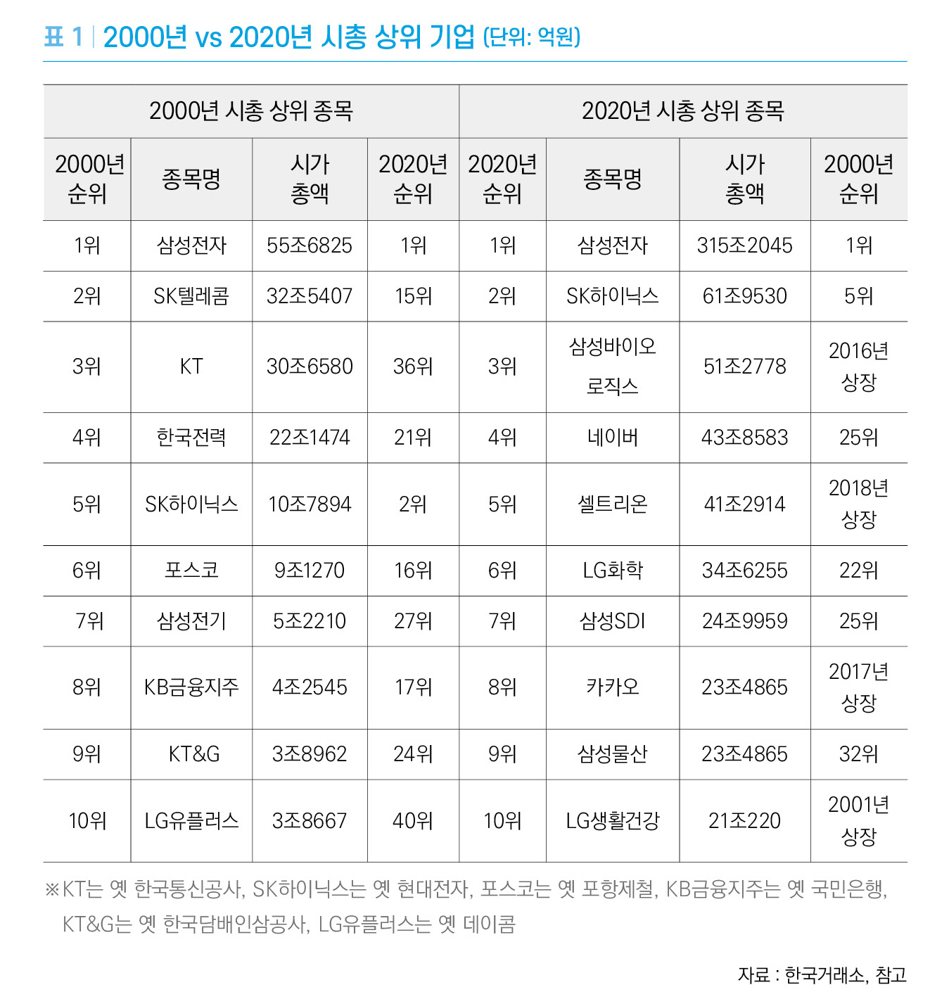
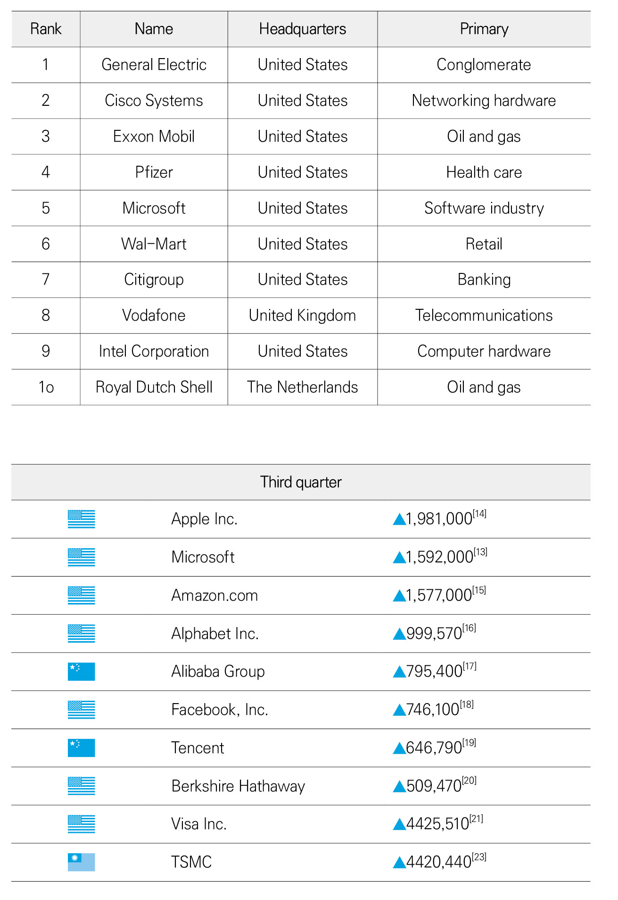

# 01 \| 10년 전과는 다른 IT 기업

바야흐로 4차 산업혁명 시대가 도래하였다. 최근 10년간 사회는 우리가 생각하지 못했던 아주 빠른 속도로 발전해왔다. 
그 이면에는 다양한 정보통신기술\(이하 IT 기술\)의 발전이 있었다. 
이러한 기술 덕분에 우리는 이전보다 훨씬 풍족하고 윤택한 삶을 영위하고 있다.

## 변화의 핵심 동력은 IT 기술

그렇다면 과거 30년 동안 무슨 일이 있었던 것일까? 

우리 생활에서 접할 수 있는 주요 기술의 발전을 중심으로 과거의 변화를 살펴보자. 
2009년 애플 아이폰의 등장으로 인해 일명 ‘모바일 혁명’ 시대가 시작되었다. 
이로 인해 스마트폰이 대중화되었으며 우리 생활을 편리하게 바꾸어주는 다양한 애플리케이션도 봇물 터지듯 쏟아졌다. 
여기에 소셜 미디어라는 새로운 형태의 서비스가 등장함으로 인해 이러한 변화 속도는 더욱 빨라졌다. 
‘트위터’, ‘페이스북’으로 촉발된 소셜 미디어 서비스는 전 세계인의 소통 방식을 바꾸었고, 정보 생산의 주체가 개인이 되는 시대가 되었다. 
지금도 사람들은 다양한 소셜 미디어를 통해 생활, 뉴스, 다양한 정보 등을 공유하고 있다. 

이러한 변화로 인해 모바일\(스마트폰\) 분야의 기업은 급성장하였고 스마트폰으로 대체 가능한 산업은 내리막길을 걸었다. 
대표적으로 아이리버\(MP3\), 아이나비\(내비게이션\), 아이스테이션\(PMP\) 등의 기업은 대부분 매출이 급감하여 사업을 전향하거나 파산 선고를 받았다. 

또한, 모든 사물이 연결되는 초연결 시대에도 빠르게 근접하고 있다. 
초연결 시대의 핵심은 사물 인터넷\(IoT\) 기술이며 이 기술은 이제 우리 가정에서도 손쉽게 활용할 수 있는 기술이 되었다. 
우리 가정에서 사용하는 냉장고, 세탁기, 공기청정기 등의 가전과 냉/난방 기기, 스마트폰, 
그리고 AI 스피커가 연결되어 모든 제품들을 어디에서나 손쉽게 제어할 수 있는 시대가 왔다. 

이러한 시대적 흐름에 따라 모바일 기기, IoT 기기 등 다양한 곳에서 엄청난 양의 데이터가 생성되었다. 
이렇게 방대한 양의 데이터를 ‘빅데이터’라고 부르며, 데이터가 많아지면서 이를 수집하고 처리해야 할 필요성은 점점 커졌다. 
따라서 이와 관련된 산업이 각광을 받기 시작했다. 

예를 들어, 카드사에서는 고객 결제 데이터를 활용하여 새로운 수익 모델을 창출하고 콘텐츠 제공 업체는 
고객의 데이터를 기반으로 맞춤형 콘텐츠와 광고 등을 제공하는 식이다. 

2016년 3월에는 ‘세기의 바둑 대결’로 불리는 이세돌 9단과 알파고의 바둑 대결이 벌어졌다. 
그 대결은 인공지능의 완승으로 끝났다. 
이 사건 이후로 인공지능에 대한 일반인들의 관심이 급증했고 인공지능 관련 알고리즘과 관련 응용 제품들이 쏟아졌다. 
이로 인해 최근 출시되는 가전제품 중 상당수의 제품에 인공지능 관련 기능이 탑재됐다. 

‘공간 학습을 통해 적절한 냉방 온도를 조절하는 인공지능 에어컨’, 
‘세탁물을 자동으로 분석하여 알맞은 코스를 선택하는 인공지능 세탁기’, 
‘보관하고 있는 식자재를 자동으로 인식하여 관련 레시피를 제공하는 냉장고’ 등 
우리 생활에서 활용하는 가전제품에 인공지능 기술이 널리 활용되고 있다. 

이제는 우리가 원하는 관광지를 집에서도 가볼 수 있는 시대가 왔다. 
바로 확장현실기술\(XR, Extended Reality\) 덕분인데, 이 기술은 기존의 가상현실\(VR\), 증강현실\(AR\), 혼합현실\(MR\)이라고 부르던 기술을 통칭하는 용어다. 
해당 기술을 통해 가기 어려운 관광지에도 가볼 수 있고 현실에서 만나지 못하는 사람을 만날 수도 있다. 

또한 ‘포켓몬고’와 같은 게임을 통해 현실감 넘치는 게임을 할 수도 있다. 
XR 기술을 통해 우리는 이전에 체험하지 못했던 새로운 경험을 손쉽게 맛볼 수 있는 환경이 마련되었다. 

그렇다면 이러한 사회의 변화를 가져온 핵심 기술은 무엇일까? 
3차 산업혁명을 이끌었던 요인은 컴퓨터 등의 IT 기술이었다. 
4차 산업혁명도 이러한 IT 기술의 발전으로 이루어졌다고 해도 과언이 아니다. 
위에서 언급한 인공지능, 사물인터넷, 확장현실 등 모든 것이 IT 기술이다. IT 기술이 없다면 이러한 변화가 오지 않았을 것이다.

## 시가총액 TOP 10의 변화

기업의 가치는 일반적으로 시가총액\(이하 시총\)을 기준으로 판단하곤 한다. 
이번 장에서는 최근 시총 상위 기업들이 어떤 유형의 기업들인지, 
과거의 시총 상위 기업들 중 도태된 기업들은 어떤 유형의 기업들인지 
등을 분석하여 최근 사회 변화와 이에 따른 기업 경영의 트랜드를 파악한다.

### 국내 기업의 변화

\(표1\)통해 지금으로부터 20년 전 국내 시가총액 상위 10개의 기업과 2020년 기준 상위 10개의 기업에 어떠한 변화가 있었는지 알아보자. 
2000년 시총 2위였던 SK텔레콤은 2020년 15위로 내려갔고 3위였던 KT는 2020년 36위를 기록했다. 
이 밖에도 포스코\(2000년 6위-&gt;2020년 16위\), LG유플러스\(2000년 10위-&gt;2020년 40위\) 등과 같이 상위 10위권에 있던 기업들의 순위가 급격한 하락세를 보이는 것을 확인할 수 있다. 

반면 새로운 흐름도 감지되고 있다. 
2010년 시총 25위였던 네이버가 4위를 기록했고 2017년에 상장한 카카오도 8위를 기록, IT 플랫폼 업계의 강세가 두드러지는 것을 확인할 수 있다. 
이 밖에도 엔씨소프트 13위, 넷마블 29위\(2000년 창업\) 등 IT 기업이 대거 상위권으로 진입했다. 
20년이 흐르는 동안 가장 큰 변화의 모습을 살펴보면 과거의 제조업 중심\(자동차, 철강, 건설\)의 산업이 뒤로 밀려나고 
IT를 기반으로 중무장한 신유형의 산업이 빈자리를 메웠다. 
20년 만에 국내 주력 산업의 패러다임이 통째로 바뀐 셈이다. 
최근 코로나19 사태로 인해 원격 근무와 같은 ‘언택트’ 문화가 빠르게 확산하고 있어 이러한 변화는 앞으로도 더욱 가속화될 전망이다.

> 표1 \| 2000년 vs 2020년 시총 상위 기업 \(단위: 억원\)

### 해외 기업의 변화

다음은 지금으로부터 20년 전 세계 시가총액 상위 10개의 기업과 2020년 3분기 기준 상위 10개의 기업에 어떠한 변화가 있었는지 알아보자. 
2000년대만 해도 가전제품 등을 생산하는 제너럴 일렉트릭\(General Electric, GE\)이 시총 1위를 기록했고, 엑손 모바일\(Exxon Mobile\)/보다폰\(Vodafone\) 등과 같은 통신회사가 각각 3위/8위를 기록한 것을 확인할 수 있다. 
이 밖에도, 오프라인 기반의 쇼핑 체인인 월마트\(Walmart\), 컴퓨터 OS 및 각종 소프트웨어를 만드는 마이크로소프트\(Microsoft\) 등이 상위권에 올라와 있다. 

2020년 3분기는 IT 기업의 세상이 되었다. 
애플\(Apple\), 마이크로소프트\(Microsoft\), 아마존\(Amazon\), 알파벳\(구글, Alphabet\), 알리바바\(Alibaba\), 페이스북\(Facebook\), 텐센트\(Tencent\) 등의 IT 기업이 상위 7위까지를 휩쓸었다. 
여기서 한 가지 더 주목할 점은 알리바바\(Alibaba\)와 텐센트\(Tencent\)와 같은 중국 IT 기업이 상위권에 당당하게 이름을 올린 것이다. 
바야흐로 IT 기업의 전성시대가 온 것이다. 

한국과 마찬가지로 20년 전에는 통신, 제조업 기반의 시장이었다면 20년이 흐른 지금은 IT 기업 중심으로 모든 시장이 재편되었다. 
앞으로 10년 후는 어떻게 될까? 
IT 기반으로 성장한 대기업의 성장세는 더욱 공고해질 것이며 후발 주자들도 무서운 속도로 따라갈 것이다. 
그리고 미국의 주요 기업만이 성장하는 것이 아니라 중국의 IT 기업도 더욱 빠른 속도로 성장하고 있다는 사실을 잊으면 안 될 것이다. 

> 표2 \| 2000년 시총 상위

## IT 기업으로 변신은 무죄

앞서 언급한 바와 같이 전 세계 기업의 시총 순위가 완전히 뒤바뀌었고 이 변화의 핵심은 IT 기술과 개발자들이라는 말을 했다. 
최근 국내외 여러 기업은 이러한 변화의 핵심을 빠르게 파악하고 기업 자체를 바꾸려는 움직임을 보이고 있다. 
수십 년간 호황을 누렸던 금융 업계도 저성장, 저금리, 저물가라는 삼중고에 처해있다. 따라서 각국의 금융 분야 기업들은 생존을 위하여 다양한 변화를 시도 중이다. 

골드만삭스는 금융회사 이미지를 버리고 기업 자체를 변화시키려고 다양한 노력을 하고 있다. 
IT 분야 인력을 대거 선발하고 핀테크 및 IT 기업 인수에 총력을 다하고 있다. 
이처럼 글로벌 금융회사들은 기존 운영 방식에서 벗어나 인공지능 기반 고객 서비스 등 새로운 유형의 서비스를 개발하고 있다. 
이는 기업의 생존과도 맞물려 있는 문제이므로 총력을 다하고 있다. 

한국의 금융 업계는 더 심각한 상황이다. 
국내 은행 이익의 약 88%가 이자 수익이라고 한다. 
이자 수익 의존도가 높다는 것은 수익 구조가 금리 변동에 매우 민감하게 반응할 수밖에 없다는 것이다. 
최근 저금리 기조가 장기간 지속되면서 국내 은행의 수익성은 계속 악화되고 있다. 

게다가 인터넷은행인 카카오뱅크, 케이뱅크 등의 등장으로 이러한 수익성 악화는 더욱 심화되고 있는 상황이다. 
실제로 4대 시중은행\(신한, KB, 하나, 우리\)이 최근 5년간\(2015~2020년 8월 말\) 폐점한 은행 점포 수는 549개로 나타났다. 
앞으로도 기존 점포의 폐점 속도는 더욱 빨라질 전망이다. 

이는 코로나19로 인한 비대면 문화의 확산과 인터넷·스마트폰 뱅킹을 활용하는 비율이 늘어났기 때문으로 분석된다. 
이러한 상황에서 생존을 위해 국내 은행들은 IT 기반의 디지털 전환을 추진하고 있다. 
우선 인공지능 기술을 접목하여 고객 상담 업무\(챗봇\)/신용도 평가/이상 거래 탐지 등을 시행하고 있으며 
IT 자원을 더욱 유연하게 활용할 수 있는 클라우드 접목 추진, 고객 빅데이터 활용 맞춤형 서비스 제공 등 다양한 분야를 활용하여 디지털 전환을 추진하고 있다. 

IT 기업으로 디지털 전환을 하려는 기업은 금융 업계뿐만 아니라 대부분 업종에서 일어나는 현상이다. 
전통적인 제조업의 불량품 탐지 등을 위해서, 보다 과학적인 스마트 농업을 위해서, 
정확하고 과학적인 물류 유통을 위해서는 반드시 IT 기반의 디지털 전환이 필요하다. 
즉, 전통적인 산업 대부분에서 디지털 전환이 필요한 시기이며 지금 이 시기를 놓친다면 그 기업은 돌아올 수 없는 길을 걸을 수밖에 없다.

## IT 기술의 핵심은 개발자

우리 회사가 기존의 전통 산업 기반으로 성장했던 기업이라면 이제는 IT 기반의 디지털 전환이 필요한 시기가 다가왔다. 

시장은 매우 냉정해서 변화하지 않는 기업은 곧바로 도태되고 만다. 
IT 기반의 디지털 전환을 위해 반드시 필요한 존재는 누구일까? 
필자는 이를 위해 가장 중요한 존재를 단연 개발자라고 단언할 수 있다. 
은행권에서는 ‘행원 대신 개발자를 모셔라’라는 말이 나올 정도다. 

최근 인터넷은행 3사\(케이뱅크, 카카오뱅크, 토스뱅크\)가 동시에 경력직 채용에 나섰다. 
기존 은행에 비해 파격적인 혜택을 내세워 개발자를 모시기에 안간힘을 쓰고 있다. 

엔터테인먼트 기업인 빅히트는 IT 인력을 대거 채용하면서 ‘IT 기반의 콘텐츠 기업’으로 탈바꿈했다. 
경기도 판교 등지의 IT 기업에서 근무하는 개발자 100명 이상이 빅히트로 이직했다고 알려졌으며 지금도 다양한 분야에서 개발자를 채용하고 있다. 

빅히트에서는 어렵게 채용한 개발자들을 활용해 다양한 디지털 상품을 출시했으며 
최근에는 게임업체 넷마블과 협력해 BTS를 활용한 게임을 출시하기도 했다. 

이처럼 새로운 서비스 개발 등을 위해 유능한 개발자를 채용하는 것은 필수적이며 
이는 기업의 생존과도 직결되는 문제이기 때문에 반드시 고려해야 하는 시대가 되었다. 

앞서 언급한 기술을 서비스로 구현하기 위해 단순히 아이디어만 가지고는 할 수 없다. 
이를 눈에 보이는 서비스로 만들어 낼 기술자, 즉 개발자라는 존재가 필요하다. 

과거 20년 사이에 산업의 패러다임이 IT 기반으로 변화하는데 가장 많은 기여를 한 직종은 무엇일까? 
필자는 단연 개발자라고 말할 수 있다. 

위에서 언급한 IT 기업들은 개발자 없이 생존할 수 없는 구조를 지니고 있으며 
유능한 개발자를 뽑기 위해서 삼고초려의 노력을 통해 위와 같은 성과를 거두었다. 
결과적으로 개발자가 없으면 기업의 생존도 위태로운 시대이며 이러한 변화는 점점 더 심해질 것이다. 

여러분은 개발자라는 용어에 익숙하지 않을 수 있다. 
개발자는 소프트웨어를 활용하여 제품과 서비스를 개발할 수 있는 기술자를 의미한다. 
여러분이 지금 사용하고 있는 스마트폰, 가전제품, 자동차, 컴퓨터, 컴퓨터 프로그램 등 개발자의 손이 닿지 않는 곳이 없다고 보면 된다. 

이렇게 중요한 역할을 하는 개발자가 당신 회사에 없다면 어떨까? 
최근 불고 있는 IT 기반의 디지털 전환\(Digital Transformation\)을 제대로 수행할 수 없을 것이며, 이를 진행하더라도 실패할 확률이 높아질 것이다.

