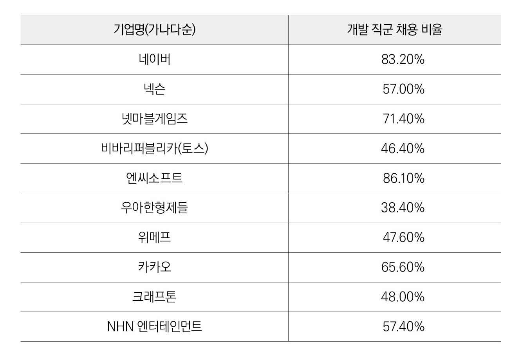
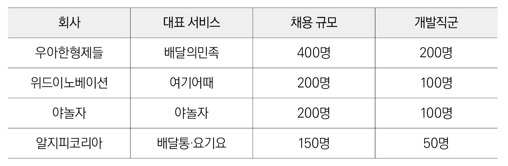

# 02 \| 개발자 채용 전쟁

## 개발자 채용을 위한 소리 없는 전쟁

국내외의 많은 기업들이 IT 기반으로 디지털 변화를 시도하고 있다. 변화를 추구하는 기업들은 필수 인력인 IT 분야 혹은 소프트웨어 개발자 채용에 안간힘을 쏟고 있다. 기업에서 유능한 개발자를 모시기 위해 어떤 방법을 활용하는지, 이들이 만족하며 근무할 수 있는 환경을 어떻게 마련하는지 등을 여러 사례를 통해 알아본다.

### 업계 최고 수준의 연봉을 드립니다

잡코리아\(Jobkorea\)에서 2020년 4년 대졸 신입직 초임을 분석\(총 771개 기업 조사\)한 결과 대기업 대졸 신입의 초임은 평균 4,130만 원이며, 공기업 3,810만 원, 중소기업 2,800만 원 순으로 조사되었다. 하지만 개발자 채용이 매우 어려운 지금의 상황에서 위의 평균 연봉으로는 원하는 역량을 가진 개발자를 구할 수 없다. 따라서 스타트업은 물론 IT 분야 대기업 등은 높은 연봉 및 복지 제공을 통해 유능한 개발자 선점에 안간힘을 쓰고 있다. 최근 개발자들 사이에 ‘네카라쿠배’라는 생소한 용어가 등장했다. ‘네카라쿠배’는 네이버, 카카오, 라인, 쿠팡, 배달의 민족을 의미하는데, 직장인 익명 커뮤니티를 중심으로 퍼지면서 신조어로 자리 잡았다. ‘네카라쿠배’는 국내 IT 분야를 주도하고 있는 기업들이다. 플랫폼 기반의 다양한 서비스를 통해 가파른 확장세를 보이고, 이러한 성장세에 따라 이들 기업은 개발자들이 가장 입사하고 싶어 하는 회사가 되었다. 이들 기업은 최고 수준의 연봉과 다양한 복지 혜택, 무한한 성장성을 무기로 최고 수준의 개발자를 채용하고 있다. ‘네카라쿠배’ 기업들의 개발자 신입 연봉은 4,000만 원~5,000만 원 수준으로 대기업 신입 초임보다 비교적 높은 수준이다. 경력직의 경우 이들이 가진 역량에 따라 천차만별이라고 한다. IT 분야 대기업인 ‘네카라쿠배’에서 공격적인 인재 유치에 나서면서 중견 IT 기업과 스타트업은 인재 유치에 비상이 걸렸다. 실제로 최근 중견 IT 기업의 유능한 개발자들이 ‘네카라쿠배’로 대규모 이직을 했다고 한다. 따라서 상대적으로 불리한 위치에 있는 기업들은 유능한 개발자를 대기업에 빼앗기지 않기 위해 더욱 높은 연봉과 다양한 복지 혜택을 통해 생존 전략을 마련하고 있다. 토스는 경력직 입사자에게 이전 회사 연봉의 1.5배를 제안하는 것으로 알려졌다. 여성 쇼핑몰 모음 서비스인 지그재그는 신규 입사 경력자에게 전 직장 연봉 대비 30% 인상을 약속해준다. 중고 거래 플랫폼인 당근마켓은 400억 원의 투자를 유치한 후 개발자의 연봉은 최소 5,000만 원을 보장한다는 채용 공고를 냈다. 대부분 중견기업/스타트업은 개발자의 최저 연봉 5,000만 원 수준을 보장하고 있으며 이보다 더욱 많은 금액을 지급하는 회사들도 늘어나는 추세다.

### 입사 시 무조건 보너스 5천만 원을 드립니다

IT 분야 개발자 찾기가 하늘의 별 따기 수준으로 힘든 상황이므로 많은 회사들이 파격적인 조건을 내걸고 공격적인 인재 영입에 나서고 있다. 그중 주목할만한 조건으로 ‘사이닝 보너스\(Signing Bonus, 입사 축하금\)’ 제도를 들 수 있다. 실제로 2000년대 초반 삼성, LG 등은 사이닝 보너스 제도를 통해 유능한 인재를 채용했다. 미국 메이저리그는 지금도 이러한 제도를 잘 활용하고 있다. 최근 개발자 채용이 매우 어려워지면서 국내 스타트업도 사이닝 보너스 제도를 도입하는 기업들이 하나둘 늘어나고 있다. 사이닝 보너스란 회사에 새로 합류하는 직원에게 주는 일회성 인센티브를 말한다. 일반적으로 사이닝 보너스를 받은 직원은 몇 년간 다른 회사로 이직할 수 없으며 만약 이직할 경우 이미 받은 보너스를 반환하는 조건 등이 붙는다. 따라서 해당 보너스 지급을 통해 우수한 역량을 가진 개발자를 채용하고 이를 장기간 유지하고 싶어 하는 것으로 파악된다. 최근 쿠팡은 약 200여 명의 기술 직군 경력 공채를 시행했는데 합격자들에게 최소 5천만 원의 사이닝 보너스를 지급한다고 전해졌다. 물류 스타트업 메쉬코리아는 AI, 데이터 사이언스, 엔지니어링 등의 개발자 경력직 공채를 시행하면서 최소 5,000만 원에서 많게는 1억 원 정도의 사이닝 보너스를 지급한다고 알려졌다. 모바일 금융 서비스 기업인 토스도 최근 파격적인 보너스 제도를 도입했다. 입사 시 이전 회사 연봉에 준하는 금액\(최대 1억 원\)을 사이닝 보너스 혹은 스톡옵션으로 제공한다. 사이닝 보너스는 입사 후 첫 월급일에 일시금으로 지급한다고 알려졌다. 그렇다면 이렇게까지 하는 이유는 무엇일까? 최근 4차 산업 기술 분야의 인력이 매우 부족한 상황이고 이 분야의 핵심 인력이 바로 개발자이기 때문이다. 스타트업은 안정적인 서비스를 빠르게 개발해야 하므로 타 경쟁업체보다 유능한 개발자를 유치하는 것이 가장 중요하다. 이러한 보너스 제도 도입을 통해서라도 우수한 개발자를 모셔야 경쟁력 있는 서비스 개발이 가능하기 때문이다.

### 최고의 근무 환경과 복지를 제공합니다

개발자들은 다른 직군에 비해 더욱 자유로운 근무 환경을 추구한다. 본인이 가장 근무하기 편한 곳에서 작업해야 업무의 효율성이 높아지기 때문이다. 따라서 집, 회사 등 어디든 본인이 편한 곳에서 개발을 할 수 있도록 배려해주는 기업들이 점차 늘어나고 있다. 이외에도 특별한 휴가 제도, 대출 제도 등 다양한 복지 혜택을 통해 유능한 개발자의 장기근속을 장려하는 기업들이 늘어나고 있다.

NHN의 기술 전문 법인인 NHN 토스트는 주 8시간의 오피스 근무를 제외하고 나머지 시간에는 전면 재택 근무가 가능한 ‘오피스 프리’ 제도를 도입하여 운영한다. 또한 근속 연수에 따라 안식 휴가를 제공하는데 3년 근속 시 1개월의 유급휴가가 주어지고 5년 근속 시 2개월, 10년 근속 시 6개월간 유급휴가가 주어진다.

우아한 형제들의 직원들은 매주 월요일엔 오후에 출근한다. 직장인들이 가장 심리적으로 힘들어하는 월요일 오전을 자유롭게 보내고 출근할 수 있어 직원들의 만족도가 매우 높다고 한다. 직원들의 만족도뿐만 아니라 업무의 효율성도 높아졌다고 하여 이를 벤치마킹하는 기업들도 늘어나는 추세다. 또한, 주 35시간 근무를 하고 1년 이상 근속한 직원들에게 ‘2주 리프레시 휴가’를 제공한다. 이 밖에도 임산부 단축 근무제, 1개월간 특별 육아 휴가\(유급\), 학부모 특별 휴가 등 다양한 복지제도로 직원들의 만족도 향상을 위해 노력하고 있다.

당근마켓은 개인 사정에 맞춰 출/퇴근 시간을 조절할 수 있는 자율 출퇴근 제도를 활용하고 있으며 매주 목요일은 재택 근무를 통해 업무의 효율성을 높이고 있다. 또한, 법인 카드로 회사 내 필요한 물품 구매, 간식, 식사 등을 자유롭게 결제할 수 있어서 직원들의 만족도가 높아졌다고 한다. 휴가 일수도 제한 없이 활용할 수 있어 필요한 경우 언제든지 쉴 수 있는 환경을 구축했다.

토스는 출퇴근 시간을 자유롭게 조절하는 자율 출퇴근제, 사용 횟수 등 제한이 없는 원격 근무제, 승인이 필요 없는 휴가 무제한 사용 등 파격적인 근무 환경을 제공한다. 또한, 직원 개인에게 법인 카드를 제공하고 1억 원의 주택 자금을 무이자로 대출해준다. 직원들의 체력 관리를 위해 매월 체력 단련비를 제공하는 것도 큰 특징 중 하나다. 토스는 이러한 근무 환경 도입으로 신규 입사자의 근속 비율이 약 90%에 달한다고 한다.

넥슨의 자회사인 게임 업체 ‘네오플’은 본사가 제주도에 위치한다는 핸디캡을 극복하고자 타지에서 온 신규 직원에게는 아파트를 사택으로 제공한다. 미혼자는 89㎡\(약 27평\), 기혼자는 105㎡\(약 32평\) 규모의 아파트를 제공하여 거주지 이전에 대한 부담을 덜어주었다.

이 밖에도 취미 공유 플랫폼인 클래스 101은 장거리 거주자에게 사택을 제공하며 월세는 회사에서 전액 부담한다. 또한, 유연근무제 도입, 외근 및 야근 시 교통비 지원, 독서 비용 무제한 지원 등의 다양한 복지제도를 도입하여 운영하고 있다.

앞서 언급한 것과 같이 대부분의 IT 기업은 개발자가 최고의 환경에서 근무할 수 있도록 다양한 복지제도를 운영하고 있다. 이는 결과적으로 개발자가 회사에 만족하면서 다닐 수 있는 큰 요인 중 하나로 작용한다. 개발자가 회사에 만족하면 이는 업무의 효율성과도 연계되므로 기업 입장에서는 더욱 많이 신경을 써야 하는 부분 중 하나이다.

## 개발자에 대한 인식 변화

불과 몇 년 전까지만 해도 개발자라고 하면 3D 업종이라고 생각한 사람들도 있었다. 하지만 불과 몇 년 사이 이러한 인식은 많이 개선되었다. 그동안 사회적으로 다양한 변화가 있었는데 아래에 설명한 요인에 기인한 것으로 파악된다.

#### ● 대학 입시 결과의 변화

80~90년대 초반의 인기 있는 학과중 하나가 ‘컴퓨터 공학과’였다. 컴퓨터공학과는 상위권 성적의 학생들이 선호하는 학과였다. 이는 실제 입시 결과에서도 나타났는데 1993년 대성학원 학력고사 점수별 대학입학 배치기준표의 가장 앞쪽에는 서울대학교 컴퓨터공학과, 물리학과 등이 차지했다. 그로부터 약 20년이 흐른 후 2010년 대성학원 대입 배치표에 따르면 백분위 점수 상위 50위 중 서울대 생명공학부, 자유전공학부를 제외하고는 모두 의예, 한의예 학과가 나머지를 차지했다. 불과 20년 만에 의예, 한의예 관련 학과가 강세를 보였다.

그렇다면 왜 이러한 결과가 나온 것일까? 이는 한국에서 소프트웨어 관련 분야로 진출할 경우 잦은 야근과 과중한 업무량, 낮은 연봉 등으로 인하여 좋은 대우를 받지 못한다는 인식이 널리 퍼졌기 때문이다. 실제로 SI 분야 개발자들의 이야기를 들어보면 아직도 워라벨이 잘 지켜지지 않는다는 곳이 많다. 이는 좋은 인력들이 오랫동안 근무할 수 있는 여건이 되지 않는다는 것이다. 이에 피로감을 느낀 개발자들이 다른 분야로 이직을 하거나 전공을 바꿔 대학원 진학 등을 통해 직종의 전환을 하는 경우도 많았다.

하지만 다시 시대가 달라졌다. 그로부터 약 10년이 흐른 2019년, 컴퓨터공학과가 다시 높은 인기를 회복했다. 약 30년 만에 최상위권 학생들이 원하는 학과가 되었고 이는 입시 결과에도 그대로 반영되었다. 2019년 서울대 정시에서 컴퓨터공학과 합격선은 406점\(수능 표준점수 600점 기준\)이었으며 의예과는 411.4점, 치의학과는 406.6점이었다. 의예과를 선호하는 현상은 비슷하지만 이제 컴퓨터공학과가 이에 버금가는 인기를 얻는 과라는 것을 실감할 수 있는 부분이다.

#### ● 대학의 변화

최근 과학기술정보통신부에서 지원하는 소프트웨어 중심대학 사업의 규모와 지원 비용을 보면 소프트웨어 분야의 인기를 다시 한번 실감할 수 있다. 소프트웨어 중심대학은 대학교육을 소프트웨어 중심으로 혁신함으로써, 소프트웨어 전문인력을 양성하고 학생, 기업, 사회의 소프트웨어 경쟁력을 강화하여 진정한 소프트웨어 가치 확산을 실현하는 대학을 말한다. 소프트웨어 중심대학은 2015년부터 사업이 시작되어 2019년 하반기\(10월\)까지 총 40개 학교가 선정되었다. 학교당 연간 10~20억 원의 예산이 지원된다. 이 예산을 통해 대학 교육과정을 소프트웨어/AI 중심으로 개편, 융합 학과 개설, 해당 분야 교원 초빙, 산학협력체계 구축 등을 수행하게 된다. 실제로 소프트웨어 중심대학 사업에 선정된 대학은 신입생 전원을 대상으로 입학 전/후 소프트웨어 교육 실시\(파이썬\), 소프트웨어/AI 융합 학과 신설, 컴퓨팅 사고력 기반의 소프트웨어 소양 교육 등을 실시하여 소프트웨어 분야의 인력 양성을 위해 다양한 노력을 수행하고 있다.

#### ● 초·중등 소프트웨어 교육의 의무화 및 인기 상승

초·중등 교육에서도 소프트웨어 교육의 인기가 날로 상승하고 있다. 일반적으로 우리가 학창시절부터 생각해왔던 주요과목은 국어와 영어, 수학 정도였다. 하지만 최근 소프트웨어 교육이 중요해지면서 초·중등 과목 내 반드시 배워야 하는 필수과목으로 자리 잡았다. 관련 학과의 인기도 덩달아 상승하면서 주요과목이 ‘국영수코’\(국어, 영어, 수학, 코딩\)라는 말이 나올 정도이다. 이에 따라 소프트웨어 교육 관련 학원 등의 사교육 시장도 빠르게 성장하고 있다. 이는 학생과 학부모의 관심을 대변하는 것으로 생각된다. 또한, 초·중등 학생 대상으로 소프트웨어 교육 및 컴퓨팅 사고 등의 교육을 수행할 수 있는 언플러그드, 로봇 코딩, 블록 코딩, 피지컬 컴퓨팅 등의 소프트웨어 교육 도구들이 출시됐다.

#### ● 인공지능에 대한 일반인의 관심 증대

2019년 12월 정부는 ‘인공지능\(AI\) 국가전략’을 발표를 통해 AI 강국으로 발돋움하기 위한 초석을 마련하였다. 해당 전략에서는 3대 분야의 9대 전략을 수립하고 100대 실행과제를 제시하였다. 이를 통해 AI 분야 인재양성을 위해 초급 인재부터 최고급 인재까지 양성하는 것을 목표로 하고 이를 바탕으로 다양한 부처에서 구체적인 전략을 실행하고 있다. 해당 전략은 전 국민이 인공지능 기본 소양을 갖게 하는 내용도 포함되었는데, 전 생애 동안 모든 국민이 인공지능을 잘 활용할 수 있게 만드는 것을 목적으로 한다. 이러한 정부의 정책과 더불어 여러 기업에서 다양한 형태의 인공지능 관련 제품을 출시하면서 대중들의 관심도 빠르게 늘어나고 있다. 요즘에는 유치원생도 인공지능이라는 단어를 들어봤을 정도로 인공지능이라는 용어가 많은 곳에서 사용되고 있다. 이는 해당 분야의 서비스 개발에 대한 요구가 많아지는 것으로 이에 따라 관련 분야의 개발자 채용으로 이어지고 있다. 소프트웨어정책연구소에 따르면 실제로 인공지능 분야 연구 및 개발 인력은 현재도 많이 부족하며 2023년까지 약 3만 명의 AI·소프트웨어 분야 인력이 부족할 것으로 전망했다.

#### ● 시대별 개발자에 대한 인식의 변화

요즘 개발자들을 만나보면 예전보다 개발자에 대한 처우가 많이 좋아졌다고 한다. 대부분 높은 수준의 연봉을 받고 있으며 근무 환경도 좋아졌다는 말을 한다. 그렇다면 개발자들은 원래부터 이러한 처우를 받았을까? 해당 내용을 구체적으로 확인하기 위해 90년대부터 최근까지의 흐름을 살펴보겠다. 1990년대에는 소프트웨어 시장이 별도로 존재하지 않았던 시대였다. 이때 대부분의 개발자는 취미 삼아 개발을 진행하는 정도였으나 실력은 뛰어난 경우가 많았다. 2000년대에는 학원 등에서 교육을 받은 개발자들이 다수 배출됐다. 이때는 SI 분야의 성장으로 인해 개발자들의 수요가 급증한 시기였다. 하지만 이러한 수요에 비해 개발자에 대한 처우 및 근무 환경은 좋지 않았다. 또한, 이때 채용된 개발자들은 비교적 만족스럽지 못한 개발 결과를 보여주었다. 이로 인해 개발자들에 대한 인식과 대우가 점점 안 좋아지는 악순환이 반복되었다.

2010년대는 모바일과 소셜 미디어가 폭발적인 성장을 한 시기이다. 따라서 관련 서비스를 개발하는 스타트업이 늘어났다. 관련 인력 수요는 급증하였고 이에 따라 개발자에 대한 처우도 자연스럽게 높아지는 계기가 되었다. 또한, 비교적 높은 경력을 가진 유능한 개발자들에 대한 수요도 동시에 증가하였으며 이러한 체계는 개발 업계의 선순환 체계를 가져오게 했다. 2020년대가 되면서 이러한 선순환 체계가 공고화되는 것으로 보인다. 유능한 개발자일수록 더 좋은 대우를 받고 좋은 환경에서 근무하는 비율이 높아졌다. 대기업뿐만 아니라 스타트업도 좋은 개발자를 뽑기 위해 삼고초려를 하는 경우도 많아졌다. 개발자들은 점점 본인이 원하는 수준의 회사를 골라서 갈 수 있는 환경이 되고 있다. 위에서 언급한 여러 요소가 복합적으로 작용하여 개발자들이 좋은 대우를 받는 환경이 마련되었다. 앞으로도 실력 있는 개발자를 필요로 하는 기업들은 더욱 빠르게 늘어날 전망이다.

## 주요 IT 기업 개발자 채용 현황

최근 주요 IT 기업의 채용 현황을 살펴보면 아래의 표와 같다. 다양한 분야에 대한 채용을 진행하고 있지만, 특히 개발자에 대한 채용 비율이 매우 높은 것을 파악할 수 있다. 표에서 제시하는 채용 공고 중에 개발자 채용을 파악할 수 있는 공식적인 통계 수치는 없다. 따라서 관련 채용 공고를 직접 살펴보고 개발자 관련 채용 공고의 비율을 파악했다. 해당 채용 공고는 2020년 10월 5일 기준으로 지원 가능한 채용 공고만을 대상으로 분석하였으므로 실제 전체 기업에서 채용하는 개발자 채용 비율과는 다소 다를 수 있다. 하지만 이를 통해 확인할 수 있는 핵심은 전체 채용 인원 중 개발자가 차지하는 비율이 상당히 높다는 점이다. 대부분 기업에서 절반 이상의 인력을 개발자로 뽑고 있으며 이를 통해 전체 채용의 경향을 추정할 수 있다.\(표3 참조\)

## 스타트업의 개발자 채용 비율

주요 IT 기업에서 많은 인력을 공격적으로 채용하고 있는 상황에서 스타트업이라고 가만히 있을 수는 없다. 아니, 가만히 있으면 안 된다. IT 분야 중견/대기업 규모의 기업은 기존 개발자들이 다수 있는 상황에서 추가적인 인력이 필요하여 채용하는 경우가 많기 때문에 스타트업과는 상황이 다소 다를 수 있다. 스타트업을 직원 수에 따라 분류하면 20인 미만인 기업과 20~50인 미만의 기업, 50인 이상의 기업 정도로 구분할 수 있다. 20인 미만인 기업은 초기 스타트업일 확률이 높으며 사업 경험이 많이 없고 서비스를 개발하기 위한 개발자가 충분하지 않을 확률이 높다. 직원 수 20~50인 정도의 스타트업은 이미 서비스를 출시한 상황에서 신규 서비스 확장, 기존 서비스 유지 보수 등의 인력이 필요할 것이다. 

> 표3 \| 주요 IT 기업의 개발자 채용 비율

마지막으로 직원 수 50인 이상의 스타트업은 시장의 인지도가 어느 정도 쌓인 기업으로 안정적인 매출이 나오고 있을 확률이 높다. 해당 기업에서도 개발자가 필요하긴 마찬가지이며 초기 스타트업 때보다 경험이 많은 유능한 개발자를 뽑을 확률이 높다. 다음은 주요 스타트업의 채용 규모\(2018년\)를 나타낸 표이다. 이 표에서 주목할 것은 스타트업 채용 규모 중 개발 직군이 차지하는 비율이 대부분 50%를 선회한다는 점이다. 앞서 살펴보았던 주요 IT 기업의 수치와 어느 정도 일치하는 부분이다. 그만큼 스타트업에서도 개발자가 아주 중요한 역할을 한다는 것을 유추할 수 있다.

> 표4 \| 주요 IT 기업의 개발자 채용 비율

