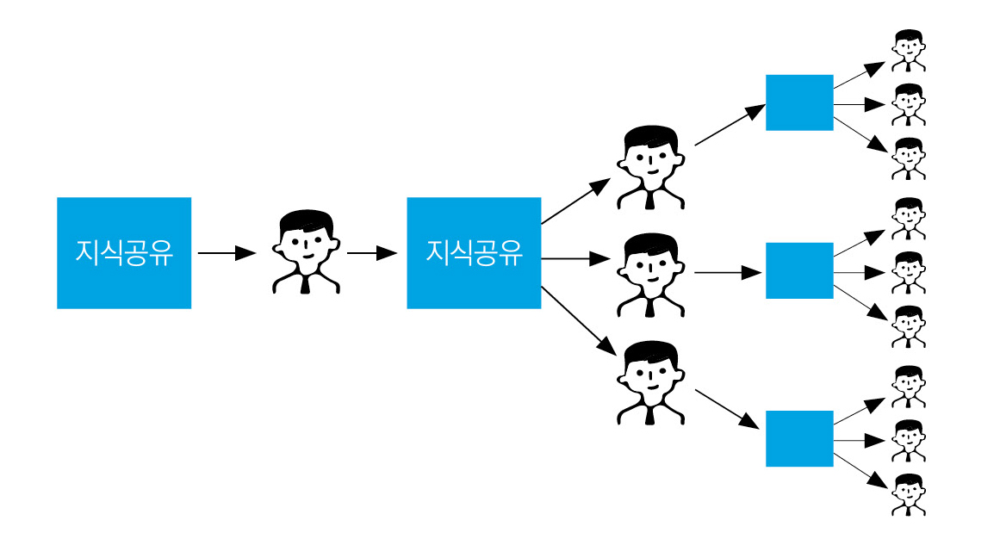

# 02 \| Selling Point를 잡아라

## 개발자, 당신은 누구인가?

우리 회사에서 개발자 채용이 필요하다면 우선적으로 그들에 대한 이해가 필요하다. 지금까지 우리 회사에서 봐 왔던 직원들과 비슷한 특성을 지녔다고 단정하고 이들을 대하면 조만간 회사를 떠날지도 모른다. ‘지피지기면 백전백승’이라고 했다. 그래서 이번 장에서는 개발자들이 가진 특성과 그들만의 문화를 구체적으로 소개한다.

### 개인이 발전할 기회를 좋아한다

#### ● 성장 가능성을 중시한다

개발자는 다른 전문직과 비슷한 특징을 가졌다고 보면 쉽게 이해할 수 있다. 목표가 주어지면 스스로 할 일을 찾아내고 다양한 자료를 통해 학습을 하며, 목표를 달성해 나가는 것을 좋아한다. 그러므로 개발자 대부분은 회사 내의 영향력 있고 혁신적인 프로젝트에 참여하고 싶어 한다. 단순하게 참여하는 것이 아닌 적극적인 프로젝트 참여를 통해 자신이 얼마나 성장할 수 있는지가 중요한 포인트이다.

#### ● 새로운 경험을 좋아한다

이들은 새로운 경험을 매우 중요하게 생각한다. 우리 회사에서 개발하는 서비스가 비교적 쉽게 누구나 개발할 수 있는 정도의 난이도라면 개발자들이 좋아할까? 개발자들은 본인 커리어나 경험에 도움이 되지 않는 프로젝트를 좋아하지 않는다. 이러한 개발 경험이 아무리 많더라도 본인의 발전에 전혀 도움이 되지 않기 때문이다. 지금까지 경험해보지 못했던 새로운 유형의 경험을 제공할 수 있다면 이들은 적극적으로 해당 프로젝트에 참여하여 본인의 역량을 마음껏 발휘할 것이다.

#### ● 꾸준한 학습을 추구한다

개발자 대부분은 새로운 것을 학습하는 것에 대한 두려움이 별로 없다. 최신 기술이 나오면 그것을 공부하기 위하여 꾸준한 노력을 아끼지 않는다. 만약 이들이 회사 업무에 필요하다며 서적이나 관련 자료를 구매하고 싶다고 한다면 절대 아끼지 말고 적극적으로 지원하라. 또한, 본인의 전문 분야와 관련된 연수나 세미나, 콘퍼런스 등에 참석하고 싶다고 하면 무조건 갈 수 있도록 비용과 시간을 지원한다. 여기에 투자한 비용은 나중에 몇 배가 되어 우리 회사의 중요한 자산으로 돌아올 것이다. 또한, 고급 수준의 개발자로 올라갈수록 한 가지 기술에 대한 전문성보다는 전체 IT 분야의 흐름을 파악하는 것이 중요하다. 이때도 다양한 자료와 여러 분야의 강의 등을 활용하여 많은 지식을 습득할 수 있도록 도움을 주어야 한다. 다시 말하면, 다양한 최신 기술 등을 끊임없이 학습할 수 있는 환경 조성에 도움을 주고 나머지는 개발자 본인에게 맡기면 된다는 얘기다.

### 개발을 위한 환경이 잘 구축되어 있어야 한다

#### ● 업무 효율성 향상을 위한 툴을 잘 갖춰야 한다

일반적으로 업무용 커뮤니케이션 툴은 이메일을 많이 활용해왔다. 이메일은 급하지 않은 업무에 대한 커뮤니케이션을 진행하는 툴이다. 회신을 받는 데에도 시간이 많이 걸린다. 물론 이러한 이메일 기반의 소통도 나쁘지 않고 아직도 많이 활용하는 방식이다. 하지만 개발자들은 새로운 협업 툴을 활용하여 업무의 효율성이 높아진다면 활용법을 배우는 것을 주저하지 않는다. 최근 기업들은 다양한 업무용 메신저, 공유 드라이브, 협업 툴\(Slack, Notion, MS Teams, 잔디, Google Workspace, Github, Jira, Confluence\)을 활용하고 있다. 이러한 툴을 활용하면 업무에 대한 빠른 회신이 가능하여 일 처리가 수월해진다. 실시간 공동 작업이 가능해 굳이 모이지 않아도 각자 원격 환경에서 업무를 수행할 수 있다는 장점도 있다. 소규모 회사에서는 큰 비용 부담 없이 사용할 수 있고 일정 인원 혹은 무료 용량 이상을 활용하기 위해서는 추가로 비용을 부담해야 한다. 하지만 회사 내 빠르고 효율적인 커뮤니케이션을 위해서는 필수적으로 도입해야 하는 툴이다. 앞서 언급한 툴 중 각 회사의 상황에 맞는 툴을 선택하여 활용하는 편이 좋다. 이전에 경험하지 못했던 것이라 할지라도 이 툴의 장점과 활용법 등에 대해 간략하게 설명해주면 개발자들은 빠르게 습득하고 적극적으로 사용한다. 반대로 말하면, 업무의 효율성을 높이는 도구들을 활용하지 못하면 회사 업무의 효율성이 매우 떨어진다고 생각을 할 것이다. 내일 회의 자료를 만드는데 직원 대부분이 협업 툴 활용에 능숙하지 않아 계속 모여서 회의를 한다고 가정해보자. 물론 모여서 회의가 필요한 사안도 있겠지만 이보다 더 중요한 것은 일의 효율성이다. 개발자들은 일의 능률을 매우 중요시하기 때문에 이러한 상황을 효율적으로 해결할 수 있는 협업 툴을 가장 먼저 찾을 것이다. 하지만 회사에서 이런 툴의 비용 등을 절약하려 하거나 팀원 대부분이 활용에 능숙하지 못하다면 이들의 업무 만족도는 크게 저하될 것이다. 개발자들이 새로운 업무용 툴을 제안한다면 회사에서는 이를 활용하는 방안을 적극적으로 검토해야 한다. 이들이 제안한 새로운 툴을 활용함으로써 회사의 업무가 더욱 효율적으로 개선될 확률이 매우 높기 때문이다.

#### ● 개발하는 장비가 좋아야 한다

당연한 이야기지만 개발에 필요한 컴퓨터, 모니터, 마우스, 키보드 등은 최고로 편하고 좋은 제품으로 지원하라. 이들 장비는 창의력을 바탕으로 새로운 서비스를 만들어내는 도구이다. 주방장은 좋은 칼, 골프 선수는 좋은 골프채, 카레이서는 좋은 차가 준비돼야 한다. 개발자에게 좋은 개발 장비가 있어야 최고의 개발 성과가 나올 수 있다. 또한 조금이라도 불편한 부분이 발생하지 않도록 책상과 의자, 스탠드 등의 사무용 가구나 주변 기기에도 많은 배려를 해야 한다. 만약 업무에 새로운 사무용 기기나 장비가 필요하다면 이 또한 아끼지 말고 적극적으로 지원하라. 이들은 이를 활용하여 몇 배의 성과를 낼 수 있을 것이다.

####  ● 최고의 업무 공간을 제공하라

개발자들은 업무 공간에 무척 민감하다. 개발자들에게 있어 업무 공간은 고도의 집중을 요구하고 이러한 몰입을 통해 최고의 산출물을 낼 수 있는 장소다. 개발자들의 이러한 특성을 알기에 많은 기업들은 개발에 몰두할 수 있는 최고의 환경을 제공한다. 이를 위해 1인이 활용할 수 있는 사무실을 제공하기도 하고 그렇지 못하다면 타인의 방해를 최소화할 수 있는 업무 환경을 제공한다. 또 다른 유형으로는 집에서 자유롭게 개발할 수 있도록 배려해줄 수 있으며 집 근처의 공유 오피스 등을 제공하기도 한다. 만약 우리 회사에서 이러한 환경을 제공하지 못한다면 당장 개발자들이 근무할 수 있는 환경으로 만들 필요가 있다.

### 좋은 동료들이 있어야 한다.

#### ● 탁월한 동료는 좋은 성과로 이어진다

넷플릭스 최고인사책임자인 패티 매코드\(Patty McCord\)는 “최고의 직장은 복지가 좋거나 급여가 많은 곳이 아니라 탁월한 동료들과 함께 일할 수 있는 곳”이라고 말했다. 이 말은 개발자 세계에는 더욱 확실하게 적용된다. 개발자들은 본인이 최고인 것보다는 더 유능한 개발자가 있는 회사를 선호한다. 이름만 들으면 알만한 개발자가 근무하는 곳이라면 서로 가고 싶어 한다. 그 이유는 무엇일까? 바로 동료를 통해 다양한 것들을 배우며 성장할 수 있기 때문이다. 또한 이런 동료와 일하게 되면 능률도 향상되고, 흥미로운 결과물도 낼 수 있는 여러 장점이 있다. 만약 A라는 개발자는 코딩 속도가 매우 빠르고, B라는 개발자는 디버깅을 잘하며, C라는 개발자는 전체 시스템 통합 작업을 잘한다고 해보자. 모두 각자 분야에서 최고의 역량을 보이는 개발자들이지만 특정 분야 이외의 것들은 잘하지 못한다는 단점이 있다. 하지만 이들이 상호 협력하여 장점을 극대화하고 단점을 보완한다면 그 효율은 이루 말할 수 없을 정도로 높아질 것이다. 이것이 바로 같이 일하는 동료의 중요성이며 결국 회사의 생산성 향상에 많은 도움을 주게 된다. 때문에 회사에서는 인재 관리를 통해 좋은 동료와 일할 확률을 높이는 것이 중요하다. 개발자가 전혀 없는 회사에서 처음 개발자를 뽑는다면 이들은 절대 가고 싶어 하지 않는다. 이런 회사에 가면 본인이 결정한 대로 모든 것이 흘러갈 수는 있지만 자기 발전에는 큰 도움이 되지 않는다고 생각한다. 또한, 같이 개발 업무를 담당할 동료들이 전혀 없으므로 혼자 난관을 헤쳐나가야 할 수 있다. 따라서 이런 회사는 개발자들이 선호하지 않는다. 개발자들은 함께 즐겁게 일하며 서로에게 배울 수 있는 곳에서 근무하는 것을 바란다. 이런 환경은 하루 이틀 사이에 만들 수 있는 것이 아니므로 꾸준한 노력을 통해 일궈내야 하는 결과물이다.

### 높은 자율성은 최고의 책임감을 만든다

#### ● 근무 장소와 시간에 자율성을 부여하라

개발자들은 과제가 정해지면 스스로 목표를 잡아서 개발하는 경향이 짙다. 따라서 개발자가 가지고 있는 이러한 경향에 맞춰 근무 환경도 바뀌어야 한다. 최근 많은 스타트업에서 개발자들에게 근무 환경에 대한 자유를 주고 있다. 필요하다면 언제든 재택 근무를 활용할 수 있게 하며 출퇴근 시간을 자유롭게 운영하기도 한다. 또한, 연차 휴가 등이 필요하면 언제든 눈치 보지 않고 자유롭게 쓸 수 있게 한다. 단, 본인과 회사가 설정한 목표에 도달하기 위해서 주어진 업무를 효율적으로 수행해야 하는 책임이 있다. 이러한 책임을 다하지 않고 위의 권리만을 누리라는 것은 절대 아니다. 만약 우리 회사에 이러한 제도가 없다면 다양한 스타트업의 사례를 살펴보고 적극적으로 반영할 필요가 있다.

#### ● 본인에게 많은 결정권을 주어라

회사 생활을 하다 보면 연차 활용, 법인 카드 사용, 재택 근무 사용 등 상위 결정권자의 결재가 필요한 경우가 많다. 물론 결재가 정말 필요한 경우도 있겠지만 결재 과정 때문에 번거롭고 눈치가 보여 이런 제도를 잘 활용하지 못하는 경우도 많다. 최근 스타트업 등에서 활용하는 제도 중 ‘본인 전결 제도’가 있다. 결재가 필요한 상황이면 단순 통보 형식으로 결재를 올리고 본인이 결재를 하여 최종 책임을 스스로가 지는 방식이다. 이는 복잡한 과정의 결재를 쉽게 하자는 취지도 있지만 개발자 본인이 스스로 결정할 수 있는 주체라는 것을 인식시켜 업무에 대한 책임감과 소속감을 높이는 방법이기도 하다.

### 회사의 개발 문화를 중시한다

개발 문화를 어떻게 정의할 수 있을까? 사실 개발 문화라는 것은 추상적이며 우리가 원한다고 해서 한 번에 만들어질 수 있는 것도 아니다. 개발자들은 지원하는 회사의 개발 문화에 대해 궁금해하며 면접 시에 주로 이러한 내용을 물어본다. 일할 회사의 개발 문화를 알아야 본인이 회사에서 적응할 수 있을지를 판단할 수 있기 때문이다. 개발 문화는 개발하는 코드에 대한 꾸준한 리뷰, 에자일 프로세스를 활용한 개발, 비슷한 성향을 가진 동료와의 협업 등 구성원들이 함께 공유하고 실행해 나가야 할 목표와도 같다. 좀 더 부드럽게 표현하면 개발을 하면서 같이 지켜나가야 할 공감대 형성이라고 할 수 있다. 즉, 이런 목표와 공감대 형성을 통해 개발 문화가 만들어진다. 언급한 것들을 무조건 적용한다고 해서 개발 문화가 바로 형성되는 것은 아니다. 단순히 개발만 열심히 하는 것이 아니라 궁극적으로 우리 회사 서비스의 품질\(코드의 품질\)을 향상하려는 공감대가 형성되는 것이 개발 문화의 시작이라고 볼 수 있다. 이러한 것들을 개발자 모두가 이해하고 서로 지켜나가고자 할 때, 비로서 개발 문화로 자연스럽게 정착된다. 회사는 이러한 개발 문화가 잘 정착할 수 있도록 애써야 한다. 만약 우리 회사에 이러한 문화가 제대로 정착되지 않았다면 이를 위한 부단한 노력이 필요하다.

### 편안한 근무를 위한 최고의 복지가 필요하다

#### ● 법인 카드를 아끼지 말라

개발자들은 생각할 시간이 많이 필요하며 이를 통해 창의적인 결과물을 산출한다. 이들에게 시간은 매우 소중하며 이러한 시간을 아낄 수 있게끔 도움을 주어야 한다. 이를 위해 개발자들이 회사 업무와 연계하여 필요한 물품이 있을 때는 적극 지원하도록 하자. 어떤 회사는 필요한 물품을 회사 공용 아이디 장바구니에 담아놓으면 다음 날 도착할 수 있도록 바로 구매한다고 한다. 이는 개발자들이 물품 구매를 위한 비용을 아낄 수 있도록 하기도 하지만 이를 구매하기 위한 고민과 쏟는 시간을 절약하는 데 많은 도움을 준다. 출출할 때 먹을 수 있는 간식과 음료 등을 갖추는 것도 잊지 말아야 한다. 회사에서 식사해야 한다면 법인 카드로 맛있는 식사를 할 수 있도록 해주는 것이 좋다. 그런 자유를 준다고 해서 이들이 법인 카드를 흥청망청 쓰는 일은 거의 없다. 자유의 범위가 늘어나는 대신 이들은 책임감 있게 이를 활용할 것이므로 크게 걱정하지 않아도 된다. 최고의 효율을 내기 위한 공간에서 배가 고파서 혹은 식대가 부담스러워서 아무것도 못 하면 안 되지 않겠는가? ‘법카’는 이럴 때 쓰라고 있는 것이다. 아낌없이 주는 회사가 되자.

#### ● 개발자의 가족도 소중하다

개발자들이 장기근속하며 회사를 발전시킬 수 있는 가장 큰 요인 중 하나는 이들의 가족이다. 반대로 말해서 이들의 가족에게 회사의 복지가 영향을 미칠 수 있다면 개발자들은 더욱 만족할 것이며 회사의 성과 향상에 기여를 할 확률이 높아지게 된다. 구체적으로 어린 자녀가 있는 경우 사내 어린이집이나 공동 어린이집 등에 아이를 맡길 수 있게 해주는 것이 좋다. 개발자 본인의 건강과 가족 건강 모두를 챙길 수 있도록 건강검진, 체력 단련 비용 등을 지원하는 것도 좋다. 가족 여행을 갈 수 있도록 콘도 및 호텔 이용권을 주기적으로 제공하는 것도 가족 복지 혜택 중 하나다. 일주일 중 하루를 가족의 날로 정하여 조기 퇴근 혹은 영화 쿠폰 등을 제공하는 것도 좋은 방법이다. 개발자의 가족을 사랑하는 것이 바로 개발자를 아껴주는 일이고 이는 장기적으로 회사의 발전과 연계될 것이다.

#### ● 충분한 휴식을 할 수 있는 공간이 필요하다

개발 업무는 고도의 집중을 통한 작업이 이루어지므로 피로감 또한 그에 비례한다. 이런 이유로 충분한 휴식을 취할 수 있는 환경이 필요하다. 국내외 여러 기업에서 개발자들이 휴식을 취할 수 있는 환경을 마련하고 있다. 비디오 게임을 하며 머리를 식힐 수 있게 하거나 만화책을 마음껏 볼 수 있는 공간을 제공한다. 숙면을 할 수 있는 공간을 제공하기도 한다. 또한, 마사지를 받으며 휴식을 취할 수 있는 환경을 제공하는 곳도 있고 당구/탁구 등 실내 스포츠를 하며 스트레스를 풀 수 있는 공간을 제공하는 회사도 있다. 이러한 환경은 결국에 개발자들의 업무 집중도 향상과 생산성 향상에 기인하게 되므로 이런 공간 마련에 아낌없이 투자해야 한다.

### 높은 연봉은 좋은 개발자 채용으로 이어질 확률이 높다

제일 중요한 이야기지만 제일 마지막에서 언급하는 이유는 개발자마다 높은 가치를 두는 곳이 다르기 때문이다. 실력이 좋은 개발자는 어디를 가도 당연히 연봉을 많이 받는다. 우리 회사에서 실력 있는 경력 개발자를 뽑기 위해서는 시장에서 해당 경력자들의 연봉 수준보다는 높게 지급할 준비를 해야 한다. 중고차 시장에는 이런 말이 있다. ‘싸고 좋은 차는 없다’. 개발자 세계도 마찬가지다. 연봉이 낮으면 좋은 개발자를 구할 확률은 그렇게 높지 않다. 만약 회사가 앞에서 언급한 조건들을 모두 다 갖추고 연봉만 조금 부족하다면 이야기가 다르겠지만 그런 기업이 개발자에게 줄 연봉이 부족하다는 것은 말이 되지 않는다. 좋은 개발자를 구하려면 그에 맞는 연봉을 충분히 주어야 이들의 마음을 움직일 수 있고, 회사에 오더라도 이직할 확률이 낮아진다. 넷플릭스는 동종 업계 최고의 연봉으로 A급 직원들을 뽑아서 운영한다고 한다. 또한, 주기적으로 시장 조사를 하여 해당 개발자의 연봉 시세를 파악하여 더 높은 연봉을 주는 곳이 있으면 그 기업보다 더 많은 연봉으로 협상한다고 한다. 이는 최고의 직원을 뽑아서 유지하고 관리하는 데도 많은 노력을 기울인다는 얘기다. 우리 회사에서 뽑을 개발자의 등급을 정했다면 최소한 그에 맞는 평균 이상의 연봉을 준비하고 영입할 준비를 해야 한다. 그렇지 않으면 절대 우리가 원하는 수준의 개발자를 뽑을 수 없다.

## 개발자들에게 알려라

우리 회사가 채용을 진행하고 있다는 사실을 많은 개발자들에게 알리기 위해서는 어떤 방법을 활용하는 것이 좋을까? 개발자 직군은 개발하는 서비스, 개발 환경, 활용 언어 등에 따라서 다른 특색이 있다. 채용 전략은 이에 따라서 꾸준히 변해야 한다. 단순히 ‘채용 공고 사이트에 올리면 개발자들이 이것을 보고 우리 회사에 지원하겠지’라는 안일한 생각을 가지면 안 된다. 그만큼 시대가 변했고 개발자들도 바뀌었으며 채용 채널도 다양해졌다. 우리 회사의 채용 공고가 최대한 노출되는 방법들을 골라서 활용해야 한다. 하나의 채널만을 고집하면 절대 안 된다. IT 리크루팅 및 인재 관리 회사인 테크시스템스의 리서치 디렉터 제이슨 헤이먼은 “잘못된 방법을 사용하거나 인재를 찾을 때 활용하는 채널이 충분하지 않은 회사들이 많다. 유치하고자 하는 기술과 인재의 종류, 이들을 찾을 수 있는 장소를 생각해야 한다. 경력이 20년인 보안 분석가와 헬프 데스크 지원 인력을 찾는 전략이 같을 수는 없다. 반드시 달라야 한다”고 강조했다. 그렇다면 채용 채널은 어떤 것들이 있을까? 일반적으로 많이 활용하는 채용 채널을 소개하겠다.

#### ● 소셜 미디어

소셜 미디어는 우리가 가장 많이 접하는 채널 중 하나다. 트위터, 페이스북, 링크드인 등이 이러한 채널에 속한다. 소셜 미디어에 채용 광고를 하고 링크드인에서 적합한 인재를 적극적으로 찾는 노력도 해야 한다. 개발자들은 본인의 커리어를 외부에 보이고 싶어 하므로 이러한 소셜 미디어를 많이 활용한다. 특히 링크드인 등의 소셜 미디어는 우리 회사에 필요한 인재를 효과적으로 검색하고 연락을 할 수 있는 수단으로 활용할 수 있다.

#### ● 구인/구직\(공채\) 포털

가장 전통적인 방식의 공고 방식이다. 예전에는 신문 등을 통해서 구인 광고를 냈지만 이제는 구인/구직 포털을 통해서 원하는 인재를 찾는다. 개발자뿐만 아니라 대개의 채용 공고는 이러한 포털에 올라온다고 생각하면 된다. 우리가 일반적으로 많이 알고 있는 사람인, 인크루트 등이 이러한 채널에 속한다. 많은 사람들이 사용하는 만큼 빼놓을 수 없는 채널 중 하나이다.

#### ● 세미나/콘퍼런스/박람회

세미나/콘퍼런스 등은 최근 코로나19 사태로 인해 많이 위축되었다. 이로 인해 온라인 콘퍼런스 등으로 대체되어 운영되고 있으나 이 또한 충분한 홍보 효과를 가져올 수 있다. 기업 체험관, 홍보관 등을 온/오프라인으로 운영하여 우리 회사를 대중에게 잘 알릴 수 있다. 이는 자연스럽게 회사의 문화나 분위기를 예비 채용 후보자들에게 전달할 좋은 기회다. 또한, 오프라인 행사 진행 시 현장에서 다양한 분야의 사람들을 만나볼 기회가 될 수 있다.

#### ● 사내 채용

인력이 필요한 자리가 있다면 외부에 공고를 내기 전에 회사 내부에 채용할 사람이 있나 확인할 필요가 있다. 사내에 해당 포지션에 맞는 사람은 없는지, 적절한 교육을 통해 이러한 개발 업무를 수행할 수 있는 사람은 없는지 등을 먼저 고려해야 한다. 등잔 밑이 어둡다고 했다. 멀리서 찾지 말고 우선 안에서 찾아보면 적합한 인재가 있을 수 있다. 외부에서 개발자를 채용할 경우 어느 정도의 리스크를 갖게 되지만, 사내 개발자들은 이미 회사 문화에 적응했을뿐더러 인성 검증도 되어있기 때문에 큰 장점이 될 수 있다.

#### ● 직원 지인 추천

내부 직원이 외부의 유능한 인재를 추천하는 방법도 있다. 1차로 검증된 인재를 우선하여 채용할 수 있어 많은 회사에서 활용하는 방법이다. 내부 직원 추천으로 외부 인재가 채용되면 두 직원 모두에게 보너스 등의 혜택을 지급하는 기업도 많아지고 있다. 아무것도 모르는 인력을 채용하는 것보다는 조금이나마 검증이 된 사람을 더욱 선호하는 것이다. 회사 입장에서는 잘못된 인력 채용만큼 고통스러운 일은 없기 때문이다.

#### ● 커뮤니티 활용

개발자들은 새로운 분야에 대한 개발을 진행하면서 수많은 오류를 접하게 된다. 이에 관해 물어볼 사람이 없으면 혼자 구글링 등 다양한 방법으로 해결한다. 만약 오류를 접했을 때 같이 공유하고 해결할 수 있는 곳이 있으면 어떨까? 그래서 만들어진 것이 개발자 커뮤니티다. 해외는 ‘스택 오버플로’라는 사이트가 대표적이고 국내에서는 오픈소스 커뮤니티, SNS 중심의 커뮤니티, 포탈서비스의 카페를 중심으로 한 커뮤니티들이 있다. 많은 개발자들이 가입해 활발히 활동하므로 이곳이야말로 금광이라고 부를 수 있다. 개발자들 대부분이 모여 있으므로 이곳을 집중적으로 공략하면 좋다. 회사 대표 중에는 개발자 커뮤니티 활동을 하는 경우도 많다. 커뮤니티 활동을 통해 왕성한 활동을 하는 사람을 관찰할 수 있고 이들의 성향, 실력 등을 파악할 수 있으며, 이를 기반으로 우리 회사에 채용할 수도 있기 때문이다. 그렇다면 개발자 커뮤니티를 처음 접한 사람이 바로 왕성한 활동을 할 수 있을까? 이를 위한 정답은 먼저 솔직해지는 것이다. 개발자들은 어느 직군의 사람들보다 순수하다고 생각한다. 만약 어떤 사람이 “나는 30년간 농사만 짓고 있는 사람입니다. 스마트팜을 위해서 개발자가 너무 필요한 상황입니다. 어떻게 하면 될까요?”라고 글을 올리면 많은 개발자들이 이를 위한 조언을 해줄 것이다. 솔직함이 많은 사람들의 공감을 이끌 것이고 이러한 소통을 통해 커뮤니티에서 활동량을 늘리는 것이 좋다.

## Developer Relations\(이하 DevRel\)

### DevRel은 이런 도움을 준다

국내에서 DevRel 직군을 운영하고 있는 회사는 손에 꼽는다. 그렇다면 DevRel이란 무엇일까? DevRel은 ‘Developer Relations’의 줄임말로 개발자와 기업 간의 소통을 도와주는 역할을 한다. 즉, 개발자의 입장을 대변하고 개발자가 필요한 것들을 적시에 제공해주는 역할을 한다. DevRel의 역할은 연예 기획사의 매니저라고 표현할 수 있다. 내부 개발자들이 외부에서 인정받을 수 있도록 중간자의 역할을 하는 셈이다. 예를 들어 외부의 유명한 콘퍼런스, 세미나, 해커톤 등에 우리 회사의 개발자들이 참석할 수 있게 하여 이들뿐만 아니라 회사의 명성도 높이는 역할을 한다. 만약 정부에서 주최하는 대규모 소프트웨어 개발자 행사에 우리 회사의 핵심 개발자가 기조 강연을 한다고 해보자. 해당 강연을 통해 개발자 본인뿐만 아니라 회사의 명성까지 높이는 계기가 될 것이다. 이러한 역할을 바로 DevRel에서 하는 것이다. DevRel은 왜 이러한 역할을 할까? 주된 이유는 좋은 개발자를 뽑을 수 있는 기반이 되기 때문이다. 내부 개발자들은 DevRel의 다양한 활동을 통해 성장할 수 있고 이는 회사의 발전과 연계된다. 외부 개발자들이 봤을 때에는 ‘나도 저 회사에 가면 저렇게 성장할 수 있구나’라는 생각이 들 것이다. 이는 유능한 개발자 채용, 회사의 평판 향상 등에 많은 도움을 줄 수 있다.

### DevRel은 다음과 같이 운영하라

DevRel은 어떻게 운영해야 할까? 초반에는 내부의 리소스와 인맥 등을 적극적으로 활용할 필요가 있다. 처음부터 외부로 드러나는 활동을 할 필요는 없다. 회사의 인지도가 높지 않을 때는 외부의 인지도를 빌리는 방법이 있다. 이 분야에서 유명한 개발자들이 활동하는 커뮤니티\(파이썬 코리아, 케라스 코리아, 코리아 스타트업 포럼\)에서 활동하면서 친분을 쌓는 것도 좋은 방법이다. 이러한 친분은 우리 기업의 인지도 향상에 많은 도움을 줄 수 있고 추후 홍보와 채용 등을 진행할 때 도움을 받을 수도 있다. 해커톤을 활용하는 것도 좋은 방법이다. 해커톤은 회사에서 직접 주관할 수도 있고 멘토로 참여할 수도 있다. 회사에서 주관할 경우 다양한 상금과 입사 시 유리한 점 등을 강조한 홍보가 가능하다. 입상자 및 수상작에 대한 홍보도 가능하므로 일거양득이다. 게다가 입상자의 실력이 이미 검증되었으므로 이들을 대상으로 빠른 채용 진행도 가능하다. 실제로 회사에서 개최한 해커톤에서 우수한 성적을 거두고 채용된 사례가 많다\(몇 년 전 우아한 형제는 해커톤에 참여하기만 하면 1차 서류 전형을 통과시켜주었다\). 다음은 개발자들이 해커톤에 멘토로 참여하는 경우다. 이때 우수한 개발자들이 적극적으로 참여할 수 있도록 한다. 이들이 멘토링을 진행하면 해커톤 참여자에게 ‘이렇게 유능한 개발자랑 일할 수 있겠구나’, ‘이 회사는 비전이 있구나’ 등의 긍정적인 이미지를 줄 수 있다. 기업 입장에서는 ‘참가자의 실력이 검증되었구나’, ‘이 정도 유능하면 우리 회사에서 바로 쓸 수 있는 인재구나’ 등 지원자에 대한 긍정적인 이미지를 가질 수 있다. 즉, 기업과 개발자 둘 다 win-win 할 수 있는 전략이다. 다음으로는 다양한 홍보 채널을 활용해야 한다. 우리 회사의 서비스를 써볼 기회를 주고 여기에 참여하는 개발자들을 확보하는 것도 하나의 방법이다. 또한, 아주 사소한 내용이라도 블로그나 유튜브에 올리는 것도 좋은 방법이다. 만약 물류회사라면 ‘딥러닝을 활용해 우리 회사의 물류를 빠르게 하는 방법’ 등 호기심을 가지게 할만한 내용을 꾸준히 올린다. 이런 방법은 검색엔진에서 노출될 확률을 높이고 자연스레 회사 이미지 향상과 연계된다. 실제로 쏘카에서는 기술 블로그를 운영하고 있는데 효과가 매우 좋다고 한다. 기술 블로그를 통해 완성도 높은 성과, 회사가 만들어내는 최신 기술, 사내 프로젝트 진행 과정 등을 소개한다. 이는 회사의 인지도 향상뿐만 아니라 좋은 개발자 채용과도 연계된다. 다만, 자랑거리 등의 좋은 내용만 올리지 말고 개선이 필요한 부분도 함께 올리면 좋다. 이런 문제를 해결하기 위해서 개발자들이 우리 회사의 문을 두드릴지도 모른다. 다음은 비용 문제에 대해 생각해보자. 회사는 곧바로 성과로 이어지지 않는 부문에 대한 투자는 달가워하지 않는 편이다. 비용도 적지 않게 들 수 있어 꺼릴 수도 있다. 하지만 채용을 위해서는 DevRel 운영비용 이상을 소모할 수 있다. 어차피 채용을 위해서 크든 작든 비용 투자를 해야 한다. 인재 확보를 위한 투자를 해야 한다면 DevRel을 효과적으로 운영하는 것이 더 나은 선택일지 모른다. 초기 비용이 조금 많이 들더라도 DevRel을 만들고 운영하는 데에 초점을 맞춰야 한다.

