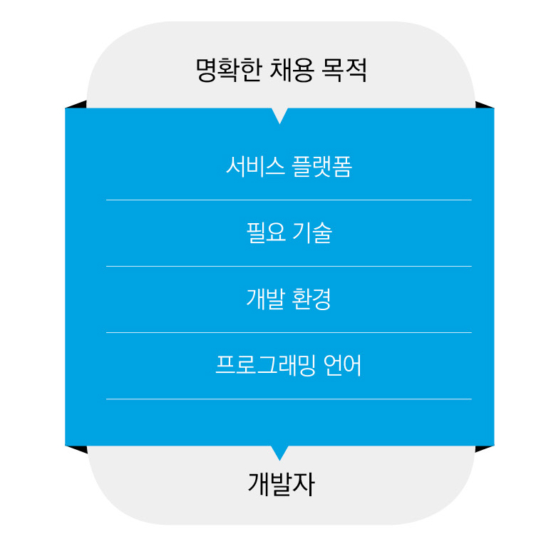
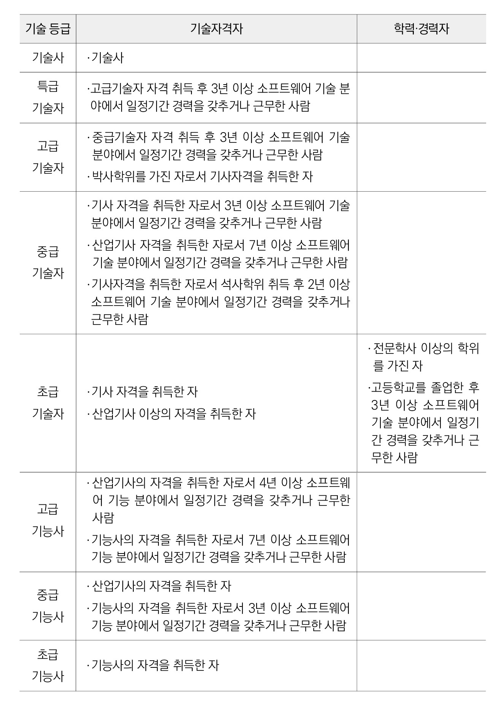
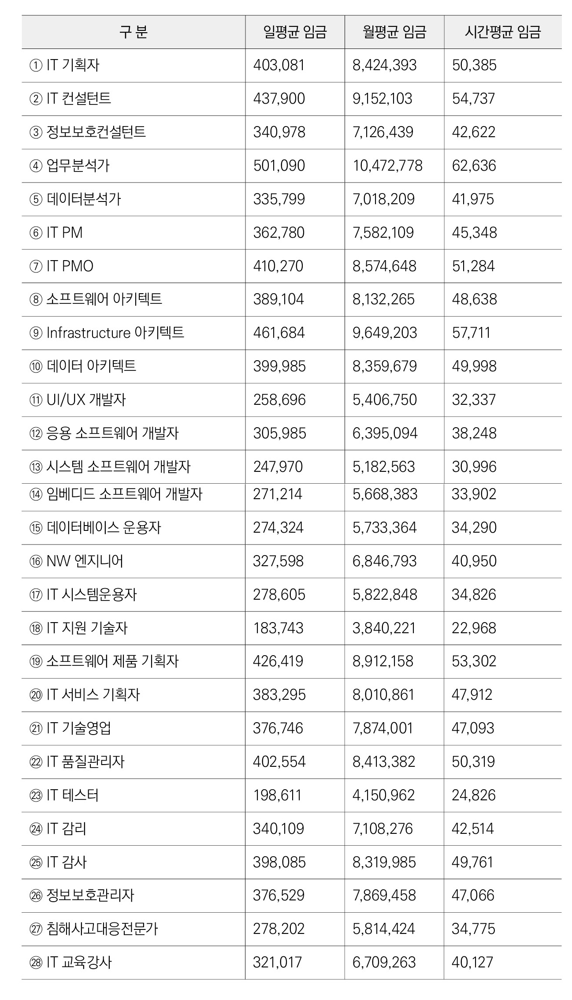

# 01 \| 채용 준비하기

지금부터는 우리 회사에 필요한 개발자를 직접 채용하는 과정에 대해 알아보자. 
 일반적으로 개발자 채용의 시작은 조직 내부의 요구로부터 시작하기 마련이다. 
 새로운 사업을 준비 혹은 추진하기 위한 인력이 필요할 수도 있고, 특정 부서의 업무량이 증가하여 이를 보완해줄 인력이 필요할 수도 있다. 
 또한, 부서 내 기존 개발자가 다른 회사로 이직 혹은 퇴직할 경우 빈자리를 메워줄 인력이 필요하기도 하다. 
 채용 목적에 따라 우리가 뽑아야 하는 개발자의 성격은 달라지기 마련이다. 
 명확한 목적 없이 이루어지는 채용은 실패할 확률이 높다. 
 그러므로 우리는 가장 먼저 ‘왜 개발자를 뽑아야 하는가? 
’라는 질문에 대답할 수 있어야 한다. 

## 채용 목적을 명확히 하라

### 채용 자체가 목적이 되어서는 안 된다

우선 우리 회사에 개발자가 왜 필요한지에 대한 구체적인 고민이 필요하다. 
 우리가 개발자를 채용하여 얻고자 하는 것은 무엇인가? 
 이 질문에 대한 대답이 필요하다. 
 단순하게 개발자 채용을 통해 디지털 전환을 해보려고, 혹은 시대에 뒤처지지 않기 위해서라고밖에 대답할 수 없다면 개발자 채용이 당장에 필요하지 않을 수도 있다. 
 단순하게 개발자가 필요하다는 생각으로 채용을 하면 실패할 확률이 높다. 
 개발자 채용을 통해 어떤 목적을 달성할 것인지 구체화하고 이에 맞게 채용하는 것이 무엇보다도 중요하다. 
 하지만 기업에서는 ‘채용’ 자체가 목적이 되는 경우가 흔히 발생한다. 
 ‘공채 시기이기 때문에 직원을 뽑는다’, ‘신규 사업에 필요할 것 같은 인력을 미리 확보해야 한다’는 목적을 갖고 채용을 진행하는 경우가 많다. 
 이럴 경우 십중팔구 우리 회사에 그다지 필요하지 않은 인력이 채용될 가능성이 크다. 
 우리가 목적하는 바와 다른 역량을 가진 개발자가 입사한다면 이들이 회사를 만족하며 다닐 수 있을까? 
 본인이 목적하는 바와 회사가 추구하는 가치가 다를 경우 다시 다른 회사로 이직을 결심하고 떠날 가능성이 매우 높다. 
 ‘우리가 개발자를 채용하는 목적은 무엇인가? 
’라는 질문에 구체적인 대답을 내놓지 못하다면 지금은 개발자를 채용할 시기가 아니다. 
 반대로 명확한 답변이 가능하다면 바로 채용을 진행할 것을 추천한다. 

### 채용을 통한 이익이 발생해야 한다

다음은 회사 비즈니스에 IT 기술 도입을 통해 얼마나 이익이 발생하는지에 대한 고려가 필요하다. 
 해당 개발자 채용을 통해 회사가 얼마나 이윤을 얻을 수 있는지 파악해야 한다. 
 기업의 입장에서는 채용을 통한 이윤이 발생하지 않는다면 굳이 진행할 필요가 없다. 
 우수한 개발자를 채용했다고 곧바로 기업 성장 및 이윤 창출과 연계되지 않을 수 있다. 
 단기적으로 봤을 때는 당연히 그럴 수 있다. 
 하지만 장기적인 관점에서는 우수한 개발자 채용이 회사의 이익에 많은 도움을 줄 것이다. 
 따라서 눈앞에 보이는 이익만을 추구하지 말고 해당 채용을 통해 얻어질 수 있는 장기적인 이익까지 고려하여 준비해야 한다. 

### 목적이 없으면 채용 후 후회한다

기업의 채용담당자나 기업 대표 중 60%는 개발자의 채용 후 후회한 적이 있다고 한다. 
 원하는 스펙의 개발자를 찾아 여러 번의 면접을 거쳐서 채용했는데도 후회하는 일은 발생한다. 
 그만큼 회사의 목적에 맞는 개발자 채용은 쉽지 않다. 
 왜 이러한 현상이 발생하는 것일까? 
 가장 큰 원인은 기업의 실무와 개발자가 잘하는 분야가 일치하지 않기 때문이다. 
 아무리 코딩과 프로젝트 경험이 많은 개발자일지라도 기업의 업무에 부합하지 않는다면 우수한 성과를 내기는 어렵다. 
 이러한 결과는 명확한 목적을 설정하지 않고 채용을 진행하거나 스펙 위주로 채용을 진행했기 때문에 나타난 부작용 중 하나다. 
 우리 회사에서 개발자 채용을 통해 무엇을 할 것인지 등의 명확한 기준을 정한 후 채용을 진행해야 한다는 얘기다. 
 그래야 기업과 개발자 모두가 만족스러운 채용이 될 수 있다. 

### 뽑을 수 있다면 한 번에 최소 두 명을 뽑는 것이 좋다

우리 회사에서 개발자를 채용할 때 몇 명을 뽑는 것이 좋을까? 
 필요한 사람이 한 명이라면 한 명만 뽑을 수도 있다. 
 스스로 일을 찾아서 할 수 있는 역량을 가진 시니어급 개발자는 한 명만 채용해도 큰 문제가 발생하지 않는다. 
 하지만 주니어급 개발자 한 명만 채용할 경우 문제가 발생할 확률이 높다. 
 주니어 개발자는 배워야 할 것이 많은 개발자다. 
 우리 회사에서 필요한 서비스를 개발하기 위해 공부만 하다가 퇴사할 확률이 높다. 
 혼자서 하는 개발은 힘들고 외로운 길이다. 
 게다가 비 IT 기업에서 대표와 다른 직원들을 이해시켜가며 성장하기란 절대 쉽지 않다. 
 개발자 채용시 한번 채용에 최소 2명 이상을 뽑으면 여러 가지 장점이 있다. 
 이렇게 2명을 채용하면 처음에는 성과가 70~80% 정도 밖에 나오지 않을 것이다. 
 하지만 바로 앞에 닥치는 문제만 바라볼 게 아니다. 
 이 두 개발자는 서로 의지할 수 있는, 친한 동료가 될 수 있다. 
 결과적으로 서로 협업하여 모두 성장할 수 있다. 
 둘 중에 한 명이 퇴사해도 남은 한 명이 일단 급한 업무는 맡아서 진행할 수 있으므로 업무 리스크를 크게 줄일 수 있는 장점도 있다. 
 사실 스타트업이나 중소기업에서 두 명을 한 번에 채용하는 게 쉬운 일은 아니다. 
 요즘엔 제대로 된 개발자 한 명만 찾아도 감사한 일이다. 
 하지만 대표가 꾸준하게 인맥 관리를 하고 다양한 노력을 한다면 어렵지 않게 두 명 이상의 유능한 개발자들을 채용할 수 있다. 
 이는 대표의 의지와 노력에 달려있다고 해도 과언이 아니다. 

### 회사의 규모 및 상황에 따라 목적을 달리 설정해야 한다

개발자 관련 채용 공고를 보면 기업의 규모도 다양하고 업무도 천차만별이다. 
 기업의 규모 및 상황에 따라서 채용의 목적을 달리 설정할 필요가 있다. 

#### ● 초기 스타트업은 제품을 빠르게 만들 사람이 필요하다

초기 단계의 스타트업이 원하는 개발자는 제품을 빠르게 만드는 역량을 가진 사람이다. 
 많은 시간을 들여 완성도가 높은 제품을 만드는 것보다 시장에서 검증이 가능한 수준의 제품을 빠르게 만드는 것이 더욱 중요하다. 
 만약 초기 단계의 스타트업에서 완성도를 중시하는 개발자를 채용한다면 어떻게 될까? 
 기업 입장에서는 빠른 시일 내에 제품 출시가 어려워질 수 있다. 
 개발자 입장에서는 품질이 낮은 결과물을 출시하는 것에 대해 불만을 가질 수 있다. 
 그러므로 기업 규모가 크지 않은 스타트업은 높은 완성도보다는 빠른 제품/서비스 개발이 가능한 개발자를 채용해야 효율적이다. 
 버그가 조금 발생하더라도 런칭이 가능한 수준의 제품/서비스를 신속하게 만드는 역량을 가진 개발자를 뽑는 것이 유리하다. 

#### ● 서비스 고도화 단계 기업은 완성도 높은 제품을 만들 사람이 필요하다

서비스 고도화 단계 기업은 시간이 조금 걸리더라도 완성도 높은 서비스를 개발하는 일이 무엇보다 중요하다. 
 빨리 제품을 만드는 개발자보다는 버그 없이 완성도가 높은 서비스를 개발할 수 있는 개발자를 뽑는 것이 유리하다. 
 만약 이 유형의 기업에서 초기 단계 스타트업에 적합한 개발자를 채용한다면 어떨까? 
 해당 유형의 개발자도 일을 잘 해낼 수 있는 역량이 있겠지만 완성도가 높지 않을 수 있으며 여러 버그가 발생할 수 있다. 
 이로 인해 고급 경력 개발자가 추가로 투입되어야 하는 상황이 발생할 수 있다. 
 따라서 이 유형의 기업에서는 높은 완성도로 제품/서비스를 개발할 수 있는 역량을 가진 개발자를 채용하는 편이 바람직하다. 
 기업의 유형에 따라 목적하는 바가 명확하게 설정이 되어야만 적합한 개발자를 채용할 수 있는 확률이 높아진다. 
 어느 기업이나 유능한 개발자를 뽑고 싶어 한다. 
 하지만 회사의 목적과 규모에 맞는 개발자 채용이 더욱 중요하다는 사실을 명심해야 한다. 
 현재 회사의 규모와 개발하려는 서비스 등을 명확히 파악한 후 채용을 시작해도 늦지 않다. 
 섣불리 뽑은 후에 후회하는 것보다는 ‘천천히 가는 것이 더욱 빨리 가는 것’이라는 격언을 되새기며 채용에 임하면 좋을 것이다. 

## 목적에 맞는 개발자 구분/채용 형태 정하기

그렇다면 위의 목적에 맞는 개발자를 채용할 때 무조건 높은 스펙과 경험을 가진 S급 혹은 A급의 경력자를 채용해야 할까? 
 아무리 경험이 많은 개발자를 채용한다고 하더라도 기업의 실제 업무에 적합하지 않다면 원하는 성과가 나오기 쉽지 않다. 
 그러므로 기업이 목적으로 하는 개발 범위를 살펴보고 무조건 고급\(S급\) 개발자가 아닌 현실적으로 해당 업무를 잘 수행할 수 있는 개발자를 뽑아야 한다. 
 회사 내 예산, 수행 업무, 업무 스타일 등 다양한 요소를 고려해서 채용해야 한다. 
 채용 목적을 명확하게 설정했다면 이제는 목적에 적합한 개발자를 구분하는 단계다. 
 구분하는 방법에는 두 가지가 있는데, 첫 번째는 분야별로 구분하는 것이고 두 번째는 등급별로 구분하는 것이다. 
 개발자를 구분하는 것은 매우 복잡하고 다양해서 명확히 정리하기 어렵지만, 이해를 돕기 위해 분야별로 간략히 구분하면 다음 그림과 같다. 

> 분야별 구분 필터

### 개발자 구분하기

#### ● 개발자 채용을 위한 필터링

* **서비스 플랫폼 형태 정하기** 우선 결과물에 해당하는 서비스 플랫폼 형태를 결정해야 한다. 
 크게 구분하자면 하드웨어 기반 서비스인지 소프트웨어 기반 서비스인지 구분해야 한다. 
 ‘실시간 창고 재고 자동 관리 서비스’를 만들기 위해서는 공장 내 자동화 로봇 등 하드웨어와 이를 제어할 수 있는 소프트웨어 모두가 필요하다. 
 하지만 ‘공공 데이터 실시간 분석 및 시각화 서비스’를 만들기 위해서는 하드웨어보다는 소프트웨어 기반의 서비스가 필요하다. 
 기업에서 목적으로 하는 사업/프로젝트가 결정되었으면 이에 맞는 서비스 플랫폼\(하드웨어/소프트웨어\)을 우선적으로 결정해야 한다. 

* **필요 기술 정하기** 다음으로 필요 기술을 정해야 한다. 
 해당 서비스의 구현을 위해서는 다양한 분야의 기술이 필요하다. 
 구체적으로 프론트 엔드, 백엔드/서버, 인공지능/빅데이터, 사물인터넷, 블록체인, 클라우드 등의 기술을 대표적으로 꼽을 수 있다. 
 최근에는 4차 산업 분야의 신기술을 학습한 인재들이 채용 시장에 많이 나오고 있다. 
 위 기술 중 회사의 목적에 맞는 서비스를 구현할 수 있는 기술을 결정해야 한다. 

* **개발 환경 정하기** 다음으로 개발 환경을 결정해야 한다. 
 이클립스\(Eclipse\), 라자루스\(Lazarus\), 비주얼 스튜디오\(Visual Studio\), 파이참\(PyCharm\) 등 실제 업무에 활용하는 개발 환경의 종류는 매우 많다. 
 그중 회사 내의 개발자들이 주로 활용하는 개발 환경이나 일반적으로 많이 사용하는 개발 환경을 우선으로 고려해 선택하는 것이 좋다. 

* **프로그래밍 언어 정하기** 마지막으로 개발에 사용할 프로그래밍 언어를 정해야 한다. 
 개발 환경의 종류만큼이나 다양한 프로그래밍 언어가 존재한다. 
 서비스 플랫폼의 유형과 필요 기술, 그리고 개발 환경에 따라 프로그래밍 언어를 선정해야 한다. 
 대표적으로 C, C++, C\#, JAVA, JavaScript, PHP, Python, Ruby, Perl 등이 있다. 
 위의 4단계를 거치면 목적에 적합한 개발자가 어떤 능력을 갖추어야 하는지 명확하게 알 수 있다. 
 위 내용이 명확하게 이해되지 않는 경우 회사 내 경력 개발자와 함께 해당 채용 목적을 명확하게 설정하는 편이 좋다. 

#### ● 개발자를 등급별로 구분하기

소프트웨어 기술자 능력을 객관화하기 위해 2008년 소프트웨어 기술자 신고제\(등급제\)가 운용되었다. 
 그러나 등급 분류 기준 및 실무 경력 산정의 불합리성 등 개발자들의 수많은 원성을 사면서 2012년 11월에 결국 폐지되었다. 
 하지만 아직 현장에서는 이러한 등급을 활용하고 있는 곳이 많다. 
 실제 현장에서는 과거의 기준과 유사하게 초급/중급/고급/특급으로 구분하여 개발자를 채용한다. 
 또한, 소프트웨어산업협회에서는 매년 소프트웨어 기술자 평균 임금을 공표하는데, 2019년까지 공표된 내용은 기존의 소프트웨어 기술자 등급을 그대로 활용하였다. 
 물론 2020년부터는 분야별로 시간/일/월 평균 임금을 공표하는 방식으로 변경되었지만, 그전까지는 등급제가 여전히 활용되었다. 
 자세한 내용은 다음의 표를 참고하길 바란다. 
 대기업/공공기관 등에서 사업을 발주할 때 어떤 역량을 가진 개발자가 몇 명 정도 필요한지 수치화를 통해 총사업비용 및 기간 등을 산정하곤 한다. 
 이때 별도의 분류 기준이 없으므로 과거에 사용하던 개발자 등급제를 기준으로 활용하는 곳이 많다. 
 회사에서 요구하는 개발 수준과 예산 등을 고려하여 필요한 개발자의 등급이 어느 정도인지 파악해야 한다. 
 해당 제도가 폐지되었다고 하지만, 아직도 공공기관 및 대기업에서 개발 용역 사업 발주시 예산 기준으로 사용되고 있다. 
 이런 등급제를 통해 우리 회사에 적합한 개발자의 유형 등을 파악할 수 있을 것이다. 

> 2019년까지 활용된 소프트웨어 기술자 등급제

> 2020년 신설된 소프트웨어 개발자 평균 임

### 채용 형태 정하기

채용을 위한 개발자를 구분하였다면 이제는 채용 형태를 정해야 한다. 
 우선 크게 구분하면 인소싱\(Insourcing\)과 아웃소싱\(Outsourcing\)으로 구분이 가능하다. 
 두 형태 모두 장단점이 분명하게 존재하므로 회사의 채용 목적에 맞는 채용 형태를 결정해야 한다. 

#### ● 인소싱\(Insourcing\) 활용하기

여러분이 고품질의 제품\(서비스\)을 만들어서 시장에 런칭하려고 한다고 가정해보자. 
 이를 개발할 수 있는 시간적인 여유와 비용도 있다고 하자. 
 이때 필요한 채용 형태는 무엇일까? 
 바로 인소싱을 이용하는 것이다. 
 인소싱은 해당 제품\(서비스\) 개발을 위해 전문인력을 구성하고, 이들을 활용하여 보다 높은 품질의 제품\(서비스\)을 만드는 것이다. 
 그렇다면 인소싱은 어떤 장점이 있을까? 
 인소싱은 아웃소싱에 비해 체계적인 품질 관리를 할 수 있다. 
 또한, 개발하는 직원들이 내부에 있으므로 회사에 대한 소속감이 높고 지속적인 의사소통이 가능하다. 
 개발팀을 이끄는 PM이 해당 분야에 대한 경험이 많다면 진행 속도 및 품질 관리는 더욱 잘 될 수 있다. 
 하지만 단점도 존재한다. 
 인소싱은 아웃소싱에 비해 더 많은 비용이 들어간다. 
 개발을 위한 여러 분야의 인력을 채용하고 관리해야 하기 때문이다. 
 한 사람의 직원\(신규 졸업자\)을 채용하여 정년까지 고용한다고 가정했을 때 발생하는 비용은 23억 4천만 원 정도라고 한다. 
 직원 채용은 보험, 복지 등 챙겨야 할 것들이 많으므로 적지 않은 비용이 든다. 
 또한, 내부 인력 간에 마찰이 생길 수 있으며 예상했던 것보다 일정이 지연될 수도 있다. 
 그러므로 이에 대한 지속적인 조율과 관리가 필요하다. 
 인소싱은 서비스 개발을 위한 시간과 비용에 여유가 있을 때 추천한다. 
 아웃소싱보다 훨씬 높은 품질의 결과물과 사후 서비스가 가능하다. 

#### ● 아웃소싱\(Outsourcing\) 활용하기

여러분이 스타트업을 창업하려고 한다. 
 창업 아이디어는 좋은데 개발할 수 있는 시간과 역량이 부족한 경우에는 어떤 선택을 해야 할까? 
 이때 필요한 채용 형태가 아웃소싱이다. 
 작은 규모의 스타트업이 전문 개발 인력을 보유하고, 서비스 전체를 개발하는 일은 쉽지 않다. 
 만약 ‘애완견 관리 애플리케이션’을 만든다고 해보자. 
 이 앱 하나를 제작하기 위해서는 서버 개발자, 앱 개발자, 디자이너 등 여러 명의 관련 인력이 필요하다. 
 하지만 신생 기업에서 이런 인력을 전부 뽑기는 쉽지 않다. 
 물론 이런 작업을 모두 담당할 수 있는 인력도 존재하나 이런 개발자를 찾기는 더 어렵다. 
 따라서 이런 유형의 스타트업에서는 아웃소싱을 선택하는 게 좋은 선택일 수 있다. 
 아웃소싱을 활용하면 어떤 장점이 있을까? 
 가장 큰 장점은 비용 절감이다. 
 또한, 완성에 대한 리스크와 시간도 절약할 수 있다. 
 인소싱의 경우, 우수한 개발자라 믿고 채용했는데 기대보다 역량이 부족할 수 있다. 
 또한, 협업이 쉽지 않은 성향일 수도 있다. 
 원하는 기간에 제품을 만들지 못하는 경우도 있다. 
 인소싱이 아닌 아웃소싱을 채택하면 이런 리스크를 현저히 낮출 수 있다. 
 아웃소싱 전문업체는 우리 회사보다 훨씬 많은 경험이 있으므로 원하는 서비스\(제품\)를 쉽고 빠르게 만들 수 있다. 
 그렇다고 좋은 점만 있는 것은 아니다. 
 우리가 기대했던 품질에 못 미치는 결과가 나올 수 있다. 
 또한, 아웃소싱 특성상 개발팀과의 소통이 어렵다. 
 해당 업무를 하는 팀이 외부에 있어 개선사항을 전달하기가 쉽지 않기 때문이다. 
 이런 문제가 발생하지 않도록 사전에 명확한 기준을 전달하고 이에 맞는 개발이 진행되는지를 지속해서 파악할 필요가 있다. 

## 채용담당자 정하기

개발자 채용 공고를 내야 하는 단계에서 개발자와 채용담당자는 어떠한 역할을 하면 좋을까? 
 제일 좋은 방법은 채용담당자가 개발 관련 지식을 알고 채용을 진행하는 것이다. 
 그러나 일반적으로 개발을 잘 이해하고 있는 채용담당자는 흔하지 않다. 
 이로 인해 개발 경험이 전혀 없는 담당자가 개발자를 뽑는 아이러니한 상황이 많은 기업에서 벌어지고 있다. 
 이러한 문제를 어떻게 해결하면 좋을까? 
 채용담당자에게 개발과 관련된 교육을 시키는 것이 제일 효율적이다. 
 개발자가 채용담당자의 업무를 할 수 있도록 직무를 바꿔주는 것도 좋은 방법이다. 
 하지만 어렵게 뽑은 개발자를 채용담당자로 바꾸는 일은 쉽지 않은 결정이다. 
 또한, 개발자는 생소한 인사 업무를 진행하기 위해 시간을 들여 공부해야 할 수도 있다. 

개발을 잘 모르는 상태에서 채용을 진행하면 어떤 일이 벌어질까? 
 채용 공고를 내는 것조차 어려워질 수 있다. 
 ‘프로그래밍 잘하는 직원을 뽑습니다’라고 공고를 낼 수는 없지 않은가. 
 구체적으로 공고를 내야만 좋은 개발자를 채용할 수 있는 확률이 높아진다. 
 다음 문제는 스크리닝\(Screening\) 단계에서 발생한다. 
 어떤 경력과 기술을 가진 개발자를 뽑아야 하는지, 이력서에 있는 내용은 무엇인지, 
 우리 회사에서 진행하는 업무와 유사한 프로젝트를 진행한 지원자는 누구인지 등을 기술적으로 알지 못하면 이력서에 쓴 내용을 이해하는 데 많은 어려움이 생긴다. 
 어떤 개발자가 이력서에 ‘나는 안드로이드 앱을 만들 수 있다’, ‘Java와 Kotlin은 다뤄본 적이 없다’고 썼다면 그의 실력을 의심할 수 있다. 
 안드로이드 앱은 Java와 Kotlin을 활용하여 개발하기 때문이다. 
 하지만 기술적인 내용을 모르면 해당 지원자를 무사통과시킬 수도 있다. 

이렇게 채용이 진행되어 해당 지원자를 뽑았다고 생각해보자. 
 저 정도 역량을 가진 지원자가 개발 업무를 잘 수행할 수 있다고 생각하는가? 
 맡기는 프로젝트마다 모두 엉망진창이 될 것이다. 
 결과적으로 다른 개발자가 투입되어 마무리해야 하는 순간이 발생할 수 있다. 

개발자 채용은 한두 명의 직원이 할 수 있는 업무가 아니라 협업을 통해 진행해야 하는 업무다. 
 여러 분야의 직원 간 협업을 통해야만 효율적인 채용 절차가 진행된다. 
 회사 내 직원들은 각자의 전문 분야를 활용해야 하고 정해진 역할도 다르다. 

### 임원진\(경영진\)도 개발 및 IT 분야에 대해 알아야 한다

최근 매출 500억 정도 되는 쇼핑몰에서 개발자를 뽑지 못했다고 한다. 
 그 이유는 무엇일까? 
 쇼핑몰 대표가 IT 관련 지식이 없고 이로 인해 개발자가 회사에 크게 필요하지 않은 직군이라고 생각했기 때문이다. 
 또한, 이를 설득할 수 있는 IT 지식을 가진 경영진도 없었다. 
 그 결과 유능한 개발자 영입에 실패했고 좋은 서비스와 제품을 만들 기회를 놓쳐버렸다. 
 일반적인 IT 기업은 대표나 경영진이 관련 지식을 알고 있는 경우가 많으나, 비 IT 기업은 그렇지 못한 경우가 많다. 
 이러한 비 IT 기업에서 좋은 개발자를 뽑으려면 이들이 회사에서 다양한 의견을 제시할 때 들어줄 수 있는 환경이 되어야 한다. 
 개발자 입장에서는 개발팀도 꾸려지지 않은 비 IT 기업에 오는 것이 모험일 수 있다. 
 따라서 이들이 회사에 와서 구체적으로 어떤 성장을 할 수 있고 회사의 어떤 부분에 기여할 수 있는지를 설명해줄 수 있어야 한다. 
 즉, 비 IT 기업 내 주요 임원진 중 신뢰할 수 있는 사람이 개발 기술 혹은 최신 IT 기술을 배우는 것이 좋다. 
 회사 내 의사결정권을 가진 임원진이 IT 기술을 배우면 어떤 점이 좋을까? 
 우선 개발자를 뽑는 안목이 높아질 것이며, 이들을 적재적소에 배치하여 적극적으로 활용할 수 있을 것이다. 
 또한, 채용담당자나 개발자의 의견을 모두 청취한 후 회사의 전반적인 관점에서 판단과 결정을 내릴 수도 있을 것이다. 
 모든 임원진이 이러한 기술을 배우라는 것은 아니다. 
 비교적 IT 분야에 해박한 임원진 중 한 명이 학습하여 관련 지식과 경험을 축적하면 우리 회사에 좋은 개발자를 뽑을 기회가 늘어날 것이다. 

### 채용담당자\(인사팀\)는 전체 전략 수립을 담당한다

채용담당자는 개발자 채용을 위해 다양한 전략을 수립해야 한다. 
 채용담당자는 외부의 다양한 요인을 파악하고 이에 따른 내부 자원 활용 방법 등에 대한 구체적 이해가 필요하다. 
 이를 위해 최신 기술 트렌드나 관련 내용을 어느 정도 숙지할 필요가 있다. 
 물론 채용담당자가 개발자만 채용하는 것은 아니므로 모든 내용에 대한 이해가 쉽지 않을 수 있다. 
 이럴 때 개발팀의 전문가와 협력하면 채용 전략 수립에 많은 도움을 받을 수 있다. 
 또한, 기업 전반의 경영 전략을 이해하고 이를 기반으로 한 인사 전략을 수립하는 노력도 필요하다. 
 우리 기업이 목표하는 서비스는 무엇인지? 
 이를 개발하기 위해 어떤 수준의 개발자가 필요한지? 
 등에 대해서 고민해야 한다. 
 이를 기반으로 인사 전략을 수립하면 채용에 많은 도움이 될 것이다. 
 채용담당자는 지원자에게 회사에 대한 긍정적인 이미지를 심어주는 역할도 해야 한다. 
 이들이 회사의 진심을 느낄 수 있도록 마음이 담긴 상호작용을 해야 한다. 
 채용 공고부터 채용 확정까지, 모든 과정을 신속하게 진행하고 지원자들에게 면접 결과 등에 대한 빠른 피드백을 제공해야 한다. 

### CTO/개발팀장/시니어 개발자는 실력자를 파악한다

이들은 채용에 결정적인 역할을 하는 사람들이다. 
 지원자들이 실제로 충분한 개발 실력과 경험을 보유하고 있는지를 판단해 줄 수 있다. 
 이력서를 검토해 자격과 코딩 스킬이 부족한 개발자들을 1차적으로 걸러주는 역할을 한다. 
 이들은 인터뷰에서도 큰 역할을 한다. 
 핵심적인 기술 분야 질문을 통해 지원자가 해당 역량을 실제로 가졌는지를 판단한다. 
 과거의 프로젝트 수행 시에 어떤 역할을 했는지도 파악할 수 있다. 
 우리 회사에 필요한 기술을 가장 정확하게 아는 사람은 시니어 개발자다. 
 이들을 통해 지원자의 개발 실력을 적극적으로 검증하는 편이 좋다. 
 또한, 이들은 수십 년간의 경력을 가지고 있으므로 관련 분야의 인맥이 풍부하다. 
 따라서 지원자를 최종 선발하기 전 레퍼런스 체크를 담당하여 진행할 수도 있다. 
 여기서 잊지 말아야 할 것이 있다. 
 채용 시기에는 해당 인력들의 다른 업무를 최대한 줄이고 채용에만 집중할 수 있는 환경을 만들어줘야 한다. 
 그래야 효율적이고 양질의 채용을 수행할 수 있을 것이다. 

## 채용 채널의 다양화

요즘 기업들은 개발자 채용이 정말 어렵다고 말한다. 
 주변을 보면 유능한 개발자들이 많이 있는데 왜 개발자를 채용하는 일이 이렇게 힘들까? 
 우리가 뽑고자 하는 개발자들은 어디에 있는 것일까? 
 그 이유를 알아보자. 

### 개발자는 적극적으로 구직활동을 하지 않는 경우가 많다

스택 오버플로\(Stack Overflow\)는 컴퓨터 프로그래밍과 관련된 여러 주제에 대한 질문과 답변을 할 수 있도록 제작된 웹사이트이다. 
 이 사이트에서 전 세계 개발자 10만 명을 대상으로 구직활동에 대한 설문 조사를 진행했다. 
 설문의 응답자 중 16%만이 구직활동을 적극적으로 하고 있다고 답했다. 
 반면 응답자의 23%는 새로운 구직활동에 큰 관심을 보이지 않는 것으로 나타났다. 
 또한, 응답자의 62%는 구직활동을 하지는 않지만 지금의 직장보다 좋은 조건이 보장되는 제안이 온다면 이직할 의사가 있다고 답변하였다. 
 해당 설문 결과만 살펴보아도 우리가 원하는 개발자들을 찾기 힘든 이유를 알 수 있다. 
 그렇다면 우리는 위에서 언급한 ‘적극적 구직활동을 하는 개발자\(16%\)’와 ‘좋은 조건이 있다면 이직을 할 의사가 있는 개발자\(62%\)’에게 좋은 개발자를 찾고 있다는 것을 알려야 하지 않을까? 
 이를 효과적으로 알리는 방법에는 어떠한 것들이 있을까? 

### 채용 채널은 최대한 다양한 방법을 활용한다

앞 장에서 언급한 것처럼 개발자들에게 우리 회사의 채용을 알리기 위해 다양한 채널을 활용해야 한다. 
 앞서 다룬 내용이므로 간략하게만 소개한다. 
 회사 내부에서 직접 채용하는 경우 소셜 미디어, 구인/구직 포털, 세미나/콘퍼런스/박람회, 개발자 커뮤니티 등을 통한 홍보를 진행할 수 있으며, 사내 직원 추천제도를 활용하기도 한다. 
 외부 업체에 채용을 의뢰하는 경우에는 헤드헌팅 업체에 채용을 의뢰하는 방법, 소프트웨어 분야 HR 기업에 채용을 의뢰하는 방법 등이 있다. 
 여기에서 요점은 한두 가지 채널에만 한정하면 안 된다는 점이다. 
 최대한 많은 채널을 통해 유능한 개발자가 우리 회사의 채용에 관심을 가지고 지원할 수 있는 기반을 마련해야 한다. 
 번거롭다는 이유로 이를 게을리한다면 좋은 개발자는 다른 회사로 가버릴 수 있다. 

