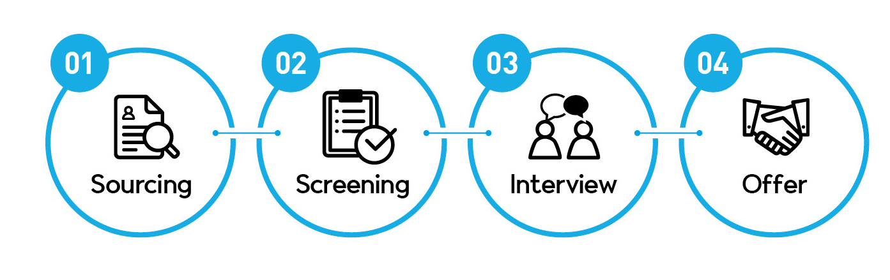
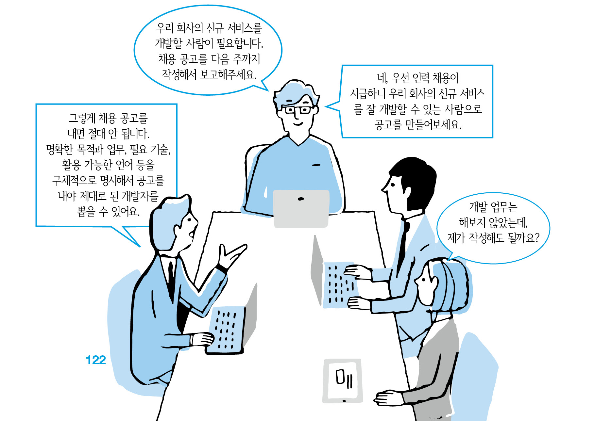

# 02 \| 채용 실행하기

## Sourcing

### 채용 공고는 명확히 하라

미혼 남녀가 결혼 정보 회사를 이용할 때 어떤 방법을 통해야 좋은 상대를 만날 수 있을까? A양은 “저는 젊고 연봉이 높으며 사회성이 좋은 분을 만나고 싶어요”라고 의뢰했다. B양은 “저는 대기업에 근무하는 OO세 정도의 나이에 연봉 수준은 O천만 원 이상이고, 동아리 활동을 1개 이상 하는 남성분을 만나고 싶어요.”라고 의뢰했다. 여러분이 결혼 정보 회사 직원이라면 누구의 요청을 더 잘 들어줄 수 있을까? 당연히 후자가 명확한 조건을 제시했기 때문에 원하는 상대를 만날 확률이 높다. 채용도 이와 마찬가지이다. 미래를 함께할 배우자를 선택하는 게 중요한 것처럼 개발자를 채용하는 일도 배우자를 고르는 것 이상으로 중요하다. 기업에게 있어 채용은 결혼과도 같다. 배우자를 잘못 만나면 평생을 고생하듯이 개발자를 잘못 뽑으면 골머리를 썩게 된다. 그렇다면 개발자 채용의 시작은 어떻게 해야 할까? 우선은 우리 회사에서 개발자를 채용하는 것을 알려야 하므로 명확한 채용 공고부터 만들어야 한다. 여기서 강조할 것은 ‘명확한’ 채용 공고라는 점이다. 막연하게 올린 채용 공고는 그만큼 좋은 개발자를 채용할 확률을 떨어뜨린다. 대부분의 채용 공고에 해당하는 내용이겠지만 특히 개발자 채용에서는 명확한 내용의 직무 기술서\(Job Description, 이하 JD\)를 올리는 것이 좋다. 명확한 JD는 다수의 지원자 및 높은 스펙의 지원자를 확보할 수 있는 가장 큰 무기이고, 직무 연관도가 낮은 지원자들이 불필요하게 지원하는 것도 방지할 수 있는 최소한의 안전장치다. 명확한 JD를 작성하는 요령을 자세히 소개한다.

#### ● 누가 쓰면 좋은가?

JD 작성을 할 때 어디부터 시작해야 할지 막막한 경우가 많다. JD 작성은 반드시 해당 업무를 가장 잘 알고 있는 사람\(개발자\)에게 도움을 받아야 한다. 회사에 HR팀이 있다면 해당 팀과 개발자들이 협업하여 작성하게 하면 금상첨화다. 만약에 HR팀에게 JD 작성을 모두 맡긴다면 해당 직원들은 개발 관련 지식이 없는 경우가 많으므로 좋은 JD가 나올 수 없다.

#### ● 어떤 내용을 써야 하나?

추상적인 업무를 기술하는 것이 아니라 실제 해야 할 업무를 구체적으로 작성하는 것이 좋다. JD에 반드시 들어가야 하는 항목들은 아래와 같다.

* **제목:** 회사에서 요구하는 기술과 경험을 한 문장으로 설명할 수 있으면 좋다. 
* **회사 소개:** 우리 회사가 추구하는 가치와 기업 문화를 상세히 소개한다. 회사의 성장과 개인의 발전이 연계되는 회사, 협업과 소통이 활발한 회사, 젊은 에너지가 넘치는 회사, 다양한 의견을 포용할 수 있는 회사 등과 같은 여러 장점을 강조해야 한다. 또한, 해당 직무를 통해 기대할 수 있는 개인적인 발전 요소, 전망, 진로 등을 명시한다. 
* **고용 기간 및 고용 형태:** 정규직, 계약직과 같이 명확한 고용 형태를 명시할 필요가 있다. 계약직 모집 시에는 고용 기간을 함께 기재한다. 
* **담당 업무:** 업무의 배경은 상세하게, 담당 업무는 명확하게 기술해야 한다. 어느 부서에서 어떤 개발 업무를 담당할지 최대한 구체적으로 작성하는 것이 좋다. 해당 업무가 기존 사업을 개선하는 작업인지, 신규 사업을 위한 것인지, 특정 플랫폼 혹은 모듈 제작인지 등을 구체적으로 명시하는 것이 좋다. ‘신규 고객 서비스 개발 및 대응 업무’라는 추상적 표현보다는 ‘머신러닝 알고리즘을 활용한 자사 콘텐츠 추천 서비스 개발 및 알고리즘 개선 업무’라는 구체적 표현을 활용할 필요가 있다. 
* **필요 기술\(자격 요건\):** 서비스 플랫폼\(하드웨어/소프트웨어\), 필요 기술\(인공지능, 빅데이터, 사물인터넷\), 개발 환경\(이클립스, 파이참\), 활용 가능한 언어\(Java, JavaScript, HTML, CSS\) 등 최대한 구체적으로 기술해주는 것이 필요하다. ‘웹서비스 개발을 잘하는 사람’이라는 추상적 표현보다는 ‘HTML/PHP/JavaScript를 활용한 웹 개발 업무 경험을 3년 이상 보유한 사람’이라는 구체적 표현을 활용하는 것이 좋다. 해당 부분을 작성할 때는 최소한 현재 해당 업무를 담당하고 있는 개발자의 리뷰를 받을 필요가 있으며, 가급적 이들과 협업하여 작성하는 것이 좋다. 기술의 빠른 변화 탓에 채용담당자가 해당 내용을 정확하게 인지하지 못하는 경우도 많기 때문이다. 
* **근무지:** 근무지의 위치는 이직을 결정하는 가장 중요한 요소다. 따라서 근무지의 정확한 위치와 근무 형태\(예: 주 1회 재택 근무, 주 4회 근무\)를 소개한다. 
* **연봉 및 보상 체계:** 지원자들이 가장 중요하게 생각하는 요소인 연봉 수준을 대략적으로 명시하는 것이 좋다\(예: 개발자 최저 연봉 6천만 원\). 또한, 다양한 보상 체계가 있음을 명시하라\(예: 성과급, 명절 상여금\). 
* **복지:** 업무에 필요한 도서 구매 지원, 세미나 및 교육 참가비 지원, 개인 사무실 제공, 식사 및 간식 제공, 통근 버스 제공, 건강 검진 지원, 학비 지원, 자율 출퇴근 등 회사에서 제공하는 복지 내용은 상세하게 기술할 필요가 있다. 생각보다 많은 개발자들이 이러한 환경을 중시한다. 
* **우대 사항:** 다양한 프로젝트 경험, 특정 개발 언어 사용 경험, 오픈 소스 contribution 경험, 특징 직무 관련 경험, 수상 경험 등의 다양한 우대 사항을 명시한다.

#### ● JD 작성 팁

JD만 매력적으로 기술해도 회사에 적합한 개발자를 충분히 뽑을 수 있다. 이 과정이 너무 번거롭고 힘든 과정인 것을 알고 있다. 하지만 JD를 잘못 작성하면 우수한 개발자를 모시는 일은 힘들다고 보면 된다. 좋은 JD 작성을 위한 팁 몇 가지를 소개한다.

첫째, 우리 회사 개발 조직의 모든 정보를 투명하게 공개해야 한다. 앞서 기술한 모든 요소가 다 들어가야 하며 내용은 상세하게 기술할수록 좋다. 요소별로 제목 정도만 쓰는 것이 아닌 부연 설명이 충분하게 담겨야 한다. ‘Frontend와 Backend 개발자 각 1명을 채용하며 이들 간의 협업 능력 중요’라고 기술하는 것보다는 ‘Frontend와 Backend 개발자 각 1명을 채용합니다. 개발팀 내에서는 Frontend와 Backend 개발자를 크게 구분하지 않습니다. 프로젝트가 발생하면 세부 주제를 나누어 선호하는 부분을 각자 맡아서 개발을 진행합니다. 개발이 완료되면 코드 리뷰 시간을 가지므로 서로 성장할 수 있는 분위기가 형성됩니다’와 같이 아주 구체적으로 적는 것이 우리 회사에 맞는 개발자를 뽑는 지름길이다.

둘째, JD만으로 우리 회사의 색깔이 묻어날 수 있도록 작성하라. 회사 이름이 비어있는 상태에서 JD를 읽어도 ‘이 회사는 OO이구나’라고 알 수 있도록 작성해야 한다. 다른 회사의 JD를 참고하는 것은 좋지만 그대로 갖다 쓰는 것은 바람직하지 못하다. 우리 회사만의 문화, 분위기, 개발 환경 등을 구체적으로 반영하여 JD 하나만으로 회사를 느낄 수 있도록 만들자. OO은행의 ‘빅데이터 처리’ 업무 JD를 쓴다고 가정해보자. 단순하게 ‘빅데이터 처리’라고 하면 어떤 업무인지 전혀 감이 오지 않는다. 하지만 여기에 ‘OO은행에서는 고객의 송금 및 입출금 데이터를 기반으로 은행 서비스의 위험도를 감지하여 금융 사고를 방지하고 있습니다. 따라서 실시간 고객 금융 빅데이터를 분산 방식을 통해 처리하여 금융 서비스의 품질 향상에 도움을 주실 개발자를 찾고 있습니다’라고 표현하면 은행 업무 및 서비스에 대한 색깔이 묻어난다. 이렇게 만들면 회사에 적합한 개발자가 지원할 수 있도록 도움을 줄 수 있다. 또한, 우리 회사에 대해 구체적으로 알리는 방법이기도 하다.

셋째, 개발자 집단에 대해 이해하고 JD를 작성하라. 개발자 집단은 일반 직장인과는 다른 그룹이다. 앞에서도 소개했지만 개발자의 문화 및 최근 트렌드 등을 명확하게 읽고 JD를 작성하는 것이 좋다. 수년 전에 활용했던 JD는 이미 시대에 뒤처졌다. 따라서 최근 개발자 채용 트렌드를 읽고 이에 맞춘 JD가 필요하다. 자세한 내용은 ‘개발자, 당신은 누구인가?’ 부분을 참고하면 이해가 쉬울 것이다.

### 좋은 개발자는 내부 직원이 더 잘 알고 있다

채용 공고를 통해 우수한 개발자를 바로 채용하면 좋겠지만 현실적으로 쉽지 않은 경우가 많다. 이때 활용할 수 있는 좋은 방법은 내부 직원 추천제이다. 사내 직원의 주변에서 우수한 개발 인력을 찾아 추천받는 채용 방법이다. 손꼽히는 해외 IT 기업들은 직원 추천제를 적극적으로 활용한다. 심지어는 직원 추천을 통해야만 제대로 된 면접을 볼 수 있다고 한다. 그렇다면 직원 추천제를 활용하면 어떠한 장점이 있을까?

째, 가장 큰 장점은 채용을 위한 소요 기간이 획기적으로 단축된다는 점이다. 외부 연구 결과에 따르면 직원 추천제를 통해 입사하는 직원들의 평균 채용 기간은 29일 정도지만, 자사의 채용 사이트를 통해 입사하는 직원들의 평균 채용 기간은 39일이 걸리는 것으로 알려졌다.

둘째, 비용 효율성 측면에서 우수하다. 외부 HR 회사를 활용하게 되면 적지 않은 수수료를 지불해야 한다. 반면에 채용 성과로 임직원에게 지급하는 보너스는 수수료에 비하면 낮은 편이다.

셋째, 회사에 대한 정보를 충분히 알고 입사할 수 있다. 최근 자료에 따르면 신입사원 3명 중 1명이 입사 1년 이내에 조기 퇴사를 하는 것으로 조사되었다. 퇴사 사유를 보면 ‘직무가 적성에 맞지 않아서’라고 답한 사람이 절반 이상\(51.4%\)을 차지한다. 사전에 입사할 기업에 대한 정보를 충분히 얻는다면 퇴사 확률은 현저하게 낮아진다. 개발자에 대한 처우를 어떻게 하는지, 회사 분위기는 어떤지, 복지는 괜찮은지 등의 정보를 직원을 통해 미리 알고 들어오기 때문에 공채로 뽑은 개발자보다 이직이나 퇴사 확률이 낮아진다.

넷째, 회사 적응을 빠르게 할 수 있다. 신규 혹은 경력 개발자로 입사할 경우 회사 분위기나 문화에 적응하는데 생각보다 많은 시간이 걸릴 수 있다. 개발자들의 성향에 따라 이 기간은 더 길어질 수도 있다. 이런 문제로 회사에서는 입사자가 수월하게 적응할 수 있도록 멘토링 등의 제도를 운용하기도 한다. 직원 추천제로 입사할 경우 추천한 직원이 입사자가 잘 적응할 수 있도록 도움을 주는 멘토 역할을 수행할 수 있다는 장점이 있다. 직원 추천제가 빛을 발하려면 어떻게 해야 할까? 정답은 회사 내부에 있다. 즉, 내부 직원을 잘 관리하고 아껴야 한다. 직원 본인이 회사에 만족해야 적극적으로 추천할 수 있기 때문이다. 대우가 나쁘고 분위기가 엉망인 회사라고 느낀다면 지인에게 입사를 추천할 수 있을까? 그럴 확률은 거의 없다고 보면 된다. 그러므로 회사의 소중한 자원인 개발자들이 만족할만한 개발 환경, 복지제도, 사내 분위기 등을 만들 수 있도록 노력해야 한다.

### 헤드헌팅\(서치펌\)을 적극적으로 활용하라

기업 대표가 좋은 개발자를 Sourcing하기 위해 발로 뛰면 좋겠지만 쉽지 않은 것이 현실이다. 이러한 어려움을 해결할 수 있는 곳이 헤드헌팅 업체와 서치펌이다. 헤드헌팅 업체에 원하는 스펙의 개발자 정보를 전달하고 이에 맞는 채용을 의뢰할 수 있다. 다만 헤드헌팅 업체는 이 분야에 대한 전문성이 비교적 낮아 유능한 인재를 걸러내기가 쉽지 않을 수 있다. 다음으로 서치펌에 채용을 의뢰할 수 있다. 이 기업들은 소프트웨어 개발 분야에 대한 전문성을 가지고 있으므로 보다 전문적인 채용 업무를 수행할 수 있다. 관련 인맥 등 다양한 요소에서 우위를 선점하고 있어 개발자 채용 시에 유용하게 활용할 수 있다. 또한, 서치펌을 통해 채용 인력에 대한 전문가들의 검증 절차를 거칠 수 있다는 장점도 있다. 서치펌을 이용하면 좋은 개발자를 채용하기 위한 기회비용도 절약할 수 있다. 물론 서치펌에 지불하는 수수료가 있겠지만 우수한 인재의 영입으로 회사에 발생할 이익을 생각하면 전혀 큰 비용은 아니라고 생각한다. 물론 모든 서치펌이 이런 업무를 잘할 수 있는 것은 아니다. 개발자 채용에 전문성과 충분한 이력을 가진 업체를 선정해야 한다. Tech HR을 전문적으로 하는 서치펌을 잘 선정해야 하며 전문적인 검증 없이 이력서만 전달하는 업체는 피해야 한다. 서치펌을 활용하기로 했으면 적극적으로 컨설팅을 받을 필요가 있다. 즉, 우리 회사가 어떤 인재를 뽑으려고 하는지 최대한 자세하게 설명하는 것이 좋다, 서치펌은 구직자와 구인회사의 모든 접점을 가지고 있기 때문에 상세한 설명을 기반으로 최대한 적합한 인재를 선별해 줄 것이다.

## Screening

명확한 목적을 가진 채용 공고 또는 직원 추천 등의 방법을 통해 지원자들을 모았다면 더욱 중요한 단계가 기다리고 있다. 바로 뛰어난 개발자들을 고르는\(Screening\) 단계이다. 우리는 대면 면접으로 지원자를 심사숙고하여 골라내야 한다. 이 단계가 빠르게 종료될수록 채용에 소모되는 시간을 단축할 수 있다. 우수한 지원자만을 제대로 골라 면접 단계로 간다면 자격이 부족한 개발자를 대상으로 인터뷰하는데 쏟는 시간을 줄일 수 있다.

### 이력서를 통해 기초적인 정보를 파악하자

많은 이력서를 검토하다 보면 이 지원자가 우리 회사에 대해 얼마나 잘 이해하고 지원서를 작성했는지 빠른 파악이 가능하다. 훌륭한 지원자들은 기업에 대해 다양한 조사 및 철저한 분석을 통해 이력서를 쓴다. 경험이 풍부한 채용담당자들은 이력서 몇 줄만으로도 이를 파악할 수 있다. 때문에 이력서 검토에 많은 시간과 노력을 쏟아야 하며 이를 효율적으로 수행할 수 있는 인력이 필요하다. 사내에 많은 경험을 가진 인사담당자와 개발자가 없다면 차라리 외부의 전문가 혹은 HR 전문업체에 의뢰하는 편이 낫다. 비용을 이유로 전문성과 경험이 없는 내부 인력만을 고집한다면 오히려 잃는 것이 더 많다. 그럼 이력서는 어떻게 검토하면 좋을까? 먼저 채용 직무 기술서를 통해 공고했던 자격과 기술을 꼼꼼하게 찾아내야 한다. 지원자 중 우리 회사에서 필요로 하는 기술을 보유한 개발자를 잘 골라내야 한다. 이 과정에서 꼼꼼하게 확인하지 않아 인재를 놓친다면 이보다 더 안타까운 일은 없다. 정규직 채용이라면 이직률도 고려해야 한다. 지원자가 현 직장\(혹은 이전 직장\)에서 어떤 업무를 수행했으며 이직을 원하는 구체적인 사유도 파악해야 한다. 우리 회사로 이직한다는 것은 반대로 말하면 얼마 지나지 않아 다른 회사로 이직할 수 있는 확률도 있다는 얘기다. 현 직장\(혹은 이전 직장\)의 근무 경력이 짧다면 이직의 구체적인 이유를 알아내야 한다. 현 직장에서 습득한 기술이 무엇인지, 어떤 프로젝트에 참여했고 맡은 임무는 무엇이었는지 등의 정보를 구체적으로 파악하는 편이 좋다. 다양한 직무 관련 경험을 파악하는 일도 중요하다. 만약에 우리 회사에서 진행하려는 프로젝트와 유사한 프로젝트를 진행한 경험이 있다면 금상첨화이다. 하지만 비슷한 프로젝트라도 세부적인 내용은 다를 수 있다. 그러므로 해당 프로젝트에서 어떤 기술을 활용하여 어떤 업무를 진행했는지, 그리고 어떤 임무를 수행했는지를 구체적으로 파악하는 것이 중요하다. 꼭 필요한 일만 했는지, 아니면 다양한 분야의 경험을 쌓기 위해서 노력했는지를 파악하는 것도 중요하다. 학교나 회사에서 반드시 해야 하는 일 위주로 프로젝트 경험을 쌓은 지원자들이 있는가 하면 스스로 재미를 느끼거나 취미로 프로젝트를 수행한 지원자들도 있다. 정말 열정적인 지원자들은 이러한 경험을 다수 보유하고 있는 경우가 많다. 단, 이런 지원자라도 해당 경험의 진실성에 대해서 깊이 있게 검토할 필요가 있다. 이력서를 화려하게 꾸미기 위해 다수의 프로젝트를 문어발식으로 만들 수도 있기 때문이다.

### 개발자의 기술 검증하기\(코드 리뷰/코딩 테스트\)

최근 개발자 채용에서는 면접 전 코딩 테스트가 필수 요소로 자리 잡는 추세이다. 국내외 IT 기업인 구글, 네이버, 카카오 등은 개발자를 채용할 때 필수적으로 코딩 테스트를 실시한다. 개발자들은 테스트에 응시하여 일정 점수 이상을 획득해야만 취업할 기회가 주어진다. 심지어는 스펙을 보지 않고 코딩 테스트와 면접만으로 채용하기도 한다. 그만큼 실력을 객관적으로 검증할 수 있는 코딩 테스트가 중요하다는 의미로 해석된다. 개발자 채용 시에 코딩 테스트를 하지 않는 것은 정말 위험한 일이다. 실력이 부족한 개발자가 입사해 바로 성과가 나와야 하는 프로젝트를 제시간에 마치지 못하거나 완성도가 낮은 결과물을 냈을 때의 피해는 상상할 수 없을 정도로 크다.

#### ● 코딩 테스트, 어떻게 할 것인가?

코딩 테스트를 할 때 명심할 점이 있다. 만약 A라는 기술이 필요하면 해당 기술에 대한 검증만 진행하는 것이 좋다. 즉, 검증이 필요한 영역만을 한정하여 테스트하고 불필요한 것을 테스트하는 데 시간을 낭비하지 말아라.

코딩 테스트는 어떻게 준비해야 할까? 회사에 따라서 조금씩 다르겠지만 공통으로 뽑아낼 수 있는 3가지 단계가 있다. 첫째, 우리 회사에서 하는 일 또는 채용의 목적을 명확히 분석하라. 코딩을 통해 어떤 문제 혹은 프로젝트를 해결할 것인지, 버그 픽스 혹은 유지보수를 할 것인지 등의 목적을 찾아내야 한다. 둘째, 이것을 기반으로 대표 케이스를 뽑아낸다. 실제 업무에서는 개발이 아니라 개발된 내용을 수정하는 일이 더 많을 수 있다. 이를 위한 방법의 하나로 회사 내 버그 중 하나를 샘플링해서 풀게 하는 것도 좋은 시험이다. 셋째, 이러한 대표 케이스를 활용하여 사내에서 테스트를 진행한다. 회사 내 뛰어난 개발자와 평범한 개발자를 몇 명 뽑아서 대표 케이스 문제를 풀도록 하고 결과를 확인한다. 해당 문제를 푸는 과정에서 질문이 많이 발생하는 부분은 실제 채용 시 수정하여 진행한다. 수정하지 않고 이 부분을 면접에서 활용하는 것도 좋은 방법이다.

그렇다면 우리 회사가 뽑는 목적에 맞는 테스트는 어떻게 진행하는 것이 좋을까? 코딩 테스트는 크게 나누어 초급, 중급, 고급 역량을 기준으로 테스트를 할 수 있다. 채용을 원하는 목적에 따라 이에 맞는 테스트 방법을 정하면 된다. 초급은 주어진 문제를 잘 해결할 수 있는가에 초점을 맞추면 된다. 즉, 일반적인 수준의 문제를 주고 주어진 시간 내에 얼마나 빠르게 잘 해결하는가를 평가하면 된다. 중급은 얼마나 효율적으로 문제를 해결하는가 또는, 최적화를 얼마나 잘 수행하는가를 평가하면 된다. 초급 개발자를 평가할 때보다 훨씬 세세한 부분을 평가해야 하므로 경력이 풍부한 개발자들을 위주로 평가 위원을 구성하는 것이 좋다. 고급 개발자 채용은 설계 능력을 중점적으로 평가해야 한다. 단순한 코딩 테스트로 이것을 평가하기는 쉽지 않다. 고급 역량을 가진 개발자를 보면 초, 중급 테스트에서는 월등한 산출물을 보여주지 못했지만 설계 능력은 이를 초월한 역량을 보유하고 있는 경우도 있다. 고급 개발자 채용 시에는 코딩 테스트에만 의존할 것이 아니라 해당 개발자가 작성한 깃\(Git\) 저장소 등을 적극 활용하여 심층적으로 역량을 평가하는 것이 중요하다.

#### ● 코딩 테스트만이 최고의 검증 방법일까?

코딩 테스트 결과 정답을 잘 맞히더라도 코드의 퀄리티 자체가 좋지 않은 지원자가 있을 수 있다. 정답은 틀렸지만 좋은 퀄리티의 코드를 작성한 지원자가 있을 수도 있다. 해당 지원자가 어떤 방식으로 문제에 접근하는지, 그리고 어떻게 소통하고 풀어나가는지를 파악하는 것이 중요하다. 무조건 코딩 테스트를 못 봤다고 해서 인터뷰 대상자로 올리지 않는 것은 좋지 않다. 코딩 혹은 문제를 해결하는 과정을 잘 살펴보고 우리 회사의 목적에 적합한지를 파악하는 것이 중요하다. 이를 위해 해당 기술을 잘 알고 있는 전문 개발자에게 도움을 요청하는 것이 좋다. 좋은 코드는 해당 분야의 전문가만이 파악할 수 있으며 일반 개발자들이 쉽게 분석할 수 있는 수준은 아니기 때문이다. 한 가지 더 추천하고 싶은 방법은 WebEx, IM, typewith.me와 같은 사이트를 활용해 지원자가 코드를 작성할 때 풀어나가는 과정을 실시간으로 보는 것이다. 코딩 문제를 풀었다고 해서 우리 회사에서 주어지는 다양한 문제 상황을 해결할 수 있다는 보장은 없다. 따라서 다음 단계에서 이어지는 인터뷰를 통해 지원자가 실제로 코딩을 잘 수행할 수 있는 역량을 보유하고 있는지를 파악해야 할 것이다.

#### ● 코딩 테스트에도 한계점이 있다

개발자의 역량을 객관적으로 평가할 수 있는 코딩 테스트이지만 한계점도 분명 존재한다. 첫째, 테스트를 접하게 되는 개발자들이 이를 선호하지 않으며 이에 부담을 느껴 지원 자체를 꺼리는 일도 충분히 발생할 수 있다. 둘째, 작은 규모의 기업이나 비 ICT 기업의 경우 해당 테스트를 자체적으로 진행하는 게 쉽지가 않다. 결국 전문 회사에 외주 형태로 진행할 수밖에 없는데 이를 위해 적지 않은 비용을 지불해야 한다. 회사에서 반드시 필요로 하는 분야/기술에 대한 심층적인 테스트 또한 만만치 않다. 만약에 가능하더라도 커스터마이징을 위해 많은 비용을 들여야 하므로 현실적으로 어려운 문제가 발생한다. 또한, 외주 업체에 해당 업무를 위탁했을 때 부정행위나 기출문제가 유출되는 등의 공정하지 못한 테스트가 될 가능성도 있다. 셋째, 테스트 대부분이 교과서적인 내용이 많아 실제 현장에서 코딩을 수십 년 한 유능한 개발자라도 시험 응시를 위해서는 다시 공부가 필요하다. 우리가 아무리 한국말을 유창하게 한다고 해도 한국어 능력 시험을 위해서는 별도의 공부가 필요한 것과 같은 원리이다.

## Interview

### 면접 준비하기

이제 우리 회사에 입사할 개발자를 만나는 시간이 다가왔다. 우리는 내실 있는 인터뷰를 위해 많은 것을 준비할 필요가 있다. 지원자가 우리 회사를 알기 위해 노력을 한 만큼 우리도 지원자를 맞을 준비를 정성껏 해야 한다. 그래야 우수한 개발자를 채용할 수 있다.

#### ● 면접 전 지원자를 꼼꼼하게 검토하라

면접 전에 지원자를 대상으로 검토해야 할 사항들을 빠짐없이 숙지하여 불필요한 시간 낭비를 막는다. 채용 접수 후 인터뷰까지, 회사 내부에는 여러 단계가 있으므로 생각보다 시간이 오래 걸린다. 지원자들은 이 사이에 우리 회사뿐 아니라 다른 회사에도 지원했을 확률이 높다. 따라서 다른 회사로 이직을 결정한 것은 아닌지, 아직도 우리 회사에 입사할 의향이 있는지 확인할 필요가 있다. 어떤 지원자는 다른 회사로부터 합격 통보를 받았거나 채용이 진행 중일 수도 있다. 해당 정보를 빠르게 파악할 수 있으면 좋겠지만 지원자는 타사로의 이직이 확정되기 전까지는 절대 공개하지 않는다. 따라서 면접 전 유선으로 해당 내용을 어느 정도는 파악해 면접 의사가 없는 지원자는 참석을 강요하지 않는 것이 좋다. 다음으로 지원자가 원하는 복지와 보상은 무엇인지 구체적으로 파악하는 것이 필요하다. 금전적인 내용을 중시하는지, 근무환경을 중시하는지 등 개발자마다 추구하는 가치는 다르다. 지원자가 중시하는 가치가 무엇인지 사전에 파악한다면 많은 도움이 될 것이다. 본인의 가치와 전문성을 키울 수 있는 회사를 원하는 지원자라면, 이에 맞는 가치와 인터뷰 질문을 준비하는 것이 바람직하다. 지원자 선발 시 검토해야 할 것 중 하나는 출퇴근 거리다. 원거리에 사는 지원자의 경우 입사하면 회사 근처로 이사를 오겠다고 말하곤 한다. 하지만 정작 입사 후에는 그렇지 못할 가능성이 크다. 그러면 결과적으로 근무 만족도가 저하되어 다시 다른 회사로의 이직을 고민하는 상황이 발생한다. 따라서 지원자의 거주지가 통근이 가능한 수준인지 확인해야 한다. 최근에는 많은 기업들이 재택 근무를 도입해 활용하고 있다. 각자의 기업 문화에 따라 해당 부분에 대한 가중치를 고려하면 된다.

#### ● 전화\(화상\) 인터뷰를 할 경우 명확한 기준을 설정하라

지원자의 상황이 여의치 않거나 대면 인터뷰 전에 사전 검증을 하고 싶다면 전화\(화상\) 인터뷰도 좋은 방법이다. 화상 인터뷰보다는 전화 인터뷰가 서로 부담이 덜하면서 자연스러운 대화를 나누는 방법이라고 생각한다. 전화로 인터뷰를 진행하면 효과가 다소 떨어질 것으로 생각할 수 있다. 하지만 실제로 인터뷰를 진행해보면 짧은 시간 내에 효율적으로 지원자를 파악할 수 있다. 지원자는 면접 전 회사에 대해 한층 더 친근하게 느낄 수 있는 계기가 되므로 회사와 지원자 모두에게 좋은 방법이다. 전화 인터뷰는 너무 길게 하는 것보다는 30분 이내의 시간을 갖고 핵심적인 내용 위주로 진행하는 게 좋다. 전화 인터뷰 후에 지원자에 대한 확신이 들면 대면 인터뷰 일정을 잡는다. 즉, 서류 전형 후 전화 인터뷰를 진행하고 적합한 지원자로 판단되면 실제 면접으로 이어지는 패턴이다. 여기서 주의할 점이 있다. 단순하게 지원자의 느낌을 파악하는 정도에서 그치면 안 된다. 전화 인터뷰를 진행할 때에도 구체적인 기준을 잡고 객관적인 인터뷰를 해야 한다. 또한, 지원자가 최대한 편하게 참여할 수 있도록 소요 시간, 주제 등에 대해서 미리 알려주는 배려도 필요하다.

### 면접 진행하기

이제 면접 대상자를 만날 차례이다. 면접은 지원자와 회사, 모두가 긴장하는 순간이다. 그만큼 중요한 과정이니 꼼꼼하게 준비할 필요가 있다.

#### ● 지원자가 우리 회사와 적합한지 파악하자

지원자는 본인이 쓴 이력서를 잘 기억하고 설명할 수 있어야 한다. 이력서 작성에 많은 공을 들인 지원자는 본인이 어떤 내용과 경험 등을 기술했는지 구체적으로 설명이 가능하다. 이를 바탕으로 지원 회사와 연계해 본인의 강점을 어필할 수 있다. 반면 여러 회사에 같은 지원서를 제출한 지원자는 우리 회사에 대한 정보를 정확하게 파악하지 못하고 있을 확률이 높다. 그러므로 면접 때 지원자의 주요 이력 1~2개를 중점적으로 질문하여 회사가 원하는 기술과 경험을 보유하고 있는지를 재차 확인해야 한다. 이력서에 쓴 기술과 경험을 질문했을 때 명확하게 답변하지 못하는 지원자는 진실하게 이력을 작성하지 않았을 확률이 높다. 우수한 개발자들은 여러 프로젝트 경험들이 있으며 본인이 가진 기술을 명확하게 설명할 수 있다. 그렇지 못한 경우를 거르기 위해 아래와 같은 예시 질문을 준비했다.

#### ● 면접 질문 예시

* 본인이 진행했던 프로젝트에 대해서 말해보세요: 개발자가 사용하는 프로그래밍 언어, 협업 방법, 구현한 기술 등을 전체적으로 파악 가능. 
* 기존에 작성된 코드가 마음에 들지 않아 모두 지우고 새롭게 작성해본 경험이 있는지 말해보세요: 기존 업무를 다양한 시각으로 살펴볼 수 있는 역량과 비판적 사고, 문제 해결 능력 등을 파악 가능. 
* 지원자가 작성한 코드 중 가장 자신 있는 코드는 무엇인가요? 그것을 구체적으로 설명하고 이것을 더욱 좋게 개선할 수 있는 아이디어가 있는지 말해보세요: 코딩 스킬을 더욱 상세하게 파악할 수 있으며 이를 기반으로 우리 회사 업무와 연계가 가능한지, 얼마나 관심이 있는지 등을 파악 가능. 
* 개발할 때 주로 활용하는 협업 툴은 어떤 것이 있는지, 코드 관리는 어떤 툴을 활용하는지 등 다양한 툴 활용 경험에 대해서 말해보세요: 협업 능력, 코딩의 좋지 않은 습관이나 팀 내에서 일할 때 소스 코드 관리를 어떻게 했는지 등을 파악 가능. 
* 코딩에서 당신을 설레게 하는 부분은 무엇인지 말해보세요: 개발자가 일을 즐기며 할 수 있는 역량을 보유했는지, 일에 대한 열정을 가졌는지 등을 파악 가능. 
* 개발자가 아닌 다른 사람에게 본인이 만든 개발 솔루션에 관해 설명하거나 발표해본 경험을 말해보세요. 만약, 해보았다면 어떤 방식으로 이해를 시켰는지 구체적으로 말해보세요: 개발자가 아닌 다른 사람과의 의사소통 방식과 역량을 파악 가능. 
* 개발자로 일하면서 상사와의 의견이 다른 경우가 많이 발생할 수 있는데 이에 대처하는 방법을 말해보세요: 동료 및 상사와 협업 방법 및 갈등 해결 능력 등을 파악 가능. 
* 본인만의 협업 방식에 대해 말해보세요: 다양한 분야의 사람들과 협업하고 의사소통 방식은 어떤지 파악 가능. 
* 팀의 리더로 근무해본 경험이 있는지? 본인의 리더십은 어떤 유형인지 말해보세요: 개발팀을 이끌어갈 수 있는 역량 보유 여부, 팀원들 간의 협업 및 소통 방식 등을 파악 가능. 
* 탐색\(트리, 정렬\) 알고리즘에 대해서 종류와 특징 등을 말해보세요, 정렬 방식 중 가장 빠른 방식은 무엇인가요?: 개발자가 갖춰야 하는 기본 지식\(자료구조와 알고리즘\)을 파악 가능. 
* 프로젝트 수행 중 어려움을 겪은 경험이 있나요? 이런 상황이 생기면 어떻게 소통할 것인지 말해보세요: 자신의 단점이나 실수 등을 인정하고 이를 극복할 수 있는 역량을 가졌는지를 파악 가능. 
* 혹시 현재 회사에 대한 불만\(불편함\)이 있나요? 만약 있다면 이것을 해결하기 위해서 어떤 노력을 했나요, 현재 회사에서 같이 일하기 싫은 동료는 어떤 유형인가요?: 회사와 동료에 대한 불만을 표출하는 방법과 갈등 해결 역량을 파악 가능. 
* 프로젝트 데드라인을 지키지 못했을 때가 있었나요? 만약 있었다면 그 이유와 이를 해결한 방법에 대해서 말해보세요: 시간 관리 능력과 위기 관리 능력, 순발력 등을 파악 가능. 
* 우리 회사에서 이 업무를 수행하면서 배우고 싶은 것은 무엇이며, 궁극적으로 추구하고자 하는 목표는 무엇인지 말해보세요: 회사에 대한 관심과 본인이 가진 개발 철학을 기반으로 한 성장 가능성 등을 파악 가능.

#### ● 면접 진행 시 잊지 말아야 할 것들

면접관들이 흔히 오해하는 것이 있는데 스스로가 아주 우월한 자리에 있다는 착각이다. 면접은 면접관을 뽐내기 위한 자리가 아니다. 지원자가 면접관보다 해당 기술에 대해 더 많이 알 수도 있다. 절대 지원자를 대상으로 가르치려고 들지 말아라. 면접관은 본인의 지식을 기반으로 지원자가 최대한 많은 말을 할 수 있도록 도움을 주는 역할을 해야 한다. 그 역할을 잘 수행해야 짧은 시간 내에 회사에 필요한 답변을 끌어낼 수 있다. 질문의 수준을 한층 높일 필요가 있다. 단순하게 사는 곳, 성격의 장단점 등을 물어보는 것보다는 면접 전 지원자의 이력서를 꼼꼼하게 읽어 심층적으로 이해하는 것이 선행되어야 한다. 이렇게 이력서를 심도 있게 이해하게 되면 지원자가 가진 고민을 조금이나마 파악할 수 있다. 이를 바탕으로 다양한 문제를 회사와 함께 해결해 나갈 수 있다는 신뢰를 심어줘야 한다. 사전에 회사의 개발 문제점을 몇 가지 준비하고 이를 해결하는 방안과 지원자의 경력과의 일치도 여부를 검증하는 것도 좋은 면접 방법이다. 개발자를 대상으로 면접을 할 때는 반드시 기술 면접을 진행할 필요가 있다. 회사에 전문가가 없다면 외부 전문가를 초빙해서 개발과 관련된 실제 문제 상황, 보유 기술, 업무 등에 대해서 기술 면접을 진행해야 한다. 면접 전에는 면접관들이 모여서 분야별로 할 질문을 사전에 조율하는 것이 좋다. 기술 면접은 지원자의 경험과 현재 업무 등 개인에게 맞는 질문을 하는 것이 좋으며 단순 질문 형식이 아닌 대화 형식으로 진행하는 것이 좋다. 만약, 지원자가 질문에 대한 대답을 어려워하면 힌트를 제공해 면접을 잘 마무리할 수 있도록 도와주는 것도 바람직한 방법이다. 이러한 기술 면접 없이 일반적인 질문들로 끝난다면 지원자는 면접이 매우 쉽다고 느낄 것이다. 그리고 회사가 보유한 기술이 실제로 구현이 가능한지, 관련 개발자들이 있는지 등에 의문점이 생길 수밖에 없다. 다음은 우리 회사의 개발 문화에 대해 어떻게 생각하는지를 파악해야 한다. 지원자가 회사 내 코드 리뷰, 에자일, 기획자, 협업 방식 등에 대해서 질문한다면 개발에 적극적으로 참여하고 싶어 하며 이에 대해 주도권을 갖고 싶어 한다는 의미로 해석할 수 있다. 이 회사에서 어떤 방식으로 일할지 고민한 지원자라면 회사의 개발 문화에 관심을 갖고 더욱 구체적으로 물을 수 있다. 반면 관심이 없고 그냥 한 번 지원해본 정도로 면접에 참석한 개발자는 이에 대해 깊이 있게 고민하지 않았을 것이다. 면접관의 구체적인 질문에도 추상적인 답변만 내놓을 확률이 높다. 회사에서도 지원자에게 큰 관심이 있다는 모습을 보여라. 지원자가 맡고 있는 업무에 관심이 많으며 이 업무가 무엇을 하는 업무인지 상세하게 물어보라. 지원자 본인이 가장 잘 아는 부분이기 때문에 자신 있게 설명할 수 있을 것이다. 그 후 천천히 질문의 수준을 확장해 나간다면 더욱 부드러운 인터뷰가 될 수 있다. 현재 하고 있는 업무와 우리 회사의 업무가 비슷하다면 이를 바탕으로 질문을 이어나가면 좋다. 이를 통해 우리 회사에 꼭 필요한 업무 경험이 있는지를 파악하기도 쉬울 것이다.

### 선정하기

이제 지원자에 대한 탐색이 모두 끝난 단계이다. 인터뷰를 통해 대부분의 정보를 파악했으며 우리 회사와의 일치도 여부도 어느 정도는 파악이 되었을 것이다. 이제 최종 결정만 남은 상태다. 사실 이 단계가 제일 중요하다. 우리가 뽑고자 하는 사람이 없을 수도 있고 너무 여러 명이라 선별하기가 곤란할 수도 있다. 다음에서 설명하는 가이드에 따라 최종 선정하는 과정을 거치면 좋은 개발자를 채용할 확률이 높아질 것이다.

#### ● 이런 지원자는 뽑아야 한다

* **다양한 개발 언어를 활용할 수 있는 역량이 있는 지원자:** 새로운 기회가 왔을 때 꾸준히 학습하는 유형이다. 이러한 개발자들은 새로운 기술이나 배우고 싶은 언어가 있으면 관련 서적 및 자료들을 능동적으로 찾아서 학습해 지식과 경험을 축적한다. 이런 개발자를 채용하면 다양한 분야에서 활용할 수 있다는 장점이 있다. 이러한 역량을 바탕으로 회사에서 새로운 기회를 창출하는 데 많은 도움을 줄 수 있다.
* **좋은 소프트 스킬\(Soft Skill\)를 가진 지원자:** 많은 회사에서 뽑고자 하는 유형이다. 소프트 스킬\(Soft Skill\)은 개발 관련 역량 등 전문성을 나타내는 하드 스킬\(Hard Skill\)과는 반대되는 개념이다. 소프트 스킬은 의사소통, 협업 능력. 시간 관리 능력, 문제 해결 능력 등을 통칭한다. 좋은 소프트 스킬을 가진 지원자는 수용적이고 겸손한 태도, 솔직함, 높은 자존감, 일에 대한 끈기를 가진 것이 특징이다. 이런 태도를 보이는 지원자는 좋은 역량을 가진 선배 개발자\(사수\)를 만나면 빠르게 회사에 적응할 수 있다. 발전 속도와 실력 성장 또한 매우 빠르다. 또한, 이런 지원자는 다양한 상황 변화에 따른 대응력도 우수하여 새로운 사업 등을 추진하는 데 중요한 역할을 할 수 있다. 하드 스킬은 아주 훌륭하지만 소프트 스킬은 떨어지는 경우, 본인 분야에 대한 자부심이 넘쳐 우월감으로 변질될 수 있다. “Java를 활용하는 사람들은 같이 일하기 힘들다”, “이렇게 개발을 할 수 있는 사람은 나밖에 없다” 등의 태도를 보일 수 있다. 이런 유형의 지원자는 채용하지 않는 편이 바람직하며 앞서 언급한 소프트 스킬이 높은 지원자를 채용하는 것이 좋다.
* **끊임없이 공부하는 개발자:** 개발 분야는 끊임없이 변화한다. 새로운 기술이 계속 등장하고 기존 기술의 활용도가 점점 낮아지기도 한다. 회사에는 이러한 변화에 잘 대응할 수 있는 역량을 가진 개발자가 필요하다. 이들은 새로운 분야를 공부하는 것을 게을리하지 않는다. 이런 개발자들은 크게 두 가지 유형으로 분류할 수 있다. 첫 번째는 지식이 넓은 타입의 개발자이다. 이들은 매우 다양한 기술과 프로그래밍 언어를 이해하고 활용할 수 있다. 항상 배울 자세가 되어있어 최신 기술이 등장하는 것에 두려움을 느끼지 않는다. 두 번째는 하나의 특정 기술을 아주 깊게 이해하고 있는 개발자이다. ‘나는 천 가지 발차기를 한 사람은 무섭지 않다. 내가 제일 두려운 사람은 한 가지 발차기를 천 번 연습한 사람이다’라는 명언이 있다. 특정 기술을 수년 이상 갈고 닦은 경험은 결국 해당 분야의 전문가를 만들게 된다. 한 분야에 대해 꾸준하게 깊은 학습을 한 개발자라면 우리 회사에 꼭 필요한 인재가 될 것이다.
* **협업을 잘하는 개발자:** 제품을 개발하기 위해서 가장 중요한 건 협업 능력이다. 고품질의 제품\(서비스\)을 효율적으로 개발하기 위해서는 고려해야 할 다양한 요소들이 있다. 이러한 요소들이 조화를 이루는 데 가장 큰 역할을 하는 것은 바로 사람이다. 동료 간의 협업이 원활하게 이루어지지 않는다면 이러한 요소들이 조화롭게 움직일 수 없다. 실제로 개발자들은 많은 사람들과 협업을 한다. 디자이너, 기획자 등 개발 업무와 전혀 무관한 분야의 사람들과도 종종 함께 일을 한다. 본인의 분야만 잘한다고 좋은 개발자가 되지 않는다. 다양한 유형의 사람들과의 협업을 통해 시너지를 낼 수 있는 사람이 필요하다. 이러한 유형의 개발자를 채용한다면 긍정적인 결과를 보여줄 수 있을 것이다.

#### ● 이런 지원자는 피해야 한다

* **시간 약속을 어기는 지원자:** 아무리 다양한 경험과 활용 가능한 기술이 많더라도 피해야 할 지원자의 유형이 있다. 가장 중요한 것은 시간 약속이다. 면접 시간이 지나도록 나타나지 않는 지원자에게 인사담당자가 전화를 걸어 “어디쯤 도착하셨어요?”라고 묻는 일은 종종 일어나는 해프닝이다. 담당자와 처음으로 대면하게 되는 상견례 자리에서 이런 행동을 보이는 지원자가 회사에서 긍정적인 방향으로 성장할 수 있을까? 정답은 ‘아니오’ 이다. 사람은 쉽게 바뀌지 않는다. 항상 그런 패턴으로 삶을 살아왔기 때문에 면접 시간에도 늦는 것이다. 면접 시간에 늦었다면 아무리 실력이 좋더라도 채용을 하지 않는 것이 좋다.
* **소프트 스킬이 불량한 지원자:** 유능한 개발자라도 소프트 스킬이 불량하면 뽑지 않는 것이 좋다. 이러한 개발자는 협업이 중요한 프로젝트에서 불편한 존재로 전락하기 마련이다. 오픈 소스 시대에 혼자 모든 것을 개발하는 개발자는 없다. 그만큼 협업이 매우 중요한 시대다. 소프트 스킬이 낮은 개발자는 함께 일하는 동료들의 마음을 불편하게 만들어 개발의 속도와 퀄리티를 떨어뜨리는 원인으로 작용할 확률이 높다. 혹시나 이런 개발자를 채용해야 한다면 가급적 이른 시일 내에 좋은 태도를 가진 개발자로 변화시켜야 한다. 이것이 말처럼 쉬운 것은 아니지만 강한 동기부여와 멘토링 등을 통해 어느 정도는 변화시킬 수 있을 것이다. 잘 변화가 된다면 그만큼 회사에 대한 신뢰와 충성도가 높아졌다고 볼 수 있다. 오히려 다른 개발자들보다 장기 근속할 확률이 높아지는 결과를 가져오기도 한다.
* **불만이 많은 개발자:** 이는 긍정적인 마인드와 연계할 수 있다. 실제로 개발자 중 이러한 유형의 개발자도 종종 있기 마련이다. 면접을 통해 이를 확인하기는 쉽지 않지만 면접 시 많은 대화를 통해 이러한 성향을 조금이나마 파악하는 것이 좋다. 앞서 면접 질문으로 소개한 현 회사에 대한 불만족 요인, 동료에 대한 불만, 이직 후 우리 회사에서 어떤 부분을 개선했으면 좋겠는지 등의 질문을 통해 파악하는 것이 좋다.
* **본인 자랑만 하는 개발자:** 자신이 했던 개발 경력을 자랑하듯이 말하는 개발자들이 있다. 이러한 유형은 대개 40대 이상의 개발자 중에서 많이 나타난다. 자신의 경험을 상세하게 이야기하는 건 좋다. 하지만 부담스러울 정도로 지나치게 이야기하는 사람이 있다. 이런 개발은 나만 가능한 일이며 본인을 뽑으려면 뽑고 아니면 말라는 태도를 보일 수 있다. 소개와 자랑은 엄연히 다르다. 개발자는 경력별로 해야 할 일들이 어느 정도 나누어져 있다. 20~30대 개발자들은 다양한 개발 업무를 접하고 현장에서 많은 경험을 쌓아야 하는 시기이고, 40대 이상의 개발자는 세부 구현 기술보다는 전체 도메인에 대한 이해도가 높아야 한다. 자신의 능력을 자랑하는 40대 이상의 개발자라면 전체 도메인에 대한 이해도와 팀의 구성원을 이끌 수 있을지를 명확하게 확인해야 한다. 그렇지 않으면 고집이 센 개발자 한 명을 뽑아서 앉혀 놓는 것과 다를 바 없다.

#### ● 개발자의 학벌은 실력을 대변하지 않는다

합격자 선정의 우선순위를 학벌에 두면 어떤 결과가 나올까? 물론 좋은 학벌을 가진 개발자들은 많다. 하지만 학벌은 떨어지지만 훌륭한 역량을 가진 개발자들의 수는 훨씬 많다. 동일한 역량과 경험, 인성을 갖고 있다는 전제에서는 학벌로 판단하는 일이 도움이 될 수 있다. 그러나 학벌을 최종 판단 기준으로 삼으면 안 된다. 자격증도 이와 유사하다. 한국은 유독 자격증을 중시하는 문화가 있다. 관련 자격증이 있다고 해서 실제로 개발을 잘할 수 있을까? 자격증 수십 개를 보유한 사람이 다양한 개발 역량을 가지고 있을까? 자격증을 갖고 있다면 업무에 도움은 되겠지만 자격증이 합격의 기준이 되어서는 안 된다. 불과 며칠 전에 공부한 내용도 다시 보지 않으면 잊어버리기 마련이다. 수년 전에 취득한 자격증이 개발자의 실력을 대신할 수 있을 것으로 생각하지 않기를 바란다. 개발자 채용 시 전공자와 비전공자를 구분하여 채용하는 것은 어떨까? 전공자라도 개발이 적성에 맞지 않는 사람이 있는가 하면 비전공자라도 개발이 적성에 맞는 사람이 있다. 최근에는 유튜브 등으로 소프트웨어 개발 기술을 배울 수 있는 곳이 넘쳐나고 있다. 비전공자라도 개발이 적성에 맞는다면 충분히 좋은 성과를 낼 수 있는 환경인 것이다. 앞으로는 전공과 비전공의 경계가 모호해질 수 있다. 전공이 중요한 게 아니라 적성에 맞는지가 중요한 시대가 되었다. 개발자 채용 시에는 학벌, 자격증과 같은 유형적인 요소가 아닌 실제로 얼마나 다양한 ‘경험’과 ‘실력’이 있는지를 파악하는 것이 중요하다. 또한, 채용 분야와 ‘전공’의 일치도보다는 ‘적성’의 일치도를 기준으로 채용해야 한다. 본인 적성에 맞아 일을 즐기는 사람을 이길 자는 없다. 최종 합격자 선정을 위한 중요한 기준이 학벌, 자격증, 전공이라면 우수한 개발자 채용으로 이어지기 힘들다는 사실을 잊지 말아라.

#### ● 레퍼런스 체크를 꼭 해라

기업 인사담당자를 대상으로 경력직 채용 시 이전 직장에 평판 조회\(레퍼런스 체크\)를 해본 경험이 있냐는 질문에 약 70% 정도가 있다는 응답이 나왔다. 그렇다면 이러한 레퍼런스 체크를 통해 어떤 것을 파악할 수 있을까? 사람인\([https://www.saramin.co.kr/](https://www.saramin.co.kr)\)에서 조사한 바에 따르면 가장 알고 싶은 것은 지원자의 인성과 성격\(77.6%\)이었고, 다음으로는 전 직장 퇴직 사유\(57.8%\)와 업무 능력\(50%\) 순이었다. 다시 말하면 채용 시 가장 중요하게 보는 것은 지원자의 인성과 성격이라는 말과 다를 것이 없다. 면접 당시에는 웃는 모습으로 긍정적인 태도를 보인 지원자가 레퍼런스 체크 결과 동료들이 싫어하는 유형의 직원일 수도 있다. 지원자가 입사 전까지는 회사 분위기를 모르는 것과 같이 회사도 같이 근무하기 전까지는 지원자에 대해서 잘 알지 못한다. 따라서 레퍼런스 체크를 통해 지원자의 인성과 업무 역량 등을 파악할 수 있다면 많은 도움이 된다. 하지만 동료의 말을 전적으로 신뢰하는 것도 좋지 않다. 앞에서 언급한 조사에 따르면 ‘레퍼런스 체크가 실제 채용에 미치는 영향은 어느 정도인가’라는 질문에 과반수 이상이 ‘참고만 한다\(55.4%\)’고 응답했다. ‘평가 점수에 반영한다’는 응답은 29.4%로 대부분 참고하는 수준에 그치는 것으로 나타났다. 우리나라 문화 특성상 남에 대해서 좋지 않은 말을 외부에 하는 것을 꺼리는 경향이 있다. 때문에 레퍼런스 체크 전화가 오면 ‘그냥 괜찮은 사람이다’ 정도로 마무리하는 경우가 많다. 그러므로 레퍼런스 체크는 하지만 참고만 한다는 의견이 많은 것으로 생각된다. 그렇지만 최종 채용 전에는 꼭 진행하는 것이 좋다. 평판이 좋지 않은 지원자를 걸러내는 마지막 기회이기 때문이다.

## Offer

최종 채용 대상자가 선정되었다면 그들에게 최종 오퍼\(Offer\)를 보내야 한다. 그런데 유능한 개발자들은 이미 여러 회사로부터 오퍼를 받고 있을 확률이 높다. 실제로 합격한 지원자에게 오퍼를 보내면 반 이상의 지원자들이 거절한다. 해당 지원자들은 이미 차선의 선택지가 많음을 알아야 한다. 반드시 채용하고 싶은 인재라면 업무 포지션, 근무하게 될 팀 등을 적극적으로 마케팅해야 한다. 해당 지원자에 대한 분석을 통해 지원자가 우선시하는 요구들을 이미 알고 있을 것이다. 이에 맞춰서 우리 회사에서 근무하게 되었을 때의 좋은 점들을 강하게 어필하자.

### 오퍼의 내용

* **연봉 및 보상 체계:** 대부분의 지원자가 제일 중요하게 생각하는 요소이다. 최소한 지원자의 현 직장의 연봉 수준보다는 높게 책정해야 이직의 메리트를 줄 수 있다. 우선 회사에서 협상 가능한 범위를 책정하고 그 범위 내에서 조율을 시도한다. 다른 회사에서 제공하지 않는 특별 성과급, 입사 축하금, 복지 혜택 등이 포함된 보상 패키지를 제공하는 것도 이직을 위한 큰 요소가 될 수 있다.
* **담당하게 될 역할과 책임, 상위 보고자:** 일하게 될 팀에서 해야 할 업무와 책임에 대해 구체적으로 설명하라. 개발자 특성상 수평적인 기업 문화를 선호하는 경우가 많다. 만약 상위 보고자가 있다면 어떤 성향이며 어느 상황에서 보고가 이루어져야 하는지 등을 말해주는 것이 좋다. 그래야 우리 회사에 들어온 지 얼마 되지 않아 다른 회사로 이직하는 것을 방지할 수 있다.
* **다양한 복지 혜택:** 채용 공고에 이미 간략한 내용은 기재되어 있으나 더욱 구체적인 내용을 언급할 필요가 있다. 피부에 와닿지 않는 여러 개의 복지보다는 바로 체감할 수 있는 ‘개인 사무실 제공’, ‘식사 비용 지원’, ‘주 1회 재택 근무’, ‘자율 출퇴근’ 등의 혜택을 강조해 우리 회사를 적극적으로 어필할 수 있다.
* **우리 회사의 제도\(문화\) 소개:** 우리 회사에서 추구하는 가치와 문화가 있다면 적극적으로 알리는 것이 좋다. 또한, 지속적인 소통과 수용적인 분위기의 회사라는 것을 알려주면 지원자가 우리 회사를 선택하는 데 많은 도움을 줄 수 있다.
* **스톡옵션 제공 기회:** 회사 규모가 크지 않다면 스톡옵션을 제공하는 것도 좋은 방법이다. 스톡옵션을 받으면 회사의 성장은 개발자가 소유한 스톡옵션 가치의 상승으로 이어지므로 소속감이 훨씬 높아지는 장점이 있다. 또한, 새로운 업무가 주어지더라도 이에 맞는 보상이 올 확률이 높아지는 것이므로 더욱 긍정적인 자세로 일을 수행할 것이다.
* **수습 기간:** 수습 기간이 종료된 후 연봉 협상을 다시 하는 것도 좋은 방법이다. 수습 기간 중에 함께 일을 해보면 해당 개발자의 역량을 충분히 파악할 수 있다. 처음 기대했던 것보다 개발\(업무\) 역량이 뛰어나다면 수습 기간 이후에 다시 연봉 협상이 가능하다는 언질을 줘야 한다.

### 오퍼를 보낼 때 주의사항

위에서 언급한 내용을 바탕으로 오퍼를 보낼 때 유의해야 할 사항이 있다. 이를 간과하여 우수한 개발자를 놓치는 우를 범하지 않기를 바란다.

#### ● 빠른 속도로 진행해라

앞에서 언급한 것처럼 우수한 개발자는 많은 옵션을 가지고 있다. 우리 회사 말고도 갈 수 있는 회사들이 많다는 얘기다. 따라서 이 사람을 꼭 채용해야겠다는 생각이 들면 적극적으로 다가가는 자세가 필요하다. 개발자 채용은 타 기업과의 경쟁이다. 다른 기업에게 지원자를 뺏기고 싶지 않다면 신속하게 움직여야 한다. 우물쭈물하다 우수한 개발자가 경쟁 회사로 가면 그 회사가 더욱 성장하도록 도와주는 꼴이 되어버린다. 최종 채용 대상자가 결정되었다면 시간을 지체하지 말고 바로 오퍼를 보내야 한다. 오퍼를 보낼 때 앞에서 언급한 내용을 구체적으로 보내고 유선으로 상세한 설명을 해줘야 한다. 자칫하면 다 된 밥을 다시 해야 하는 상황이 올 수 있다. 금요일에 이력서를 받아 토, 일, 월 3일 동안 면접과 채용까지 진행한 사례도 있다. 이것은 특정 사례를 예시로 든 것이지만 그만큼 신속하게 진행해야 한다는 것을 말해주는 것이다. 채용 대상자에 대한 빠른 피드백도 중요하다. 최종 채용 대상자가 오퍼를 받은 후 연봉과 복지 등의 질문을 하면 인사담당자는 그에 대한 즉각적인 피드백을 보내야 한다. 바쁘다는 핑계로 피드백이 늦으면 지원자는 다른 옵션을 고민할 확률이 높다.

#### ● 정성을 들여야 한다

채용하기로 한 지원자에게 오퍼를 보낼 때는 최대한 정성을 들여야 한다. 일반적으로 전화를 통해 합격 여부를 통지하고 공식적인 채용 절차 및 일정 등에 대해서는 이메일로 다시 한번 송부한다. 이때 설명이 부족한 내용은 언제든지 인사담당자에게 전화로 문의할 것을 명시해야 한다. 또한, 연봉이나 복지 등이 마음에 들지 않아 고민할 때에는 해당 지원자에게 해줄 수 있는 모든 옵션을 보여줘야 한다. 이런 내용을 전달할 때는 될 수 있으면 전화로 정중하게 안내하고 빠르고 즉각적인 대응을 하는 것이 좋다.

