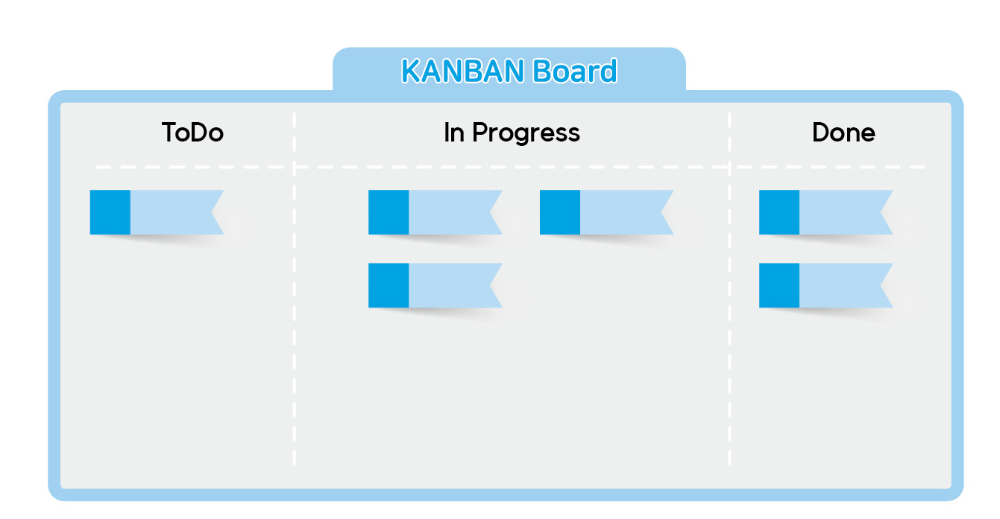

# 03 \| 팀의 성장은 회사의 성장이다

## 개발팀 운영하기

### 시스템 표준을 정하라

개발팀은 혼자 잘해서 되는 것이 아니고 협업 능력이 중요하다. 
 서로 간의 소통을 위해서 최적화된 시스템이 있어야 한다. 
 개발자들은 협업을 위해 이용하는 시스템이 자주 바뀌거나 업무 자체가 시스템화되어 있지 않은 것을 싫어한다. 
 그러므로 개발 프로세스와 시스템 표준 마련을 위한 꾸준한 노력이 필요하다. 
 먼저 개발 프로세스를 명확하게 시스템화할 필요가 있다. 
 업무를 추진하는 방식이나 피드백 방식도 명확히 해야 좋다. 
 이를 위해서 다양한 툴을 활용한다. 
 소통을 위해서는 Notion과 같은 협업 툴을, 문서 작업은 Google docs를, 코드 리뷰는 깃허브를 활용하는 것이다. 
 이러한 툴을 활용하여 피드백은 어떻게 진행하는 것이 좋은지, 협업 방식은 무엇인지를 구체화해야 한다. 
 팀의 표준 업무 방식을 만드는 일도 중요하다. 
 이러한 방식을 통해 코드 리뷰나 설계 단계에서 활발한 의사소통이 가능하다. 
 코드를 변경할 때마다 테스트는 얼마나 할지, 코드 리뷰와 디버깅은 어느 시점에서 할지 등을 명확하게 정해야 한다. 
 구체적인 소통의 시점도 명확하게 정해야 한다. 
 코드 리뷰는 매주 언제 하며, 팀 회의는 언제 하는지를 명확하게 정해서 팀원 모두가 지킬 수 있도록 하자. 
 다시 한번 강조하지만 불분명한 것들을 모두 명확하게 바꾸는 작업이 필요하다. 

### 코드 리뷰하기

코드 리뷰는 코드를 작성한 개발자 본인이 아닌 다른 사람이 점검해주는 일이다. 
 실력이 아무리 우수하더라도 본인의 코드 오류나 실수를 잡아내기는 어렵다. 
 코드 리뷰를 통해 팀원들은 담당자가 놓친 부분이나 오류 사항을 점검한다. 
 코드의 효율성 향상 방법과 더욱 경제적인 코드를 짤 수 있는 방법 등의 다양한 의견을 줄 수도 있다. 
 코드 리뷰를 하면 어떤 장점이 있을까? 

첫째, 개발자가 흔히 하는 실수를 빠르게 고쳐줄 수 있다. 
 아주 사소한 실수도 코드가 길어지면 잡아내기 어렵다. 
 이로 인하여 개발 결과물의 품질이 저하될 수 있다. 
 코드 리뷰를 통해 조기에 발견하여 수정하는 것이 중요하다. 

둘째, 여러 개발자가 정해진 표준에 따라서 개발을 진행할 수 있어 결과물의 일관성이 높아진다. 
 서로 간의 리뷰를 통해 각자가 진행하는 코드의 스타일을 알 수 있고 지속적으로 확인함으로써 추후 코드 통합 등에 매우 유리하다. 

셋째, 중복되거나 불필요한 코드를 미리 검출할 수 있다. 
 코드가 길어지면 중복되거나 불필요한 부분이 분명 발생하는데, 정작 본인은 이를 발견하지 못하는 경우가 많다. 
 다른 개발자가 이를 보면 쉽게 찾아낼 수 있으므로 리뷰 과정은 반드시 필요하다. 
 이 과정을 통해 재사용이 가능한 모듈을 중복으로 개발하는 상황도 막을 수 있다. 

넷째, 긴급한 상황에서 담당자 부재 시 빠른 대응이 가능하다. 
 팀원들이 서로 간의 코드를 이해하고 있으므로 개인 사유로 담당자가 없을 때도 신속한 대응이 가능하다. 

코드 리뷰는 어떻게 하는 것이 좋을까? 
 리뷰 방식은 온라인 리뷰를 활용하면 좋다. 
 굳이 만나지 않아도 충분히 의견 교환이 가능하다. 
 정말 중요한 코드를 리뷰할 때에는 직접 모여서 의견을 공유하는 방식을 추천한다. 
 코드 리뷰는 주기적으로 하는 것이 좋다. 
 일주일에 한 번 정도는 서로 작성한 코드를 리뷰하도록 하자. 
 다른 사람에게 보여주기 부끄러운, 혹은 숨기고 싶은 코드도 서로 리뷰할 수 있도록 장려하는 것이 좋다. 

다만, 코드 리뷰 시에 주의할 점이 있다. 
 코드 리뷰의 목적은 제품과 서비스를 개선하고 회사와 우리 모두의 성장을 위한 것임을 명확하게 알릴 필요가 있다. 
 개발자는 개선 의견이 왔을 때 감정적으로 대응하면 안 된다. 
 리뷰어도 순수하게 코드만 보고 리뷰를 해야 한다. 
 평소의 감정을 담은 리뷰를 하면 안 된다. 
 그러므로 일종의 원칙을 세우는 것이 좋다. 
 예를 들면, 코드 리뷰는 공개적인 장소\(GitHub\)에서만 진행하고 개인적인 의견을 직접 전달하는 방식은 금지할 수 있다. 
 또한, 리뷰 시에 사적인 감정을 최대한 배제하고 객관적인 리뷰를 하는 등의 원칙을 세우는 것이 좋다. 
 그렇지 않으면 서로 간의 감정 소모만 심해질 뿐이며 긍정적인 팀 분위기 형성에도 도움이 되지 않는다. 

### 팀의 현재 상황을 지속적으로 살펴라

개발팀이 잘 운영되고 있는지 지속적으로 관심을 가지고 살펴야 한다. 
 어떤 문제가 발생하고 있는지, 코드는 주기적으로 잘 나오는지, 팀원들 사이에 마찰은 없는지 등을 주기적으로 확인할 필요가 있다. 
 이를 위한 몇 가지 방법을 소개한다. 

우선 해당 팀의 코드 릴리스\(배포\) 빈도에 관심을 가져야 한다. 
 코드 릴리스를 자주 하지 않는 팀을 살펴보면 문제가 발생하고 있을 확률이 높다. 
 물론 자주 릴리스할 수 없는 서비스도 있지만 대부분의 서비스는 이런 공식 적용이 가능하다. 
 개발팀의 팀장은 어떻게 하면 팀을 효율적으로 운영할 수 있는지, 업무 배분은 어떤 방식으로 해야 하는지를 잘 알아야 한다. 
 이를 바탕으로 신속한 코드 릴리스를 위해 끊임없이 노력해야 한다. 
 사실 코드 릴리스를 하는 과정은 시간이 오래 걸릴 수밖에 없다. 
 그러한 상황에도 팀 내 적절한 역할 배분과 빠른 업무 결정 등을 바탕으로 효율적인 릴리스가 가능해야 진정한 팀장으로서 역할을 했다고 판단할 수 있다. 

다음으로 문제 발생 빈도를 줄이는 방안에 대해 고민해야 한다. 
 우리의 목표는 서비스의 품질을 높이고 안정적으로 운영하는 데 있다. 
 발생할 문제를 최소화하는 것도 품질 관리에 속한다. 
 개발자는 안정적인 상황에서 근무하기를 원한다. 
 지속해서 문제가 발생하면 이를 해결하는데 수많은 시간을 쏟아야 한다. 
 이는 전체적인 일의 효율을 크게 낮춘다. 
 물론 문제가 발생하지 않을 수는 없다. 
 그래도 최소화하기 위해서 여러 노력을 해야 한다. 
 또한, 개발자들이 단순 문제 해결에 너무 많은 시간을 쏟지 않도록 한다. 
 해당 문제 해결로 인하여 개발자 본인과 팀이 발전한다면 더할 나위 없이 좋지만 단순하게 문제만 찾아서 해결하고 끝나버리는 식의 일은 우리 조직의 발전에 아무런 도움이 되지 않는다. 

마지막으로 팀원들 간의 관계와 업무 상황을 주기적으로 파악하는 것이 좋다. 
 개발자들 모두 각자 개성이 강하다. 
 그러므로 이들 간에 마찰이 발생하는 것을 심심치 않게 보았다. 
 마찰이 발생하지 않도록 예방하는 것이 중요하다. 
 혹시나 이러한 상황이 오더라도 현명하게 대처해야 한다. 
 마찰은 업무 배분, 코드 리뷰, 지속적인 오류 발생 등 다양한 상황에서 발생한다. 
 팀의 리더는 갈등 상황에서 구성원들의 각자 성향을 명확히 파악한 후 이에 맞는 해법을 찾아줘야 한다. 
 그리고 불필요한 업무로 인해 업무과 과중한 건 아닌지도 주기적으로 파악해야 한다. 
 불필요한 업무로 인해 본연의 업무에 치중하지 못하는 상황을 막아야 하기 때문이다. 

### 문제가 있는 팀 개선하기

앞서 언급한 것과 같이 코드 릴리스 빈도가 낮거나 팀원 간 관계가 엉망인 팀을 운영해야 할 때도 있다. 
 같이 일하는 팀원들의 원성이 자자하고 팀 리더도 불만이 많을 수 있다. 
 이 팀은 분명히 잘못 운영되고 있지만, 누구도 무엇이 잘못되었는지 확실한 판단을 내릴 수 없는 상황이다. 
 가장 큰 문제는 팀원들 간의 관계가 좋지 않은 것이다. 
 사람들이 여러 유형이 있듯이 개발자들도 여러 유형이 있다. 
 이중 매사에 부정적으로 임하는 사람은 어떻게 대하면 좋을까? 
 그가 잘못하고 있는 부분을 명확하게 지적하고 개선할 수 있도록 요구해야 한다. 
 부정적인 분위기 하나만으로 팀원들은 매우 피곤해지며 하루의 에너지를 다 빼앗긴다. 
 그러므로 신속히 개선을 요구해야 한다. 
 그래도 개선되지 않는다면 다른 팀으로 이동시키는 게 그나마 나은 방법이다. 
 사실 사람은 잘 바뀌지 않는다. 
 우리 팀과 맞지 않는다면 다른 길로 갈 수 있도록 도와주는 것이 서로 좋은 방법이다. 
 팀원들이 과도한 야근과 업무로 스트레스를 받는 경우는 어떻게 해결해야 할까? 
 개발 업무 이외의 다른 잡무들로 고통받고 있을 수 있다. 
 이런 경우는 해결이 간단하다. 
 잡무를 담당할 다른 직원을 채용하면 된다. 
 업무가 비교적 적은 팀원들에게 분배하는 방법도 있다. 
 한 사람이 과중한 업무에 시달리지 않도록 관리를 해야 한다. 
 사실 긴급한 서비스 개선 작업 등이 필요할 때는 어쩔 수 없는 경우가 많다. 
 이럴 때는 옆에서 도움을 주는 동반자의 역할을 해야 한다. 
 우리 팀원 전체가 같이 고생하고 있다는 느낌을 받게 해주어야 한다. 
 바쁜 상황에서 팀 리더가 휴가를 가거나 조기 퇴근을 해버리면 팀원들은 업무에 집중할 수 없을 것이다. 
 같이 고민해주고, 도와주며, 이 상황이 끝나면 회사 차원의 보상이나 휴가 등이 있을 것이라고 독려하는 것도 하나의 방법이다. 
 맛있는 저녁 식사와 간식도 풍부하게 제공하자. 
 이들에게 진심으로 감사하는 마음을 갖고 응원해줄 수 있어야 한다. 
 이번 상황만 모면하면 된다는 안일한 생각은 하지 말아라. 
 서로 간의 협업이 잘 안 되는 경우도 있다. 
 분명 잘하고 있는 것처럼 보였는데 팀원들의 손발이 맞지 않는다. 
 그로 인해 코드 릴리스가 늦어지고 이에 대한 불만이 쌓이는 경우는 어떻게 해야 할까? 
 이런 상황은 사실 가장 해결하기 어렵다. 
 때문에 우선 장기적인 관점에서 바라볼 필요가 있다. 
 이 상황에서 가장 필요한 건 바로 소통이다. 
 팀원 간에 소통할 기회를 자주 만들어 서로의 문제점을 찾아 나가는 것이다. 
 사적으로 친해질 기회도 만들면 좋다. 
 회사 업무를 떠나 인간 대 인간으로 만나서 함께 식사하고 영화도 보는 기회를 만들어보자. 
 단, 업무 시간을 벗어나서 이런 것을 하면 요즘 개발자들은 정말 싫어한다. 
 한 달에 하루 정도는 회사에 나오지 않고 영화관에서 만나는 방법을 써보자. 
 그날은 원래 근무일이어야 한다. 
 출근 대신에 소풍을 가는 마음으로 올 수 있도록 말이다. 
 이런 자연스러운 방법으로 직원들 간의 관계를 개선하면 협업 관계 향상에 많은 도움을 줄 수 있다. 

### 360도 평가하기

모든 회사의 숙명인 평가를 해야 하는 시점이 다가온다. 
 모든 개발자가 잘했으므로 같은 평가를 주고 싶지만 현실은 그렇지 못하다. 
 여기에서 360도 평가 방법을 소개한다. 
 이 방법은 360도 평가, 360도 다면평가 등의 여러 이름으로 불린다. 
 360도 평가는 상사가 부하를 일방적으로 평가하는 방식이 아닌 다양한 사람들의 의견을 바탕으로 정보를 수집하고 평가하는 방식이다. 
 여기서 다양한 사람들이란 자기 자신뿐만 아니라 동료, 상사, 부하 등 우리가 회사에서 자주 접하는 사람들을 말한다. 
 이 평가 방법은 여러 사람의 피드백을 바탕으로 이루어지므로 시간이 꽤 많이 소요된다. 
 그렇지만 예상보다 많은 정보를 얻을 수 있다는 장점이 있다. 
 이러한 정보는 꽤 정확한 편이다. 
 한두 명의 평가가 아닌 주변에서 접하는 대부분의 사람을 활용하기 때문이다. 
 360도 평가 방법의 성공적인 운영을 위해서 몇 가지 기억해야 할 점들이 있다. 

첫째, 평가 항목의 커스터마이징\(Customizing\)이 필요하다. 
 다른 회사의 평가 항목을 가져다 쓰는 것이 아니라 우리 회사만의 평가 항목을 만들어야 한다. 
 특히, 부서별 특색이 다른 경우 이러한 것을 적극 반영할 필요가 있다. 

둘째, 최근 1년간의 성과를 바탕으로 평가한다는 것을 잊지 않도록 한다. 
 사람들은 일반적으로 3개월 이상 지나면 그때의 일은 잘 기억하지 못한다. 
 만약 연초에 엉망으로 개발을 했던 사람이 후반부에 아주 우수한 개발 실적을 냈다고 해보자. 
 사람들은 앞에 있었던 일보다는 최근 일을 더 잘 기억하기 때문에 우수한 평가를 줄 수도 있다. 
 이러한 문제를 피하기 위해서는 협업 시 기록을 철저하게 해놓는 것이 중요하다. 
 그리고 과거의 이메일 등을 확인하여 월별로 어떤 협업과 소통을 했는지 파악해야 한다. 

셋째, 모든 이해 관계자가 참여하는 것이 좋다. 
 말 그대로 다면평가이므로 해당 직원과 관계있는 모든 사람을 참여시켜야 한다. 
 내가 상대방을 성실하게 평가해야 상대방도 나에 대해 성실하게 평가에 임한다는 생각으로 참여하는 것이 좋다. 

넷째, 평가를 위한 준비부터 실행까지 충분한 시간을 할애해야 한다. 
 앞서 언급한 것처럼 이 평가 방법은 효율적이나 시간이 많이 소요된다. 
 여러 사람에게 평가서를 받아 취합하는 과정부터가 시간이 걸린다. 
 팀 리더는 취합한 평가서를 잘 읽어보고 요약 및 피드백을 작성해야 한다. 
 이러한 과정이 단 며칠 만에 이루어질 수 없으므로 여유를 갖고 준비하고 시작해야 한다. 

다섯째, ‘평가 기준’을 공개해야 한다. 
 평가의 절차와 방법, 상위 평가의 기준 등을 정하고 구성원 전체에게 미리 공지해야 한다. 
 일반적으로 평가가 연말에 이루어지는 것을 고려해 연초에 해당 내용을 공지하면 좋다. 
 그래야 1년 동안 해당 평가 지표에 맞춰서 업무를 진행할 수 있고, 이에 따라 더욱 객관적인 평가가 가능하기 때문이다. 

최근 기업들은 상대평가의 개념보다는 절대평가에 가까운 방법으로 직원 평가를 하고 있다. 
 즉, 직원 개개인에 대한 성과평가의 비중이 약해지고 있다는 뜻이다. 
 성과평가보다는 협력을 통한 성과 창출에 중점을 두는 시대로 변화하고 있다. 
 직원을 줄 세우려는 목적으로 평가를 활용해서는 안 된다. 
 직원을 평가하되 순위를 매기지 말고 추후 이들의 발전을 위해서 활용해야 한다. 
 팀 내 개발자들 대다수가 훌륭한 협업 방식과 퍼포먼스를 보여준다면 이들 모두에게 최고의 평가를 줄 수 있어야 한다. 
 또한, 성과급 등의 보상으로 이어진다면 동기부여에 큰 도움이 될 수 있다. 

### 개발자가 성장할 수 있는 문화를 만들자

‘개인의 성장은 곧 회사의 성장이다’라고 아무리 강조해도 개발자들 본인에게는 와닿지 않을 수 있다. 
 말뿐인 경우가 많기 때문이다. 
 회사에서 하는 업무를 바탕으로 진짜 본인이 성장할 기회를 만들어줘야 한다. 
 회사가 직원을 소모품처럼 다루는 시대는 끝났다고 보면 된다. 
 특히 개발자들을 이런 식으로 대한다면 한 달을 못 넘기고 퇴사하는 사태가 발생할 수 있다. 
 개발자들이 성장할 수 있는 문화를 만들기 위해 회사는 다양한 노력을 해야 한다. 
 예를 들어 개인의 성장 방향을 명확한 경력 개발 로드맵을 통해 보여주고, 개인의 성과가 회사의 성과와 어떻게 연관되어 있는지 공유하는 것이 좋다. 
 이를 통해 개인은 자신이 하는 일이 의미가 있으며 자신의 지속적인 성장 가능성을 회사에 있다고 생각할 수 있다. 
 가끔은 자신이 하는 일이 회사의 결과와 매우 동떨어져 있다고 느낄 수도 있기 때문에 이 과정은 매우 중요하다. 
 또한, 고객의 목소리를 직접 들려주는 것도 직원에게 보람을 느끼고 공감할 수 있게 해주는 좋은 방법이다. 
 예를 들면, 회사 내 행사에 고객을 초청해서 우리가 개발한 것이 어떻게 도움이 되었는지를 듣고 다양한 사람들이 공감하는 모습을 보여주는 것도 좋은 방법이다. 

### 떠나보내되 좋게 떠나보내라

개발자가 또 다른 성장을 위해 떠나려고 할 때도 세심하게 배려해야 한다. 
 우리 회사에서 가장 유능한 풀스택 개발자가 다른 회사로 이직하겠다는 결정을 통보해왔다. 
 회사 입장에서는 이를 어떻게 받아들여야 할까? 
 가기로 마음먹은 사람을 되돌릴 수는 없다. 
 이미 결정하기까지 많은 고민을 했을 테니까. 
 다만 이때가 중요하다. 
 누구보다 쿨하게 잘 보내주어야 한다. 
 다음 기회에 좋은 곳에서 다시 만나기를 기원하면서, 우리 가족이 좋은 곳으로 간다는 마음으로 보내주어라. 
 물론 회사 입장에서는 손실이 클 수 있다. 
 하지만 이미 벌어진 상황을 어쩌겠는가? 
 우리가 잘 보내주어야 새로 들어올 개발자도 잘 들어올 수 있다. 
 생각보다 이 바닥은 좁다. 
 몇 번 건너면 다 아는 사이이다. 
 이 직원이 나갈 때 온갖 괴롭힘을 통해 고통스럽게 만든 후 퇴사시키면 어떨까? 
 내부 직원들은 이런 과정을 다 보고 있다. 
 이렇게 퇴사한 당사자는 뒤도 안 돌아보고 나갈 것이다. 
 나쁜 소문은 결국 화살이 되어 우리 회사로 날아올 것이다. 
 그럼 그만큼 유능한 개발자를 뽑을 수 있을 것 같은가? 
 이 바닥에서 한 번 그렇게 소문난 회사는 개발자들이 기피하는 회사 1순위가 되어있을 것이다. 
 아름답게 떠나보내 주어라. 
 그는 우리 회사의 좋은 기억을 잊지 못해 다른 회사에서 더욱 실력을 쌓은 후에 다시 돌아올 수도 있다. 
  
퇴사자가 우리 회사를 좋게 떠나면 선순환이 된다. 
 ‘이 회사에 가면 저 개발자처럼 성공해서 나올 수 있구나’, ‘저 회사에는 성장에 도움을 주는 시니어들이 많이 있구나’ 등의 좋은 소문이 외부 개발자들 사이에서 돌게 된다. 
 실제로 3~4년 차 경력을 가진 주니어 급 개발자 채용은 매우 어렵다. 
 이들은 팀에서 보고 배울 사람이 있는지를 확인하고 이직을 결정한다. 
 우리 회사에 좋은 팀이 유지되고 배울 수 있는 훌륭한 사람들이 많이 있다는 것을 알게 되면, 유능한 개발자들이 오고 싶어 하는 회사가 될 것이다. 
 즉, 잘 보낸 개발자 한 명이 열 명의 유능한 개발자를 불러오는 선순환 구조를 만든 것이다. 
 핵심 개발자가 떠난 후 우리 회사는 그냥 멍하니 있어야 할까? 
 절대 아니다. 
 이들이 왜 떠나게 되었는지 명확한 원인을 분석하고 이를 개선하기 위한 노력을 해야 한다. 
 그렇지 않으면 퇴사자와 같이 일했던 다른 개발자들도 하나둘 짐을 싸기 시작할 수 있다. 

## 함께 일하는 방법

### 생각할 시간이 필요하다

아침에 출근해 팀 회의를 하고, 회의가 끝나면 점심을 먹고, 점심 후에 커피를 마시고 회사에 들어오면 피곤하다. 
 피곤하니 조금 쉬었다가 이제 개발을 시작하려고 하니 긴급회의 소집이 있다. 
 이 회의가 끝나니 집에 갈 시간이 다 되어간다. 
 우리가 쉽게 경험할 수 있는 개발자의 모습이다. 
 개발자에게는 오롯이 개발에만 쏟을 수 있는 시간이 필요하다. 
 하지만 위와 같은 일정으로는 개발할 시간이 없다. 
 앉아서 시작하려고 하면 회의해야 한다고 호출한다. 
 또 와서 시작하려고 하면 옆의 동료가 잠깐 부른다. 
 ‘티타임도 업무’라는 말이 있다. 
 그만큼 회사에서 불필요한 시간을 보낼 때가 많다. 
 개발자뿐만 아니라 우리 대부분은 바쁘게 살며 생각할 시간을 갖지 못하는 경우가 많다. 
 하지만 생각할 시간이 없다는 것은 정말 불행한 일이다. 
 특히 개발자는 개발 업무를 효율적으로 수행하기 위해 고도의 집중력을 바탕으로 많은 생각을 해야 한다. 
 많은 고민을 통해야만 좀 더 좋은 코드와 결과물이 나오게 된다. 
 하지만 위와 같이 생각할 시간이 없다면 어떨까? 
 시간에 쫓겨 개발하게 되고 결과적으로 품질에 좋지 않은 영향을 미친다. 
 그러므로 개발자들이 불필요한 일에 시간을 쏟지 않도록 도와줘야 한다. 
 개발에 많은 생각과 고민을 할 수 있게끔 방해하지 않아야 한다. 
 생각을 많이 하라고 강요하는 게 아니라 그런 환경을 만들어주라는 얘기다. 
 요즘엔 재택 근무를 도입하는 기업이 많아지고 있는데, 이 또한 생각할 시간을 가질 수 있도록 도와주는 것이다. 
 어떤 기업은 개발자가 커피숍에서 일하고 싶으면 언제든 커피값을 지원해주고, 회사 안이 아닌 커피숍에서 일할 수 있도록 배려해준다. 
 개발자 본인은 어디서 일해야 생산성이 가장 높은지 알고 있다. 
 개발자가 충분한 시간을 갖고 생각할 수 있는 시간을 가질 수 있도록 많은 배려가 필요하다. 

### 회의 방법도 여러 가지이다

회사에 출근하니 바로 메신저가 울린다. 
 “오늘은 신규 서비스 런칭과 관련된 회의를 진행합니다. 
 회의실로 모여주세요”. 
 아침부터 회의실에 팀원 모두가 모이게 되었고 바로 회의를 시작한다. 
 그런데 회의의 끝이 보이지 않는다. 
 회사에 출근하자마자 바로 회의를 시작했는데 점심 먹을 때까지 끝이 안 난다. 
 이런 상황에서 두 가지로 생각을 하는 그룹이 있을 수 있다. 
 첫 번째 그룹은 “이렇게 길게 회의를 해서 다양한 의견 수렴을 하니 좋다”고 생각할 수 있다\(물론 긴 회의를 좋아하는 사람은 없다\). 
 두 번째 그룹은 “결론도 안 나는데 이렇게 지루하게 할 필요가 있나”라고 생각할 수 있다. 
 둘 다 맞는 말이다. 
 다만 목적에 따라 회의하는 방식이 달라져야 한다는 것을 명심하고 회의를 진행해야 한다. 
 무작정 회의를 위해 모이는 것은 좋지 않다. 
 명확한 목적에 따라서 회의의 종류를 정해야 한다. 
 참고할만한 여러 가지 회의 방식은 다음과 같다. 

첫 번째는 ‘토론을 위한 회의’이다. 
 다양한 토론을 통해 다른 사람의 의견을 계속 청취하는 것은 서로의 발전을 위해서 좋은 일이다. 
 그리고 이는 팀의 발전으로 연계될 수 있다. 
 다만 회의의 주제가 토론이 필요한 회의일 때에 한정한다. 
 무언가 결정이 필요한 회의에서 토론만 계속하다가는 결론도 안 나고 끝나버릴 수 있다. 
 이 방식의 회의를 시작하기 전에는 반드시 미리 회의의 유형을 알려야 한다. 
 아니면 결론도 나지 않는데 왜 이렇게 길게 회의를 하는지 불만을 가지는 사람들이 많아질 것이기 때문이다. 
 이 유형의 회의를 진행할 때는 브레인 스토밍 같은 방식을 통해 최대한 자유로운 의견을 낼 수 있게 하며, 상호 비판은 가급적 하지 않는 것이 좋다. 
 이 회의 방식을 통해 지금까지 생각하지 못했던 창의적인 아이디어가 나올 수도 있기 때문이다. 

두 번째는 ‘주요한 의사결정 회의’이다. 
 이 유형의 회의는 일반적으로 앞서 진행한 토론 회의에 이어 진행된다. 
 본 회의는 의사결정이 이루어지는 것이 최종 목적이라고 생각하고 진행해야 한다. 
 이미 충분한 논의를 거치지 않았는가? 
 여기서 주의할 점이 있다. 
 이 회의에서는 토론을 위한 회의에서 충분한 논의를 거친 주제를 가지고 진행하므로 이에 대한 불필요한 논의는 과감히 생략해야 한다. 
 토론 과정을 다시 진행하면 이 회의는 언제 끝날지 모른다. 
 이 회의의 목적인 최종 의사결정에 집중하고 이것을 위해서만 논의하라. 
 회의 종료 후에는 결정된 사안을 정리 및 요약하여 회사 구성원 모두가 알 수 있도록 공유하는 것도 잊지 말아야 한다. 

세 번째는 ‘모두가 참석하는 회의’이다. 
 규모가 작은 회사는 직원 전체일 수도 있고, 규모가 큰 회사는 하나의 팀 단위가 될 수도 있다. 
 이 회의는 현재 우리 조직에서 해결하고 있는 현안, 진행하는 프로젝트 등 직원들이 관심을 가질만한 주제를 발표하는 것으로 시작한다. 
 발표 후에는 직원들의 의견 수렴과 질의응답 시간을 갖는다. 
 이 유형의 회의를 통해 직원들은 회사의 전체 상황에 대해 이해할 수 있다. 
 회사는 직원들의 다양한 의견들을 직접 들어볼 수 있는 시간이 된다. 
 다만, 이 유형의 회의는 가급적 최소화하며 반드시 필요할 때에만 하는 것이 좋다. 

마지막은 ‘스킵 레벨 미팅\(Skip-Level Meeting\)’이라는 회의 방식이다. 
 이 회의 방식은 다소 생소할 수 있다. 
 스타벅스는 스킵 레벨 미팅 방식의 회의를 이용한다. 
 매니저를 제외한 매장 직원들만 참여하는 회의를 진행하는 방식이다. 
 중간 관리자는 회의 진행에 부담을 줄 수 있으니 배제하고 자유로운 토론을 진행한다. 
 CEO와 무작위로 선정된 직원 10명이 미팅을 하는 회사들도 있다. 
 이런 회의를 하는 목적은 무엇일까? 
 중간 관리자에 대한 불만을 접수하는 시간일까? 
 이 회의의 궁극적인 목적은 회사의 발전이며 중간 관리자가 범하고 있는 오류들이 있으면 이러한 의견을 들어 개선할 수 있는 방향을 만드는 것이다. 
 연차가 낮은 직원들이 느꼈던 불편함을 경청하고 이를 기반으로 좀 더 나은 회사를 만들기 위한 회의이다. 
 다만, 이 회의를 자주 하는 것보다는 1년에 한두 번 정도 진행하는 것이 바람직하다. 

### 업무 흐름을 정리하라

팀 리더가 매일 팀원들에게 “오늘은 무슨 일을 할 예정인가요? 
”, 혹은 “다음 주에 해야 할 일은 무엇인가요? 
” 등의 질문을 통해 업무 흐름을 파악한다면 어떨까? 
 물어보는 사람도 비효율적이지만 답변하는 사람도 피곤해진다. 
 이런 상황을 피하려면 업무 흐름을 명확하게 할 수 있는 도구가 필요하다. 
 여기서는 ‘칸반보드\(Kanban Board\)’라는 것을 소개한다. 
 칸반보드는 빠른 테스트 및 개발, 수정이 이루어지는 에자일 소프트웨어 개발 방식에 많이 활용되는 일정 관리 기법이다. 
 이는 아래 그림과 같이 쉽게 표현할 수 있다. 

칸반보드는 ‘해야 할 업무\(ToDo\)’, ‘진행 중인 업무\(In Progress\)’, ‘완료된 업무\(Done\)’의 세 부분으로 구성된다, 각 업무는 포스트잇 1개, 회사의 모든 업무는 게시판 전체로 생각한다. 
 다른 색상은 다른 팀 혹은 다른 팀원을 의미한다. 
 활용 방법은 간단하다. 
 자신이 맡은 일을 포스트잇에 적어서 세 칸 중 한 곳에 붙이면 된다. 
 포스트잇의 색깔은 본인 고유의 색깔이 된다. 
 이런 방식을 활용하면 어떤 점이 좋을까? 
 가장 큰 장점은 현재 진행이 잘 안 되는 부분\(병목 현상\)이 어디인지 한눈에 파악할 수 있다. 
 이에 따라서 도움이 필요한 부분을 파악하여 해결해 주기도 하고, 잘되고 있는 부분은 더욱 완성도 높게 진행할 수 있도록 격려하기도 한다. 
 칸반보드를 활용하면 문제의 발생을 미리 파악하고 이를 해결하기 위한 준비를 할 수 있다. 
 이와 같은 방법을 통해 업무를 시각화하면 누구나 전체적인 업무 진행 상황을 알 수 있게 된다. 
 결과적으로 제품의 생산성과 품질, 모두 향상이 가능하다. 

### 오픈 소스 활용하기

개발과 전혀 친하지 않은 사람은 이해하지 못할 개발자들의 문화가 있다. 
 바로 오픈 소스이다. 
 직접 개발을 해보면 알겠지만 이 작업은 결코 만만한 작업이 아니다. 
 엄청난 시간과 노력이 있어야 하나의 결과물을 완성할 수 있다. 
 그런데 이렇게 완성한 결과물을 ‘라이브러리’라는 형태로 누구나 무료로 쓸 수 있도록 공개하고 있다. 
 정말 대단한 일이다. 
 1년 동안 만든 프로젝트를 얼굴도 모르는 사람들이 자유롭게 쓰도록 공유하기가 쉬울 것 같은가? 
 더욱이 무료로 공개하는 것은 더욱 어려울 것이다. 
 하지만 개발자들은 이러한 문화에 익숙해져 있으며 지금 이 순간도 수많은 오픈 소스들이 만들어지고 공개되고 있다. 
 불과 10년 전만 해도 오픈 소스의 중요성은 그렇게 크지 않았다. 
 내가 만든 소스 코드를 다른 사람에게 공유한다는 것 자체가 쉬운 일이 아니었다. 
 기업의 문화도 오픈 소스 시대에 맞춰 변화하고 있다. 
 기존에는 개발을 진행할 때 각각의 세션을 나누고, 각 세션의 전문가가 이를 단계별로 해결하는 방법을 활용했다. 
 하지만 시대가 바뀌었다. 
 최근에는 고객의 피드백을 바로 받아서 솔루션을 해결하고 이를 제공해야 하므로 프로세스를 한 번에 빨리 진행하는 것이 좋다. 
 이를 위해 필요한 것이 오픈 소스 기술이다. 
 여러분이 알고 있는 리눅스, 안드로이드, 데이터베이스\(MySQL\), 웹서버\(Apache\), 빅데이터 관리\(Hadoop\) 프로그램 등의 소프트웨어는 오픈 소스 기술을 활용한다. 
 최근에는 개발자가 모든 코드를 다 짜지 않는다. 
 이미 잘 짜여있는 오픈 소스들이 널려 있는데 다시 같은 것을 개발하며 시간을 낭비할 필요가 없지 않은가? 
 오픈 소스 활용을 통해 시간과 비용을 절약하는 것이 좋다. 
 개발을 진행하면서 좋은 오픈 소스를 찾게 되면 팀원들에게 공유하여 개발의 효율을 높이는 방법도 좋다. 
 또한, 우리가 만든 서비스도 오픈 소스로 공개하면 우리 회사 서비스의 성장에 도움이 될 수 있다. 
 물론 오픈 소스를 적극적으로 활용하기 위해서는 보안의 취약점을 잘 파악하고 관리해야 하며, 이에 대응하기 위한 기술 혹은 관련 인력을 배치하는 등의 노력이 필요하다. 

