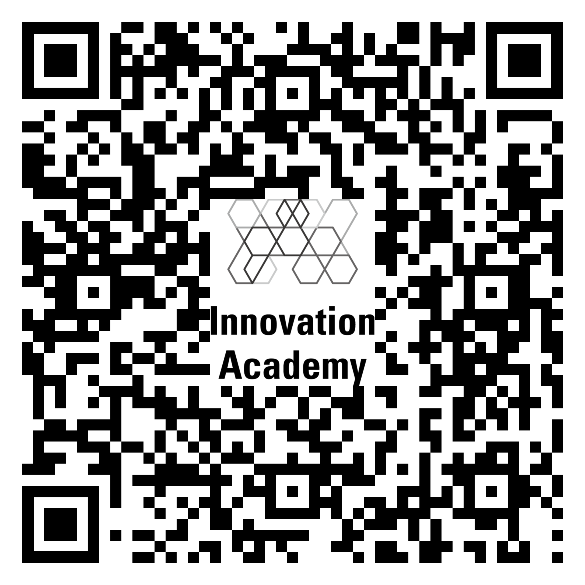

# 02 \| 기업에서 사용할 수 있는 형식들

## 채용에 관한 여러 가지 형식들

막상 개발자 채용을 하려고 하면 관련 양식이나 형식들이 없어서 새롭게 만들어야 하는 경우가 많다. 그래서 이번 장에서는 개발자 채용을 위해서 활용 가능한 기본적인 프로세스와 이와 관련된 문서들을 제공한다. 또한, 회사가 구직자에게 지켜야 할, 기본적인 비즈니스 예의를 차릴 수 있는 문서\(성의 있는 입사 안내, 정식 입사 제안서\)도 공유한다.

### ● 양식 다운로드할 수 있는 QR Code

### ● 구인 회사를 위한 채용 관련 양식\(절차순\)

1. [입사 안내서](https://github.com/innovationacademy-kr/tech-hr/blob/master/download/recruit/1_Greeting_Mail.pdf)
2. [구인 양식](https://github.com/innovationacademy-kr/tech-hr/blob/master/download/recruit/1_Resume_v1.pdf)
3. [인터뷰 안내](https://github.com/innovationacademy-kr/tech-hr/blob/master/download/recruit/4_Interview_mail.pdf)
4. [입사 제안서 양식](https://github.com/innovationacademy-kr/tech-hr/blob/master/download/recruit/5_Adminssion_mail.pdf)

### ● 구직자\(개발자\)를 위한 이력서 양식

* [개발자 이력서 양식](https://github.com/innovationacademy-kr/tech-hr/blob/master/download/recruit/2_Resume_v2.pdf)

## DevRel과 관련된 프로세스

DevRel의 행사 진행 프로세스는 다음과 같다. 우선 행사를 기획하고 이에 참여할 연사를 모집하며, 참석자를 관리한다. 다음으로 행사 홍보 및 후원자를 결정하고 실제 행사를 진행하며, 진행 후에는 회계 및 평가 보고를 진행한다. 여기에서 주의할 점은 콘퍼런스나 행사를 통해 목표\(목적\)와 기대효과를 명확하게 해야 한다는 것이다.

### ● 행사 준비 프로세스

1. 기획 
   1. 기획서
   2. 개요 
   3. 연사 초청 메일 
2. 연사 
   1. 연사 미팅노트 
   2. 행사 준비 관련 정보 요청 설문 
   3. 발표 가이드 제공
   4. 내부 리허설
   5. 발표자료 보완
   6. 행사장 리허설
3. 후원사 모집
   1. 후원 대상 카테고리 선정
   2. 후원 제안서 작성
   3. 후원사 모집
4. 홍보
   1. 홍보 채널 선정: SNS, 개발자 커뮤니티
   2. 홍보를 위한 컨텐츠 제작: 배너, 영상, 뉴스레터
   3. 홍보 활동 시작
5. 참석자 
   1. 참석자 DB 관리 
   2. 참석자 Q&A 수집
   3. 참석자 설문
6. 진행 
   1. 진행을 위한 큐시트 작성
   2. 내부 스태프 리허설
   3. 필요한 기자재 준비
7. 회계 및 평가 보고

### ● 행사 준비에 필요한 양식 \(다운로드\)

1. [기획서](https://github.com/innovationacademy-kr/tech-hr/blob/master/download/event/1_Planning_OKKYCON_2021.pdf)
2. [연사 및 발표 자료 관리](https://github.com/innovationacademy-kr/tech-hr/blob/master/download/event/4_Speaker_OKKYCON_2021.xlsx)
3. [후원 제안서](https://github.com/innovationacademy-kr/tech-hr/blob/master/download/event/3_Sponsor_OKKYCON_2021.pdf)
4. [진행 일정](https://github.com/innovationacademy-kr/tech-hr/blob/master/download/event/2_Scheduling_OKKYCON_2021.xlsx)
5. [큐시트](https://github.com/innovationacademy-kr/tech-hr/blob/master/download/event/5_Qsheet_OKKYCON_2021.xlsx)

